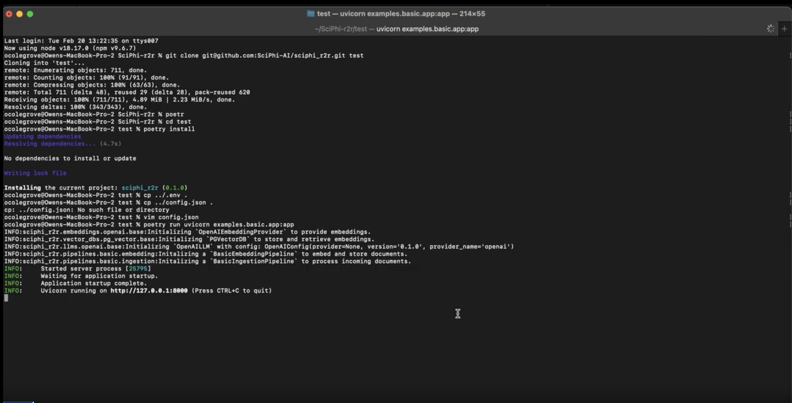

# R2R: Production-ready RAG systems.

<p align="left">
  <a href="https://r2r-docs.sciphi.ai"></a>
  <a href="https://discord.gg/p6KqD2kjtB"></a>
  <a href="https://github.com/SciPhi-AI"></a>
  <a href="https://github.com/SciPhi-AI/R2R/pulse"></a>
  <a href="https://opensource.org/licenses/MIT"></a>
</p>

A semi-opinionated RAG framework.


R2R was conceived to bridge the gap between experimental RAG models and robust, production-ready systems. Our semi-opinionated framework cuts through the complexity, offering a straightforward path to deploy, adapt, and maintain RAG pipelines in production. We prioritize simplicity and practicality, aiming to set a new industry benchmark for ease of use and effectiveness.

## Demo(s)

Launching the server locally, running the client, and pipeline observabiilty application:
[](https://github.com/SciPhi-AI/R2R/assets/68796651/7ac102e0-f6ad-4926-8a7a-5db25db4612d)

!! Note - The server has been removed from this repo - instead we now recommend using [SciPhi Cloud](https://app.sciphi.ai) to pair with the R2R framework for observability and optimization.

### Quick Install:

**Install R2R directly using `pip`:**

```bash
# use the `'r2r[all]'` to download all required deps
pip install 'r2r[parsing,eval]'

# setup env 
export OPENAI_API_KEY=sk-...
export LOCAL_DB_PATH=local.sqlite

# OR do `vim .env.example && cp .env.example .env`
# INCLUDE secrets and modify config.json
# if using cloud providers (e.g. pgvector, supabase, ...)
```

### Run the server with Docker:

```bash
docker pull emrgntcmplxty/r2r:latest

# Place your secrets in `.env` before deploying
docker run -d --name r2r_container -p 8000:8000 --env-file .env r2r
```

## Links

[Join the Discord server](https://discord.gg/p6KqD2kjtB)

[Read the R2R Docs](https://r2r-docs.sciphi.ai/)

## Basic Examples

The project includes several basic examples that demonstrate application deployment and interaction:

1. [`basic app`](r2r/examples/basic/app.py): This example runs the backend server, which includes the ingestion, embedding, and RAG pipelines served via FastAPI.

   ```bash
   # If using a venv, replace `uvicorn` with `venv_path/bin/uvicorn`
   uvicorn r2r.examples.basic.app:app
   ```

2. [`basic client`](r2r/examples/basic/run_client.py): This example should be run after starting the server. It demonstrates uploading text entries as well as a PDF to the local server with the python client. Further, it shows document and user-level vector management with built-in features.

   ```bash
   python -m r2r.examples.basic.run_client
   ```

3. [`academy`](r2r/examples/academy): A more sophisticated demo demonstrating how to build a more novel pipeline which involves synthetic queries

   ```bash
   # Launch the `academy` example application
   # If using a venv, replace `uvicorn` with `venv_path/bin/uvicorn`
   uvicorn r2r.examples.academy.app:app

   # Ask a question
   python -m r2r.examples.academy.run_client search "What are the key themes of Meditations?"
   ```
4. [`end-to-end`](docs/pages/examples/end-to-end.mdx): An example showing how to combine a complete web application with the basic RAG pipeline above.

5. [`intelligence`](app.sciphi.ai): A cloud platform which can be used to deploy R2R pipelines powered by SciPhi


### Full Install:

Follow these steps to ensure a smooth setup:

1. **Install Poetry:**

   - Before installing the project, make sure you have Poetry on your system. If not, visit the [official Poetry website](https://python-poetry.org/docs/#installation) for installation instructions.

2. **Clone and Install Dependencies:**

  - Clone the project repository and navigate to the project directory:
     
     ```bash
     git clone git@github.com:SciPhi-AI/r2r.git
     cd r2r
     ```
     
  - Copy the `.env.example` file to `.env`. This file is in the main project folder:

     ```bash
     cp .env.example .env

     # Add secrets, `OPENAI_API_KEY` at a minimum
     vim .env
     ```
     
  - Install the project dependencies with Poetry:
  
     ```bash
     # See pyproject.toml for available extras
     # use "all" to include every optional dependency
     poetry install -E parsing -E eval
     ```
     
  - Execute with poetry run:
     
     ```bash
     python -m r2r.examples.pdf_chat.run_client ingest
     ```

3. **Configure Environment Variables:**
   - You need to set up cloud provider secrets in your `.env`. At a minimum, you will need an OpenAI key.
   - The framework currently supports PostgreSQL (locally), pgvector and Qdrant with plans to extend coverage.

## Key Features

- **🚀 Rapid Deployment**: Facilitates a smooth setup and development of production-ready RAG systems.
- **⚖️ Flexible Standardization**: `Ingestion`, `Embedding`, and `RAG` with proper `Observability`.
- **🧩 Easy to modify**: Provides a structure that can be extended to deploy your own custom pipelines.
- **📦 Versioning**: Ensures your work remains reproducible and traceable through version control.
- **🔌 Extensibility**: Enables a quick and robust integration with various VectorDBs, LLMs and Embeddings Models.
- **🤖 OSS Driven**: Built for and by the OSS community, to help startups and enterprises to quickly build with RAG.
- **📝 Deployment Support**: Available to help you build and deploy your RAG systems end-to-end.

## Core Abstractions

The framework primarily revolves around three core abstractions:

- The **Ingestion Pipeline**: Facilitates the preparation of embeddable 'Documents' from various data formats (json, txt, pdf, html, etc.). The abstraction can be found in [`ingestion.py`](r2r/core/pipelines/ingestion.py).

- The **Embedding Pipeline**: Manages the transformation of text into stored vector embeddings, interacting with embedding and vector database providers through a series of steps (e.g., extract_text, transform_text, chunk_text, embed_chunks, etc.). The abstraction can be found in [`embedding.py`](r2r/core/pipelines/embedding.py).

- The **RAG Pipeline**: Works similarly to the embedding pipeline but incorporates an LLM provider to produce text completions. The abstraction can be found in [`rag.py`](r2r/core/pipelines/rag.py).

- The **Eval Pipeline**: Samples some subset of rag_completion calls for evaluation. Currently [DeepEval](https://github.com/confident-ai/deepeval) is supported. The abstraction can be found in [`eval.py`](r2r/core/pipelines/eval.py).

Each pipeline incorporates a logging database for operation tracking and observability.
