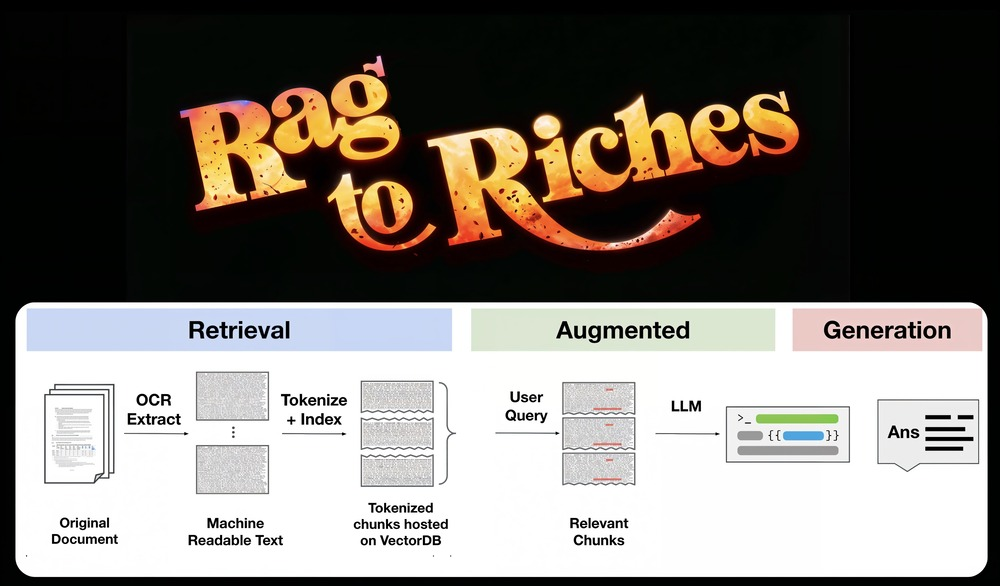

# R2R

<p align="center" style="margin-top: 20px">
  <p align="center">
  R2R: A semi-opinionanted RAG framework.
  <br>
    <a href="https://discord.gg/p6KqD2kjtB">Discord</a>
    ·
    <a href="https://sciphi.ai">Website</a>
    ·
    <a href="https://github.com/Sciphi/sciphi/issues">Issues</a>
  </p>
</p>

<p align="center">
   <a href="https://discord.gg/p6KqD2kjtB"></a>
   <a href="https://github.com/SciPhi-AI"></a>
   <a href="https://github.com/Sciphi/sciphi/blob/main/LICENSE"></a>
   <a href="https://github.com/SciPhi-AI/R2R/pulse"></a>
<a href="https://docs.sciphi.ai/"></a>

</p>


R2R (RAG to Riches) is a Python framework designed for the rapid construction and deployment of production-ready Retrieval-Augmented Generation (RAG) systems. This semi-opinionated framework accelerates the transition from experimental stages to production-grade RAG systems.

## Backed by

<p align="center">
  <a href="https://www.ycombinator.com/" target="_blank"></a>
</p>

## Key Features

- **🚀 Rapid Deployment**: Facilitates a smooth setup and development of production-ready RAG systems.
- **⚖️ Flexible Standarization**: `Ingestion`, `Embedding`, and `RAG` with proper `Observability`.
- **🧩 Easy to modify**: Provides a structure that can be extended to deploy your own custom pipelines.
- **📦 Versioning**: Ensures your work remains reproducible and traceable through version control.
- **🔌 Extensibility**: Enables a quick and robust integration with various VectorDBs, LLMs and Embeddings Models.
- **🤖 OSS Driven**: Built for and by the OSS community, to help startups and enterprises to quickly build with RAG.
- **📝 Deployment Support**: Available to help you build and deploy your RAG systems end-to-end.

### Quick Install:

**Install R2R directly using `pip`:**

```bash
pip install r2r
```

### Full Install:

Follow these steps to ensure a smooth setup:

1. **Install Poetry:**

   - Before installing the project, make sure you have Poetry on your system. If not, visit the [official Poetry website](https://python-poetry.org/docs/#installation) for installation instructions.

2. **Clone and Install Dependencies:**

   - Clone the project repository and navigate to the project directory:
     ```bash
     git clone git@github.com:SciPhi-AI/r2r.git
     cd r2r
     ```
   - Install the project dependencies with Poetry:
     ```bash
     # See pyproject.toml for available extras
     # use "all" to include every optional dependency
     poetry install --extras "parsing"
     ```

3. **Configure Environment Variables:**
   - You need to set up cloud provider secrets in your `.env`. At a minimum, you will need an OpenAI key.
   - The framework currently supports pgvector and Qdrant with plans to extend coverage.
   - If starting from the example, copy `.env.example` to `.env` to apply your configurations:
     ```bash
     cp .env.example .env
     ```

### Basic Examples

The project includes several basic examples that demonstrate application deployment and standalone usage of the embedding and RAG pipelines:

1. [`app.py`](examples/basic/app.py): This example runs the main application, which includes the ingestion, embedding, and RAG pipelines served via FastAPI.

   ```bash
   poetry run uvicorn examples.basic.app:app
   ```

2. [`run_client.py`](examples/basic/run_client.py): This example should be run after starting the main application. It demonstrates uploading text entries as well as a PDF with the python client. Further, it shows document and user-level management with built-in features.

   ```bash
   poetry run python -m examples.basic.run_client
   ```

3. [`run_pdf_chat.py`](examples/pdf_chat/run_demo.py): A more comprehensive example demonstrating upload and chat with a more realistic pdf.

   ```bash
   # Ingest pdf
   poetry run python -m examples.pdf_chat.run_demo ingest

   # Ask a question
   poetry run python -m examples.pdf_chat.run_demo search "What are the key themes of Meditations?"
   ```

4. [`web`](web/package.json): A web application which is meant to accompany the framework to provide visual intelligence.
   ```bash
   cd web && pnpm install
   # Serve the web app
   pnpm dev
   ```

## 1min from setup to basic example

[](https://github.com/SciPhi-AI/r2r/assets/68796651/c648ab67-973a-416a-985e-2eafb0a41ef0)

## Core Abstractions

The framework primarily revolves around three core abstractions:

- The **Ingestion Pipeline**: Facilitates the preparation of embeddable 'Documents' from various data formats (json, txt, pdf, html, etc.). The abstraction can be found in [`ingestion.py`](r2r/core/pipelines/ingestion.py).

- The **Embedding Pipeline**: Manages the transformation of text into stored vector embeddings, interacting with embedding and vector database providers through a series of steps (e.g., extract_text, transform_text, chunk_text, embed_chunks, etc.). The abstraction can be found in [`embedding.py`](r2r/core/pipelines/embedding.py).

- The **RAG Pipeline**: Works similarly to the embedding pipeline but incorporates an LLM provider to produce text completions. The abstraction can be found in [`rag.py`](r2r/core/pipelines/rag.py).

Each pipeline incorporates a logging database for operation tracking and observability.

## Community

[Join our Discord server!](https://discord.gg/p6KqD2kjtB)
