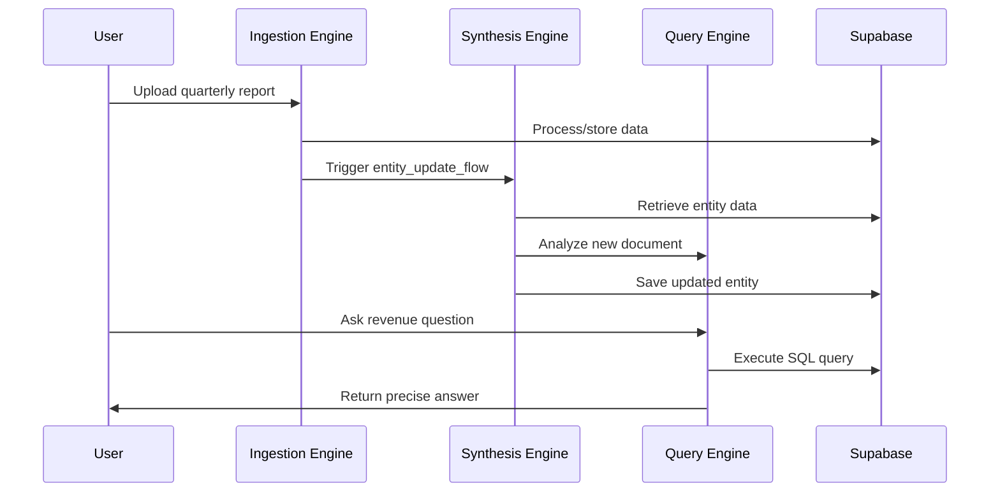

# Ellen V2: System Architecture

**Version**: 1.0

This document details the software architecture for the Ellen V2 platform, designed around principles of modularity, extensibility, and trust.

## 1. Core Architectural Principles
For a visual overview of the architecture, see [Three-Engine Architecture Diagram](../architecture_diagrams/three_engine_architecture.mmd)

| Principle             | Description                                                                 |
|-----------------------|-----------------------------------------------------------------------------|
| Supabase-Centric      | Built entirely on Supabase (PostgreSQL with pgvector)                       |
| Adopt and Expand      | Leverage R2R framework for RAG pipeline, extend with custom capabilities    |
| Separation of Concerns| Knowledge Layer (R2R) vs. Reasoning Layer (CrewAI)                          |
| Verifiability         | Provide precise, deep-linked citations for all generated information        |

## 2. The Three-Engine Architecture
All engines run on the same Supabase foundation:

### 2.1. Ingestion Engine (R2R Extensions)
**Purpose**: Asynchronously transform unstructured documents into structured, searchable knowledge

**Foundation**: R2R's core ingestion pipeline

**Custom Extensions**:
| Module                     | Functionality                                                                 |
|----------------------------|-------------------------------------------------------------------------------|
| Image-to-Narrative Module  | Uses multimodal LLM to generate text descriptions of images                   |
| Structured Data Module     | Processes spreadsheets into "long table" format with narrative summary        |
| HierarchicalChunkingProvider| Implements "Parent/Child" chunking model for multi-level context              |

### 2.2. Query Engine (R2R Extensions)
**Purpose**: Synchronously power AI chat and answer ad-hoc questions

**Foundation**: R2R's core RAG pipeline (hybrid search, reranking)

**Custom Extension**:
| Module                             | Functionality                                                                 |
|------------------------------------|-------------------------------------------------------------------------------|
| ToolAugmentedOrchestrationProvider | Extends retrieval with SQL query generation and execution for structured data |

### 2.3. Synthesis Engine (CrewAI Services)
**Purpose**: Periodically create/maintain "living wiki" pages for key entities

**Foundation**: Background service powered by CrewAI Flows

**Process**:
1. **Trigger**: Schedule or event-based (e.g., new document mentioning watched entity)
2. **Execution**: CrewAI Flow uses `R2RKnowledgeSearchTool` for broad research
3. **Validation & Output**: Structured JSON validated against entity model and UPSERTed to Supabase

## 3. Data Flow: From Document to "Living" Entity

1. **Ingestion**: User uploads quarterly report → Processed by Ingestion Engine → Stored in Supabase
2. **Entity Recognition**: Ingestion Engine recognizes watched entity → Triggers Synthesis Engine
3. **Targeted Update**: Synthesis Engine initiates `entity_update_flow` → Analyzes new document
4. **Reasoning**: Compares new data with existing entity → Updates relevant sections
5. **Validation & Storage**: Validates updated JSON → Saves to Supabase
6. **User Query**: User asks revenue question → Query Engine retrieves structured data → Returns precise answer