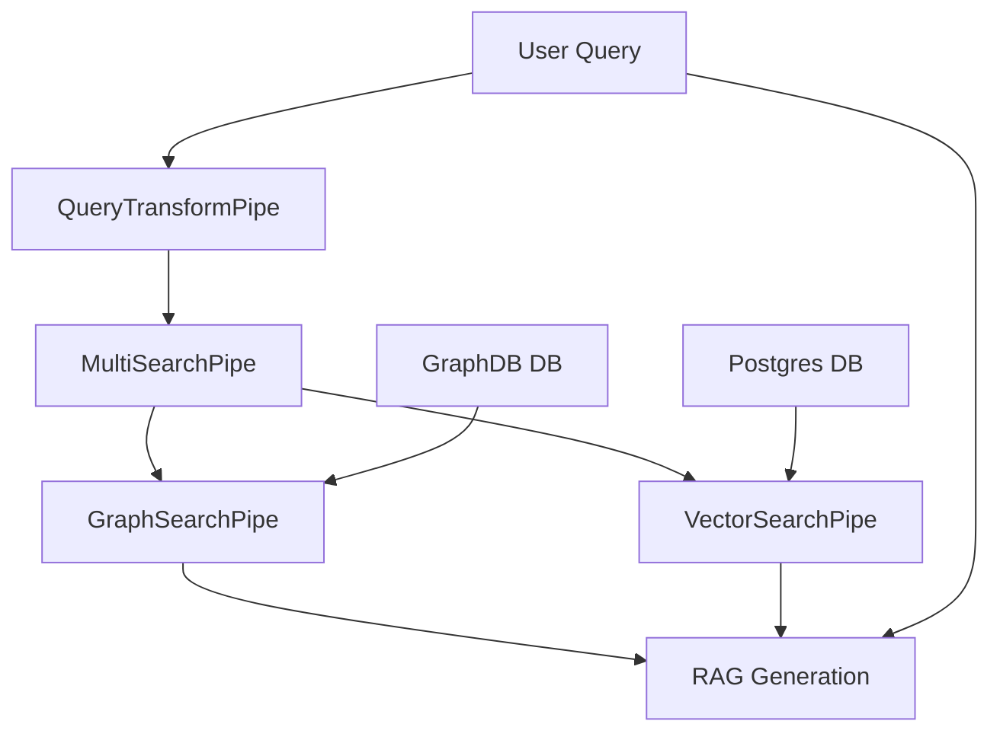
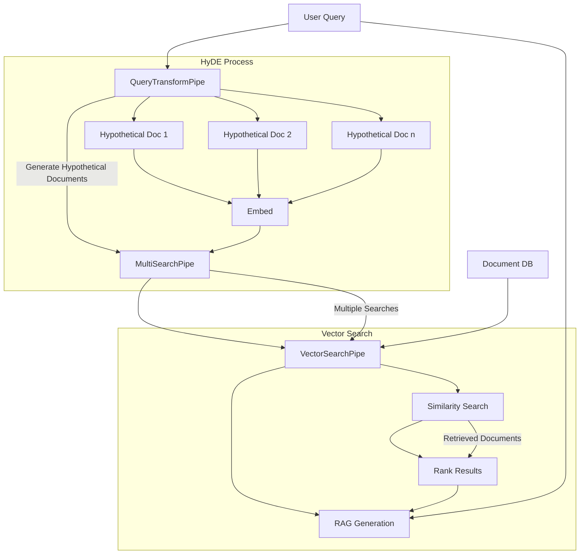
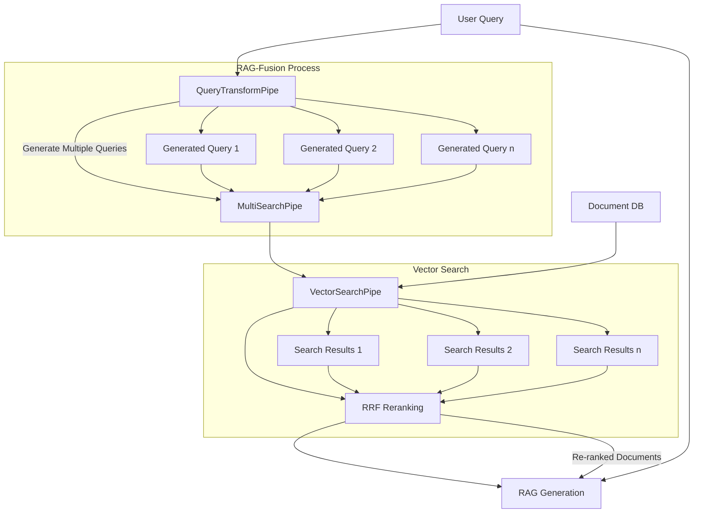

# Advanced RAG Techniques

R2R supports advanced Retrieval-Augmented Generation (RAG) techniques that can be easily configured at runtime. This flexibility allows you to experiment with different SoTA strategies and optimize your RAG pipeline for specific use cases. **This cookbook will cover toggling between vanilla RAG, [HyDE](https://arxiv.org/abs/2212.10496) and [RAG-Fusion](https://arxiv.org/abs/2402.03367).**.

<Note>

Advanced RAG techniques are still a beta feature in R2R. They are not currently supported in agentic workflows and there may be limitations in observability and analytics when implementing them.


Are we missing an important RAG technique? If so, then please let us know at founders@sciphi.ai.

</Note>

## Advanced RAG in R2R
R2R is designed from the ground up to make it easy to implement advanced RAG techniques. Its modular architecture, based on orchestrated pipes and pipelines, allows for easy customization and extension. A generic implementation diagram of the system is shown below:



## Supported Advanced RAG Techniques

R2R currently supports two advanced RAG techniques:

1. **HyDE (Hypothetical Document Embeddings)**: Enhances retrieval by generating and embedding hypothetical documents based on the query.
2. **RAG-Fusion**: Improves retrieval quality by combining results from multiple search iterations.

## Using Advanced RAG Techniques

You can specify which advanced RAG technique to use by setting the `search_strategy` parameter in your vector search settings. Below is a comprehensive overview of techniques supported by R2R.

### HyDE

#### What is HyDE?

HyDE is an innovative approach that supercharges dense retrieval, especially in zero-shot scenarios. Here's how it works:

1. **Query Expansion**: HyDE uses a Language Model to generate hypothetical answers or documents based on the user's query.
2. **Enhanced Embedding**: These hypothetical documents are embedded, creating a richer semantic search space.
3. **Similarity Search**: The embeddings are used to find the most relevant actual documents in your database.
4. **Informed Generation**: The retrieved documents and original query are used to generate the final response.

#### Implementation Diagram


The diagram which follows below illustrates the HyDE flow which fits neatly into the schema of our diagram above (note, the GraphRAG workflow is omitted for brevity):



#### Using HyDE in R2R

```python
from r2r import R2RClient

client = R2RClient()

hyde_response = client.rag(
    "What are the main themes in Shakespeare's plays?",
    vector_search_settings={
        "search_strategy": "hyde",
        "search_limit": 10
    }
)


print('hyde_response = ', hyde_response)
```

```bash Sample Output
'results': {
    'completion': ...
    'search_results': {
        'vector_search_results': [
            {
                ...
                'score': 0.7715058326721191,
                'text': '## Paragraph from the Chapter\n\nThe Fundamental Theorem of Calculus states that if a function is continuous on a closed interval [a, b], then the function has an antiderivative in the interval [a, b]. This theorem is a cornerstone of calculus and has far-reaching consequences in various fields, including physics, engineering, and economics. The theorem can be proved through the use of Riemann sums and the limit process, which provides a rigorous foundation for understanding the relationship between integration and differentiation. The theorem highlights the deep connection between these two branches of mathematics, offering a unified framework for analyzing functions and their derivatives.'
                'metadata': {
                        'associated_query': 'The fundamental theorem of calculus states that if a function is continuous on the interval [a, b] and F is an antiderivative of f on [a, b], then the integral of f from a to b is equal to F(b) - F(a). This theorem links the concept of differentiation with that of integration, providing a way to evaluate definite integrals without directly computing the limit of a sum.',
                        ...
                    }
                },
        ],
        ...
    }
}
```
### RAG-Fusion

#### What is RAG-Fusion?

RAG-Fusion is an advanced technique that combines Retrieval-Augmented Generation (RAG) with Reciprocal Rank Fusion (RRF) to improve the quality and relevance of retrieved information. Here's how it works:

1. **Query Expansion**: The original query is used to generate multiple related queries, providing different perspectives on the user's question.
2. **Multiple Retrievals**: Each generated query is used to retrieve relevant documents from the database.
3. **Reciprocal Rank Fusion**: The retrieved documents are re-ranked using the RRF algorithm, which combines the rankings from multiple retrieval attempts.
4. **Enhanced RAG**: The re-ranked documents, along with the original and generated queries, are used to generate the final response.

This approach helps to capture a broader context and potentially more relevant information compared to traditional RAG.

#### Implementation Diagram

Here's a diagram illustrating the RAG-Fusion workflow (again, we omit the GraphRAG pipeline for brevity):



#### Using RAG-Fusion in R2R

```python
from r2r import R2RClient

client = R2RClient()

rag_fusion_response = client.rag(
    "Explain the theory of relativity",
    vector_search_settings={
        "search_strategy": "rag_fusion",
        "search_limit": 20
    }
)

print('rag_fusion_response = ', rag_fusion_response)
```

```bash Sample Output
'results': {
    'completion': ...
    'search_results': {
        'vector_search_results': [
            {
                ...
                'score': 0.04767399003253049,
                'text': '18. The theory of relativity, proposed by Albert Einstein in 1905, is a fundamental theory in modern physics that describes the relationships between space, time, and matter. The theory is based on two postulates, which are the principle of relativity and the invariant speed of light. The principle of relativity states that all inertial reference frames are equivalent, while the invariant speed of light refers to the constant speed of light in vacuum, independent of the motion of the emitting body.\n\n19. Through the use of space-time diagrams, we can graphically represent events and their relationships in space and time. By plotting events on a Minkowski diagram, which is a four-dimensional representation of space and time, we can visualize time dilation and length contraction, two key effects of the theory of relativity. The hyperbola of light in the Minkowski diagram illustrates the invariant speed of light, providing a clear depiction of the geometry of space and time.',
                'metadata': {
                        'associated_queries': ['What is the theory of relativity?', "What are the key principles of Einstein's theory of relativity?", 'How does the theory of relativity impact our understanding of space and time?'],
                        ...
                    }
                },
        ],
        ...
    }
}
```


### Combining with Other Settings

You can readily combine these advanced techniques with other search and RAG settings:

```python
custom_rag_response = client.rag(
    "Describe the impact of climate change on biodiversity",
    vector_search_settings={
        "search_strategy": "hyde",
        "search_limit": 15,
        "use_hybrid_search": True
    },
    rag_generation_config={
        "model": "anthropic/claude-3-opus-20240229",
        "temperature": 0.7
    }
)
```

## Customization and Server-Side Defaults

While R2R allows for runtime configuration of these advanced techniques, it's worth noting that server-side defaults can also be modified for consistent behavior across your application. This includes the ability to update and customize prompts used for techniques like HyDE and RAG-Fusion.

- For general configuration options, refer to the R2R [configuration documentation](/documentation/configuration/introduction).
- To learn about customizing prompts, including those used for HyDE and RAG-Fusion, see the [prompt configuration documentation](/documentation/configuration/prompts).

Prompts play a crucial role in shaping the behavior of these advanced RAG techniques. By modifying the HyDE and RAG-Fusion prompts, you can fine-tune the query expansion and retrieval processes to better suit your specific use case or domain.

## Conclusion

By leveraging these advanced RAG techniques and customizing their underlying prompts, you can significantly enhance the quality and relevance of your retrieval and generation processes. Experiment with different strategies, settings, and prompt variations to find the optimal configuration for your specific use case. The flexibility of R2R allows you to iteratively improve your system's performance and adapt to changing requirements.
