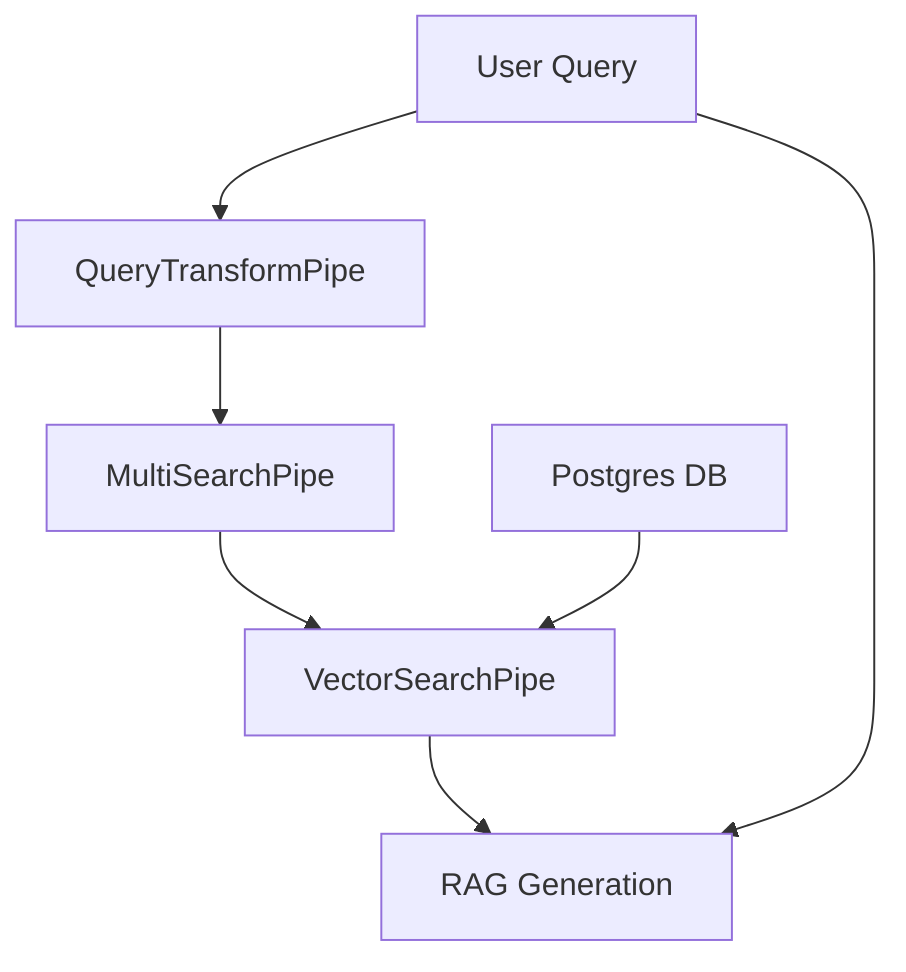
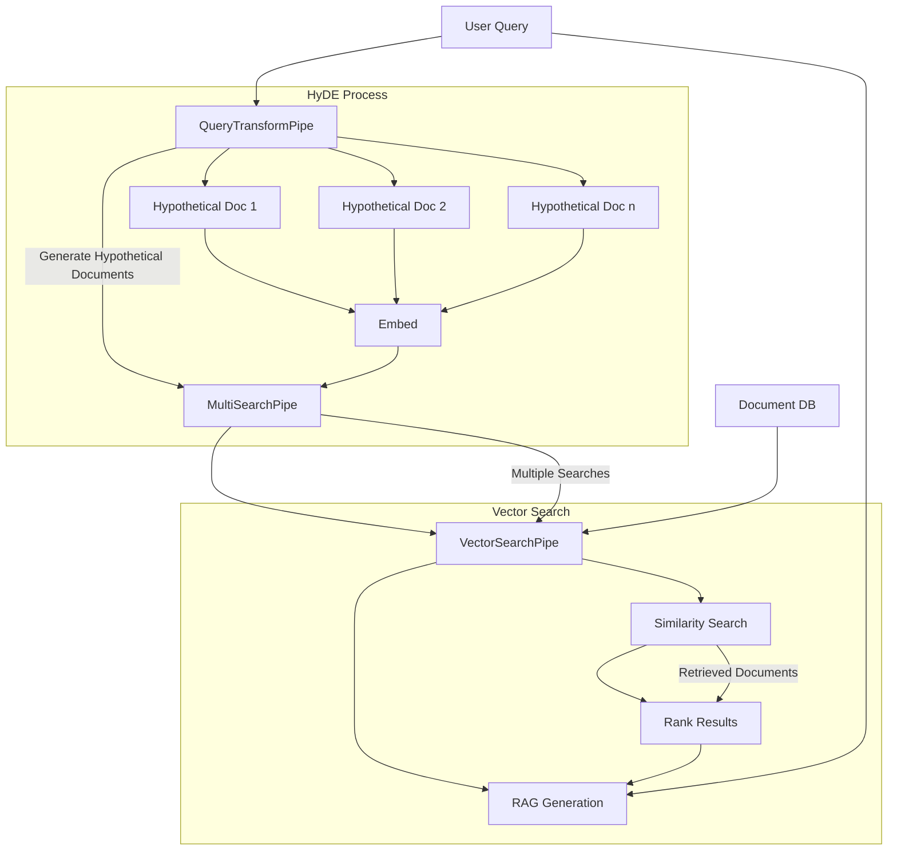

## Introduction

This cookbook will guide you through implementing Hypothetical Document Embeddings (**HyDE**), an advanced technique that significantly enhances RAG performance. By the end of this guide, you'll have a powerful, flexible RAG system that pushes the boundaries of what's possible in information retrieval and generation. You may then proceed to use this as a starting point for your own experimentation.

## What is HyDE?

HyDE is an innovative approach that supercharges dense retrieval, especially in zero-shot scenarios. Here's how it works:

1. **Query Expansion**: HyDE uses a Language Model to generate hypothetical answers or documents based on the user's query.
2. **Enhanced Embedding**: These hypothetical documents are embedded, creating a richer semantic search space.
3. **Similarity Search**: The embeddings are used to find the most relevant actual documents in your database.
4. **Informed Generation**: The retrieved documents and original query are used to generate the final response.

## Implementation Diagram

R2R is designed from the ground up to make it easy to implement advanced techniques like HyDE. Its modular architecture, based on pipes and pipelines, allows for easy customization and extension. Let's see how R2R's components come together to create a HyDE-powered RAG system:



The diagram which follows below illustrates the HyDE flow which fits neatly into the schema of our diagram above:


## HyDE with R2R

### Step 1: Serve A Custom R2R Application

First, let's write a script to build a custom R2R application which uses the HyDE-enabled pipeline:

```python examples/scripts/serve_with_hyde.py
from r2r import R2RBuilder, R2RConfig, R2RPipeFactoryWithMultiSearch
import fire


def main(task_prompt_name="hyde"):
    # Load the default configuration file
    config = R2RConfig.from_toml()

    app = (
        R2RBuilder(config)
        .with_pipe_factory(R2RPipeFactoryWithMultiSearch)
        .build(
            # Add optional override arguments which propagate to the pipe factory
            task_prompt_name=task_prompt_name,
        )
    )
    app.serve()

if __name__ == "__main__":
    fire.Fire(main)
```

The code above builds R2R with a custom factory which changes retrieval such that it:
1. Transforms input queries into hypothetical documents
2. Searches for relevant documents using these hypotheticals
3. Combines the results for final RAG generation


Now, to serve it in non-production settings, we can run the following:

```bash
python $r2r_workdir/py/core/examples/scripts/serve_with_hyde.py
```
This results in output like this -

```bash
2024-08-22 10:06:01,563 - INFO - core.providers.prompts.r2r_prompts - Loading prompts from SciPhi/r2r/py/core/providers/prompts/defaults
2024-08-22 10:06:01,584 - INFO - core.base.providers.prompt - Initializing PromptProvider with config extra_fields={} provider='r2r' default_system_name='default_system' default_task_name='default_rag' file_path=None.
2024-08-22 10:06:01,584 - INFO - core.base.providers.embedding - Initializing EmbeddingProvider with config extra_fields={} provider='litellm' base_model='openai/text-embedding-3-small' base_dimension=512 rerank_model=None rerank_dimension=None rerank_transformer_type=None batch_size=128 prefixes=None add_title_as_prefix=False concurrent_request_limit=256 max_retries=2 initial_backoff=1.0 max_backoff=60.0.
2024-08-22 10:06:01,584 - INFO - core.base.providers.llm - Initializing CompletionProvider with config: extra_fields={'concurrent_request_limit': 16} provider='litellm' generation_config=GenerationConfig(model='openai/gpt-4o', temperature=0.1, top_p=1.0, max_tokens_to_sample=1024, stream=False, functions=None, tools=None, add_generation_kwargs={}, api_base=None) concurrency_limit=16 max_retries=2 initial_backoff=1.0 max_backoff=60.0
2024-08-22 10:06:02,115 - INFO - core.base.providers.database - Initializing DatabaseProvider with config extra_fields={} provider='postgres'.
2024-08-22 10:06:02,115 - INFO - core.providers.database.vector - Using TCP connection
2024-08-22 10:06:03,320 - INFO - core.providers.database.vector - Successfully initialized PGVectorDB with collection: hyde_cookbook
2024-08-22 10:06:03,785 - INFO - core.providers.auth.r2r_auth - Default admin user already exists.
2024-08-22 10:06:04,025 - INFO - core.providers.chunking.r2r_chunking - Initializing text splitter with method: recursive
2024-08-22 10:06:04,025 - INFO - core.providers.chunking.r2r_chunking - R2RChunkingProvider initialized with config: extra_fields={} provider='r2r' method=<Method.RECURSIVE: 'recursive'> chunk_size=512 chunk_overlap=50 max_chunk_size=None
2024-08-22 10:06:04,026 - INFO - core.pipes.retrieval.query_transform_pipe - Initalizing an `QueryTransformPipe` pipe.
2024-08-22 10:06:04,160 - INFO - core.main.r2r - Starting R2R with version 0.3.0
INFO:     Started server process [42821]
INFO:     Waiting for application startup.
INFO:     Application startup complete.
INFO:     Uvicorn running on http://0.0.0.0:8000 (Press CTRL+C to quit)

```

The script above works by using a custom pipe factory, `R2RPipeFactoryWithMultiSearch` alongside the `R2RBuilder`. The custom factory overrides the default `create_vector_search_pipe` method of `R2RPipeFactory` to create a `MultiSearchPipe`. The `MultiSearchPipe` is a pre-built implementation in R2R which facilitates the conversion of an incoming query into multiple downstream queries. The implementation is actually rather simle, as we can see below:

```python
class R2RPipeFactoryWithMultiSearch(R2RPipeFactory):
    ...
    def create_vector_search_pipe(self, *args, **kwargs):
        """
        A factory method to create a search pipe.

        Overrides include
            task_prompt_name: str
            multi_query_transform_pipe_override: QueryTransformPipe
            multi_inner_search_pipe_override: SearchPipe
            query_generation_template_override: {'template': str, 'input_types': dict[str, str]}
        """

        ...

        # Initialize the new query transform pipe
        query_transform_pipe = kwargs.get(
            "multi_query_transform_pipe_override", None
        ) or QueryTransformPipe(
            llm_provider=self.providers.llm,
            prompt_provider=self.providers.prompt,
            config=QueryTransformPipe.QueryTransformConfig(
                name=multi_search_config.name,
                task_prompt=task_prompt_name,
            ),
        )

        # Create search pipe override and pipes
        inner_search_pipe = kwargs.get(
            "multi_inner_search_pipe_override", None
        ) or super().create_vector_search_pipe(*args, **kwargs)

        return MultiSearchPipe(
            query_transform_pipe=query_transform_pipe,
            inner_search_pipe=inner_search_pipe,
            config=multi_search_config,
        )


```


### Step 2: Run a HyDE-Powered Search Query

After running the server above, we can perform a search with HyDE using the CLI:

```
r2r search --query='Who is aristotle?'
```

Example Server Output:
```bash
2024-08-22 10:01:54,333 - INFO - core.pipes.retrieval.query_transform_pipe - Transforming query: Who is aristotle? into 3 outputs with hyde.
2024-08-22 10:01:57,484 - INFO - core.pipes.retrieval.query_transform_pipe - Yielding transformed output: Aristotle was an ancient Greek philosopher and polymath during the Classical period in Ancient Greece. He was a student of Plato and later became the teacher of Alexander the Great. His writings cover many subjects, including physics, biology, zoology, metaphysics, logic, ethics, aesthetics, poetry, theater, music, rhetoric, psychology, linguistics, economics, politics, and government. Aristotles works have influenced various fields of knowledge and are considered foundational texts in Western philosophy.
2024-08-22 10:01:57,958 - INFO - core.pipes.retrieval.query_transform_pipe - Yielding transformed output: Aristotle made significant contributions to the field of logic, particularly through his development of syllogistic logic, which became the basis for deductive reasoning. His work in this area laid the groundwork for future developments in logic and scientific methodology. Aristotle's logical treatises, collectively known as the "Organon," were used as the primary texts on logic for many centuries.
2024-08-22 10:01:58,234 - INFO - core.pipes.retrieval.query_transform_pipe - Yielding transformed output: In the realm of ethics, Aristotle is best known for his concept of virtue ethics, which emphasizes the importance of developing good character traits or virtues. According to Aristotle, the goal of human life is to achieve eudaimonia, often translated as "happiness" or "flourishing," which is attained by living a life in accordance with reason and virtue. His ethical theories are primarily outlined in his works "Nicomachean Ethics" and "Eudemian Ethics."
INFO:     127.0.0.1:60286 - "POST /v2/search HTTP/1.1" 200 OK
```

Example Completion Output:
```
{'fragment_id': 'f17ae8d3-4922-580b-a793-d02e6fbee253', 'extraction_id': 'ae1d1845-a005-564d-9c37-6da3f873ad03', 'document_id': '3ece9846-80de-5035-a064-223348aa505e', 'user_id': '2acb499e-8428-543b-bd85-0d9098718220', 'group_ids': [], 'score': 0.847668290138245, 'text': 'Aristotle[A] (Greek: Ἀριστοτέλης Aristotélēs, pronounced [aristotélɛːs]; 384–322 BC) was an Ancient Greek philosopher and polymath. His writings cover a broad range of subjects spanning the natural sciences, philosophy, linguistics, economics, politics, psychology, and the arts. As the founder of the Peripatetic school of philosophy in the Lyceum in Athens, he began the wider Aristotelian tradition that followed, which set the groundwork for the development of modern science.', 'metadata': {'title': 'aristotle.txt', 'version': 'v0', 'chunk_order': 0, 'associatedQuery': "Aristotle was an ancient Greek philosopher and polymath who lived from 384-322 BCE. He was a student of Plato and later became the teacher of Alexander the Great. Aristotle's writings cover a wide range of subjects, including metaphysics, ethics, politics, logic, and natural sciences. His work laid the foundation for much of Western philosophy and science."}}
...
{'fragment_id': '10506fbd-7f39-5534-b7ed-ea17f88a3592', 'extraction_id': 'ae1d1845-a005-564d-9c37-6da3f873ad03', 'document_id': '3ece9846-80de-5035-a064-223348aa505e', 'user_id': '2acb499e-8428-543b-bd85-0d9098718220', 'group_ids': [], 'score': 0.6503914206986781, 'text': "Instead, he practiced a different style of science: systematically gathering data, discovering patterns common to whole groups of animals, and inferring possible causal explanations from these.[78][79] This style is common in modern biology when large amounts of data become available in a new field, such as genomics. It does not result in the same certainty as experimental science, but it sets out testable hypotheses and constructs a narrative explanation of what is observed. In this sense, Aristotle's", 'metadata': {'title': 'aristotle.txt', 'version': 'v0', 'chunk_order': 96, 'associatedQuery': 'In addition to his philosophical work, Aristotle made significant contributions to the natural sciences. He conducted extensive research in biology, classifying various forms of life and studying their anatomy and behavior. His observations and classifications were used for centuries as the basis for biological studies.'}}
```


We can run as follows to use RAG instead:

```
r2r rag --query='Who is aristotle?'
```

### Step 3: Define a Custom HyDE Prompt

R2R comes with a default HyDE prompt, but you can easily customize it and pass it into your application builder:

```python
CUSTOM_HYDE_PROMPT = {
    "name": "hyde",
    "template": """
    ### Instruction:
    Given the query that follows, write {num_outputs} distinct, single-paragraph attempted answers.
    Each answer should focus on a specific aspect of the query and be suitable for semantic search.

    ### Query:
    {message}

    ### Response:
    """,
    "input_types": {"num_outputs": "int", "message": "str"}
}

# Use the `query_generation_template_override` for a custom prompt:
app = R2RBuilder(config).with_pipe_factory(
    R2RPipeFactoryWithMultiSearch
).build(
    query_generation_template_override=CUSTOM_HYDE_PROMPT
)
```

Alternatively, this override prompt can be passed in at runtime with by setting the argument `task_prompt_override` in your request to `/rag`.

### Step 4: HyDE Benefits & Considerations

**Benefits:**
- **Improved Zero-Shot Performance**: Excel at answering questions on topics not explicitly in your database.
- **Enhanced Retrieval Quality**: Find more semantically relevant documents, even with complex queries.
- **Flexibility**: Easily adapt to different domains and tasks by tweaking the HyDE prompt.

**Considerations:**
- **Computational Cost**: Generating hypothetical documents adds processing time. Consider the trade-off for your use case.

## Example - Web Search

As another example of advanced RAG we turn to web search. Combining web search with your RAG pipeline allows for access to real-time information from the internet. This is particularly useful for queries that require up-to-date information or when your local knowledge base might not have sufficient data.

### Implementing Web Search in R2R

To use web search in your R2R application, you'll need to create a `WebSearchPipe` and integrate it into your pipeline. Here's how you can do it:

1. First, create a `WebSearchPipe`:

```python examples/scripts/serve_with_web.py
import fire
from r2r import R2RBuilder, SerperClient, WebSearchPipe


def run_rag_pipeline():
    # Create search pipe override and pipes
    web_search_pipe = WebSearchPipe(
        serper_client=SerperClient()  # TODO - Develop a `WebSearchProvider` for configurability
    )

    app = R2RBuilder().with_vector_search_pipe(web_search_pipe).build()

    app.serve()


if __name__ == "__main__":
    fire.Fire(run_rag_pipeline)
```

### Running Web Search RAG

Now that the server is running we perform search or RAG exactly as above, except now the results will be rooted in web sources.
This will produce output similar to:

```
Final Result:
{'fragment_id': '4ef24f90-b9d6-5423-887b-4884f652b0fb', 'extraction_id': 'e52afc3d-3d68-579c-91a1-632007e1ff43', 'document_id': 'ea7bd18e-e7b6-5733-bfdd-7346e95eeb24', 'user_id': None, 'group_ids': [], 'score': 0.0, 'text': 'Aristotle, ancient Greek philosopher and scientist who was one of the greatest intellectual figures of Western history.', 'metadata': {'title': 'Aristotle | Biography, Works, Quotes, Philosophy, Ethics, & Facts', 'link': 'https://www.britannica.com/biography/Aristotle', 'sitelinks': [{'title': 'Philosophy of mind of Aristotle', 'link': 'https://www.britannica.com/biography/Aristotle/Philosophy-of-mind'}, {'title': 'Political theory', 'link': 'https://www.britannica.com/biography/Aristotle/Political-theory'}, {'title': 'The Lyceum', 'link': 'https://www.britannica.com/biography/Aristotle/The-Lyceum'}, {'title': 'Aristotle Facts', 'link': 'https://www.britannica.com/facts/Aristotle'}], 'position': 1, 'type': 'organic'}}
...
{'fragment_id': '86aee229-a560-5e57-8e4b-c762b1713864', 'extraction_id': 'cbb7ede3-4ef5-5c2b-a4c3-a35bed29d95b', 'document_id': 'acb45ad9-46d4-5bcd-94be-e3fa7e9c206f', 'user_id': None, 'group_ids': [], 'score': 0.0, 'text': "Aristotle's concepts are function, classification, and hierarchy; he uses these concepts to explain everything.", 'metadata': {'question': 'What are the three main ideas of Aristotle?', 'title': "An Introduction to Aristotle's Metaphysics – Philosophical Thought", 'link': 'https://open.library.okstate.edu/introphilosophy/chapter/__unknown__/', 'type': 'peopleAlsoAsk'}}
```

### Combining HyDE + Web Search

As a final example, we show how easy it is to combine the two approaches shown above into an implementation of R2R which performs HyDE with web search.

```python core/examples/scripts/serve_with_web_hyde
import fire
from core import R2RBuilder, SerperClient, WebSearchPipe
from core.base.abstractions.llm import GenerationConfig
from core.main.assembly.factory_extensions import R2RPipeFactoryWithMultiSearch


def run_rag_pipeline():
    # Initialize a web search pipe
    web_search_pipe = WebSearchPipe(serper_client=SerperClient())

    # Define a new synthetic query generation template
    synthetic_query_generation_template = {
        "name": "synthetic_query_generation_template",
        "template": """
            ### Instruction:
            Given the following query, write a double newline separated list of up to {num_outputs} advanced queries meant to help answer the original query.
            DO NOT generate any single query which is likely to require information from multiple distinct documents.
            EACH single query will be used to carry out a cosine similarity semantic search over distinct indexed documents.
            FOR EXAMPLE, if asked `how do the key themes of Great Gatsby compare with 1984`, the two queries would be
            `What are the key themes of Great Gatsby?` and `What are the key themes of 1984?`.
            Here is the original user query to be transformed into answers:

            ### Query:
            {message}

            ### Response:
            """,
        "input_types": {"num_outputs": "int", "message": "str"},
    }

    # Build the R2R application with the custom pipeline
    app = (
        R2RBuilder()
        .with_pipe_factory(R2RPipeFactoryWithMultiSearch)
        .build(
            # override inputs consumed in building the MultiSearchPipe
            multi_inner_search_pipe_override=web_search_pipe,
            query_generation_template_override=synthetic_query_generation_template,
        )
    ).serve()

if __name__ == "__main__":
    fire.Fire(run_rag_pipeline)
```

## Conclusion and Next Steps

Congratulations! You've just implemented an advanced RAG technique that puts you at the forefront of AI-powered information retrieval and generation. With R2R and HyDE, you're well-equipped to tackle complex queries and deliver high-quality, context-aware responses.

Where to go from here?
1. Experiment with different HyDE prompts to optimize for your specific domain.
2. Try combining HyDE with other R2R features like knowledge graph integration for even more powerful RAG systems.
3. Dive into R2R's documentation to discover more advanced techniques and customization options. For more information, refer [here](/documentation/deep-dive/main/introduction).
