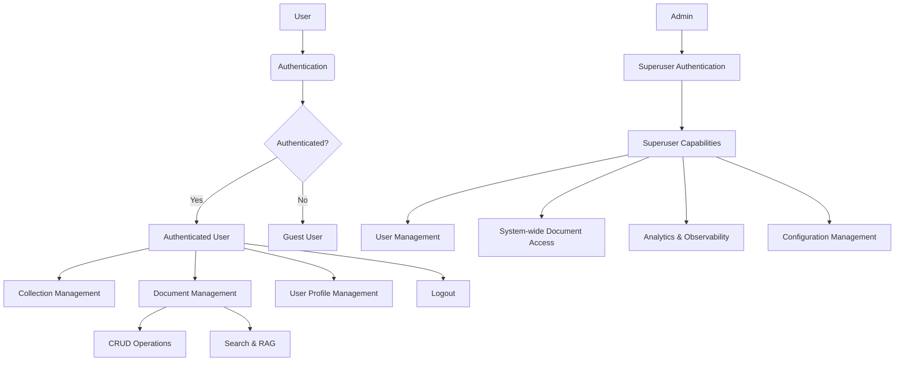

## Introduction

A collection in R2R is a logical grouping of users and documents that allows for efficient access control and organization. Collections enable you to manage permissions and access to documents at a group level, rather than individually.

R2R provides robust document collection management, allowing developers to implement efficient access control and organization of users and documents. This cookbook will guide you through the collection capabilities in R2R.

For user authentication, please refer to the [User Auth Cookbook](/cookbooks/user-auth).

<Note>
Collection permissioning in R2R is still under development and as a result the is likely to API continue evolving in future releases.
</Note>



_A diagram showing user and collection management across r2r_

## Basic Usage

<Info>
Collections currently follow a flat hierarchy wherein superusers are responsible for management operations. This functionality will expand as development on R2R continues.
</Info>

### Creating a Collection

Let's start by creating a new collection:

```python
from r2r import R2RClient

client = R2RClient("http://localhost:7272")  # Replace with your R2R deployment URL

# Assuming you're logged in as an admin or a user with appropriate permissions
# For testing, the default R2R implementation will grant superuser privileges to anon api calls
collection_result = client.create_collection("Marketing Team", "Collection for marketing department")

print(f"Collection creation result: {collection_result}")
# {'results': {'collection_id': '123e4567-e89b-12d3-a456-426614174000', 'name': 'Marketing Team', 'description': 'Collection for marketing department', 'created_at': '2024-07-16T22:53:47.524794Z', 'updated_at': '2024-07-16T22:53:47.524794Z'}}
```

### Getting Collection details

To retrieve details about a specific collection:

```python
collection_id = '123e4567-e89b-12d3-a456-426614174000'  # Use the collection_id from the creation result
collection_details = client.get_collection(collection_id)

print(f"Collection details: {collection_details}")
# {'results': {'collection_id': '123e4567-e89b-12d3-a456-426614174000', 'name': 'Marketing Team', 'description': 'Collection for marketing department', 'created_at': '2024-07-16T22:53:47.524794Z', 'updated_at': '2024-07-16T22:53:47.524794Z'}}
```

### Updating a Collection

You can update a collection's name or description:

```python
update_result = client.update_collection(collection_id, name="Updated Marketing Team", description="New description for marketing team")

print(f"Collection update result: {update_result}")
# {'results': {'collection_id': '123e4567-e89b-12d3-a456-426614174000', 'name': 'Updated Marketing Team', 'description': 'New description for marketing team', 'created_at': '2024-07-16T22:53:47.524794Z', 'updated_at': '2024-07-16T23:15:30.123456Z'}}
```

### Listing Collections

To get a list of all collections:

```python
collections_list = client.list_collections()

print(f"Collections list: {collections_list}")
# {'results': [{'collection_id': '123e4567-e89b-12d3-a456-426614174000', 'name': 'Updated Marketing Team', 'description': 'New description for marketing team', 'created_at': '2024-07-16T22:53:47.524794Z', 'updated_at': '2024-07-16T23:15:30.123456Z'}, ...]}
```

## User Management in Collections

### Adding a User to a Collection

To add a user to a collection, you need both the user's ID and the collections's ID:

```python
user_id = '456e789f-g01h-34i5-j678-901234567890'  # This should be a valid user ID
add_user_result = client.add_user_to_collection(user_id, collection_id)

print(f"Add user to collection result: {add_user_result}")
# {'results': {'message': 'User successfully added to the collection'}}
```

### Removing a User from a Collections

Similarly, to remove a user from a collection:

```python
remove_user_result = client.remove_user_from_collection(user_id, collection_id)

print(f"Remove user from collection result: {remove_user_result}")
# {'results': None}
```

### Listing Users in a Collection

To get a list of all users in a specific collection:

```python
users_in_collection = client.get_users_in_collection(collection_id)

print(f"Users in collection: {users_in_collection}")
# {'results': [{'user_id': '456e789f-g01h-34i5-j678-901234567890', 'email': 'user@example.com', 'name': 'John Doe', ...}, ...]}
```

### Getting Collections for a User

To get all collections that a user is a member of:

```python
user_collections = client.user_collections(user_id)

print(f"User's collections: {user_collections}")
# {'results': [{'collection_id': '123e4567-e89b-12d3-a456-426614174000', 'name': 'Updated Marketing Team', ...}, ...]}
```

## Document Management in Collections

### Assigning a Document to a Collection

To assign a document to a collection:

```python
document_id = '789g012j-k34l-56m7-n890-123456789012'  # This should be a valid document ID
assign_doc_result = client.assign_document_to_collection(document_id, collection_id)

print(f"Assign document to collection result: {assign_doc_result}")
# {'results': {'message': 'Document successfully assigned to the collection'}}
```

### Removing a Document from a Collection

To remove a document from a collection:

```python
remove_doc_result = client.remove_document_from_collection(document_id, collection_id)

print(f"Remove document from collection result: {remove_doc_result}")
# {'results': {'message': 'Document successfully removed from the collection'}}
```

### Listing Documents in a Collection

To get a list of all documents in a specific collection:

```python
docs_in_collection = client.documents_in_collection(collection_id)

print(f"Documents in collection: {docs_in_collection}")
# {'results': [{'document_id': '789g012j-k34l-56m7-n890-123456789012', 'title': 'Marketing Strategy 2024', ...}, ...]}
```

### Getting Collections for a Document

To get all collections that a document is assigned to:

```python
document_collections = client.document_collections(document_id)

print(f"Document's collections: {document_collections}")
# {'results': [{'collection_id': '123e4567-e89b-12d3-a456-426614174000', 'name': 'Updated Marketing Team', ...}, ...]}
```

## Advanced Collection Management

### Collection Overview

To get an overview of collection, including user and document counts:

```python
collections_overview = client.collections_overview()

print(f"Collections overview: {collections_overview}")
# {'results': [{'collection_id': '123e4567-e89b-12d3-a456-426614174000', 'name': 'Updated Marketing Team', 'description': 'New description for marketing team', 'user_count': 5, 'document_count': 10, ...}, ...]}
```

### Deleting a Collection

To delete a collection:

```python
delete_result = client.delete_collection(collection_id)

print(f"Delete collection result: {delete_result}")
# {'results': {'message': 'Collection successfully deleted'}}
```

## Pagination and Filtering

Many of the collection-related methods support pagination and filtering. Here are some examples:

```python
# List collections with pagination
paginated_collection = client.list_collections(offset=10, limit=20)

# Get users in a collection with pagination
paginated_users = client.get_users_in_collection(collection_id, offset=5, limit=10)

# Get documents in a collection with pagination
paginated_docs = client.documents_in_collection(collection_id, offset=0, limit=50)

# Get collections overview with specific collection IDs
specific_collections_overview = client.collections_overview(collection_ids=['id1', 'id2', 'id3'])
```

## Security Considerations

When implementing collection permissions, consider the following security best practices:

1. **Least Privilege Principle**: Assign the minimum necessary permissions to users and collections.
2. **Regular Audits**: Periodically review collection memberships and document assignments.
3. **Access Control**: Ensure that only authorized users (e.g., admins) can perform collection management operations.
4. **Logging and Monitoring**: Implement comprehensive logging for all collection-related actions.

## Customizing Collection Permissions

While R2R's current collection system follows a flat hierarchy, you can build more complex permission structures on top of it:

1. **Custom Roles**: Implement application-level roles within collections (e.g., collection admin, editor, viewer).
2. **Hierarchical Collections**: Create a hierarchy by establishing parent-child relationships between collections in your application logic.
3. **Permission Inheritance**: Implement rules for permission inheritance based on collection memberships.

## Troubleshooting

Here are some common issues and their solutions:

1. **Unable to Create/Modify Collections**: Ensure the user has superuser privileges.
2. **User Not Seeing Collection Content**: Verify that the user is correctly added to the collection and that documents are properly assigned.
3. **Performance Issues with Large Collections**: Use pagination when retrieving users or documents in large collections.

## Conclusion

R2R's collection permissioning system provides a foundation for implementing sophisticated access control in your applications. As the feature set evolves, more advanced capabilities will become available. Stay tuned to the R2R documentation for updates and new features related to collection permissions.

For user authentication and individual user management, refer to the [User Auth Cookbook](/cookbooks/user-auth). For more advanced use cases or custom implementations, consult the R2R documentation or reach out to the community for support.
