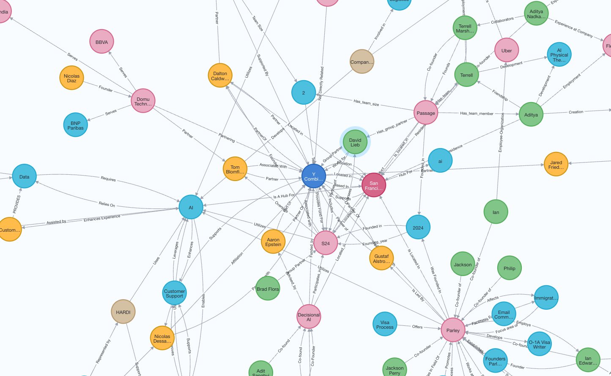
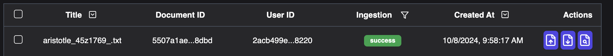
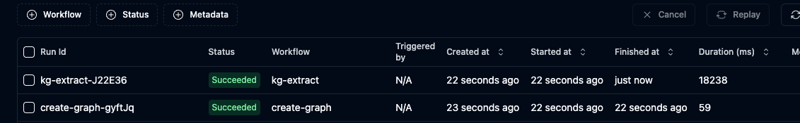

## Introduction

GraphRAG is a powerful feature of R2R that allows you to perform graph-based search and retrieval. This guide will walk you through the process of setting it up and running your first queries.


<Frame caption="An example knowledge graph constructed from companies in the YC directory.">
  
</Frame>

<Note>
Note that graph construction may take long for local LLMs, we recommend using cloud LLMs for faster results.
</Note>


## Start server

We provide three configurations for R2R Light, R2R Light with Local LLMs, and R2R Full with Docker+Hatchet. If you want to get started quickly, we recommend using R2R Light. If you want to run large graph workloads, we recommend using R2R Full with Docker+Hatchet.

<Tabs>
<Tab title="R2R Light">
```bash
r2r serve
```

<Accordion icon="gear" title="Configuration: r2r.toml">
``` toml
[kg]
provider = "postgres"
batch_size = 256

  [kg.kg_creation_settings]
    kg_triples_extraction_prompt = "graphrag_triples_extraction_few_shot"
    entity_types = [] # if empty, all entities are extracted
    relation_types = [] # if empty, all relations are extracted
    max_knowledge_triples = 100
    fragment_merge_count = 4 # number of fragments to merge into a single extraction
    generation_config = { model = "openai/gpt-4o-mini" } # and other params, model used for triplet extraction

  [kg.kg_enrichment_settings]
    max_description_input_length = 65536 # increase if you want more comprehensive descriptions
    max_summary_input_length = 65536 # increase if you want more comprehensive summaries
    generation_config = { model = "openai/gpt-4o-mini" } # and other params, model used for node description and graph clustering
    leiden_params = {}

  [kg.kg_search_settings]
    generation_config = { model = "openai/gpt-4o-mini" }
```
</Accordion>
</Tab>

<Tab title="R2R Light with Local LLMs">
```bash
r2r serve --config-name=local_llm
```

<Accordion icon="gear" title="Configuration: local_llm">
``` toml
[completion]
provider = "litellm"
concurrent_request_limit = 1
model = "ollama/llama3.1"
temperature = 0.1
top_p = 1
max_tokens_to_sample = 1_024
stream = false
add_generation_kwargs = { }

[embedding]
provider = "ollama"
base_model = "mxbai-embed-large"
base_dimension = 1_024
batch_size = 32
add_title_as_prefix = true

[parsing]
excluded_parsers = [ "mp4" ]

[kg]
provider = "postgres"

  [kg.kg_creation_settings]
    kg_triples_extraction_prompt = "graphrag_triples_extraction_few_shot"
    entity_types = [] # if empty, all entities are extracted
    relation_types = [] # if empty, all relations are extracted
    max_knowledge_triples = 100
    fragment_merge_count = 4 # number of fragments to merge into a single extraction
    generation_config = { model = "ollama/llama3.1" } # and other params, model used for triplet extraction

  [kg.kg_enrichment_settings]
    max_description_input_length = 65536 # increase if you want more comprehensive descriptions
    max_summary_input_length = 65536
    generation_config = { model = "ollama/llama3.1" } # and other params, model used for node description and graph clustering
    leiden_params = {}

  [kg.kg_search_settings]
    generation_config = { model = "ollama/llama3.1" }

[database]
provider = "postgres"

[agent]
system_instruction_name = "rag_agent"
tool_names = ["search"]

  [agent.generation_config]
  model = "ollama/llama3.1"
```
</Accordion>
</Tab>

<Tab title="R2R Full with Docker+Hatchet">
```bash
r2r serve --full --docker --config-name=full
```
<Accordion icon="gear" title="Configuration: full.toml">
``` toml
[ingestion]
provider = "unstructured_local"
strategy = "auto"
chunking_strategy = "by_title"
new_after_n_chars = 512
max_characters = 1_024
combine_under_n_chars = 128
overlap = 20

[orchestration]
provider = "hatchet"
```
</Accordion>
</Tab>
</Tabs>


## Ingesting files

We begin the cookbook by ingesting the default sample file `aristotle.txt` used across R2R tutorials and cookbooks:

<Tabs>
<Tab title="CLI">
```bash
r2r ingest-sample-file
# or
r2r ingest-files /path/to/your/files_or_directory

# Example Response
[{'message': 'Ingestion task queued successfully.', 'task_id': '2b16bb55-4f47-4e66-a6bd-da9e215b9793', 'document_id': '9fbe403b-c11c-5aae-8ade-ef22980c3ad1'}]
```
</Tab>

<Tab title="SDK">
```python
from r2r import R2RClient

import requests
import tempfile
import os

# URL of the raw content on GitHub
url = "https://raw.githubusercontent.com/SciPhi-AI/R2R/main/py/core/examples/data/aristotle.txt"

# Fetch the content
response = requests.get(url)
content = response.text

# Create a temporary file
with tempfile.NamedTemporaryFile(mode='w', delete=False, suffix='.txt', prefix='aristotle_') as temp_file:
    # Write the content to the temporary file
    temp_file.write(content)
    temp_file_path = temp_file.name

client = R2RClient("http://localhost:7272")
client.ingest_files([temp_file_path])

# Example Response
[{'message': 'Ingestion task queued successfully.', 'task_id': '2b16bb55-4f47-4e66-a6bd-da9e215b9793', 'document_id': '9fbe403b-c11c-5aae-8ade-ef22980c3ad1'}]
```
</Tab>
</Tabs>

The initial ingestion step adds parses the given documents and inserts them into R2R's relational and vector databases, enabling document management and semantic search over them. The `aristotle.txt` example file is typically ingested in under 10s. You can confirm ingestion is complete by querying the documents overview table:

```bash
r2r documents-overview

# Example Response
{'id': '9fbe403b-c11c-5aae-8ade-ef22980c3ad1', 'title': 'aristotle.txt', 'user_id': '2acb499e-8428-543b-bd85-0d9098718220', 'type': 'txt', 'created_at': '2024-09-05T18:20:47.921933Z', 'updated_at': '2024-09-05T18:20:47.921938Z', 'ingestion_status': 'success', 'restructuring_status': 'pending', 'version': 'v0', 'collection_ids': [], 'metadata': {'version': 'v0'}}
```

When ingestion completes successfully for a given file we will find that `ingestion_status` reads `success` in the corresponding output. You can also view in R2R's dashboard on http://localhost:7273 that the file has been ingested.



## Create Knowledge Graph

Knowledge graph creation is done in two steps:

1. `create-graph`: Extracts nodes and relationships from your input document collection.
2. `enrich-graph`: Enhances the graph structure through clustering and explaining entities (commonly referred to as `GraphRAG`).


<Tabs>
<Tab title="CLI">
```bash
# Cost Estimation step.
# collection ID is optional. If you don't specify one, the default collection will be used.
r2r create-graph --collection-id=122fdf6a-e116-546b-a8f6-e4cb2e2c0a09

This will run a cost estimation step to give you an estimate of the cost of the graph creation process.

# Example Response
Time taken: 0.21 seconds
{
  "results": {
    "message": "Ran Graph Creation Estimate (not the actual run). Note that these are estimated ranges, actual values may vary. To run the KG creation process, run `create-graph` with `--run` in the cli, or `run_type=\"run\"` in the client.",
    "document_count": 2,
    "number_of_jobs_created": 3,
    "total_chunks": 29,
    "estimated_entities": "290 - 580",
    "estimated_triples": "362 - 870",
    "estimated_llm_calls": "348 - 638",
    "estimated_total_in_out_tokens_in_millions": "0 - 1",
    "estimated_total_time_in_minutes": "Depends on your API key tier. Accurate estimate coming soon. Rough estimate: 0.0 - 0.17",
    "estimated_cost_in_usd": "0.0 - 0.06"
  }
}

# Then, you can run the graph creation process with:
r2r create-graph --collection-id=<optional> --run

# Example response for R2R Light
[{'message': 'Graph created successfully, please run enrich-graph to enrich the graph for GraphRAG.'}]

# Example Response for R2R Full. This call is non-blocking and returns immediately. We can check the status using the hatchet dashboard on http://localhost:7274. Details below:
[{'message': 'Graph creation task queued successfully.', 'task_id': 'd9dae1bb-5862-4a16-abaf-5297024df390'}]
```
</Tab>

<Tab title="SDK">
```python
from r2r import R2RClient

client = R2RClient("http://localhost:7272")
kg_search_settings = { 'run_mode': 'estimate' }
estimate = client.create_graph(collection_id=collection_id, kg_search_settings=kg_search_settings)
print(estimate)
# This will run a cost estimation step to give you an estimate of the cost of the graph creation process.

# Example Response
Time taken: 0.21 seconds
{
  "results": {
    "message": "These are estimated ranges, actual values may vary. To run the KG creation process, run `create-graph` with `--run` in the cli, or `run_mode=\"run\"` in the client.",
    "document_count": 2,
    "number_of_jobs_created": 3,
    "total_chunks": 29,
    "estimated_entities": "290 - 580",
    "estimated_triples": "362 - 870",
    "estimated_llm_calls": "348 - 638",
    "estimated_total_in_out_tokens_in_millions": "0 - 1",
    "estimated_total_time_in_minutes": "Depends on your API key tier. Accurate estimate coming soon. Rough estimate: 0.0 - 0.17",
    "estimated_cost_in_usd": "0.0 - 0.06"
  }
}

# Then, you can run the graph creation process with:
kg_search_settings = { 'run_mode': 'run' }
client.create_graph(collection_id=collection_id, kg_search_settings=kg_search_settings)

# Example response for R2R Light
[{'message': 'Graph created successfully, please run enrich-graph to enrich the graph for GraphRAG.'}]

# Example Response for R2R Full. This call is non-blocking and returns immediately. We can check the status using the hatchet dashboard on http://localhost:7274. Details below:
[{'message': 'Graph creation task queued successfully.', 'task_id': 'd9dae1bb-5862-4a16-abaf-5297024df390'}]


```
</Tab>

</Tabs>

If you are using R2R Full, you can log into the hatchet dashboard on http://localhost:7274 (admin@example.com / Admin123!!) to check the status of the graph creation process. Please make sure all the `kg-extract-*` tasks are completed before running the enrich-graph step.




This step will create a knowledge graph with nodes and relationships. You can get the entities and relationships in the graph using our dashboard on http://localhost:7273 or by calling the following API endpoints. These hit the /v2/entities and /v2/triples endpoints respectively. This will by default use the `entity_level=document` query parameter to get the entities and triples at the document level. We will set the default collection id to `122fdf6a-e116-546b-a8f6-e4cb2e2c0a09` in the examples below.

- Entities: [Entities](http://localhost:7272/v2/entities?collection_id=122fdf6a-e116-546b-a8f6-e4cb2e2c0a09&entity_level=document)
- Triples: [Triples](http://localhost:7272/v2/triples?collection_id=122fdf6a-e116-546b-a8f6-e4cb2e2c0a09&entity_level=document)


## Entity Deduplication

Note that the entities and triples are created at the document level. This means that if you have multiple documents with the same entity, the entity will be duplicated for each document.

To deduplicate the entities, you can run the `deduplicate-entities` endpoint. This endpoint will merge duplicate entities and delete the duplicate entities.

<Tabs>
<Tab title="CLI">
```bash
r2r deduplicate-entities --collection-id=122fdf6a-e116-546b-a8f6-e4cb2e2c0a09

# Example Response
[{'message': 'Deduplication task queued successfully.', 'task_id': 'd9dae1bb-5862-4a16-abaf-5297024df390'}]
```
</Tab>

<Tab title="SDK">
```python
from r2r import R2RClient

client = R2RClient("http://localhost:7272")
client.deduplicate_entities(collection_id="122fdf6a-e116-546b-a8f6-e4cb2e2c0a09")

# Example Response
[{'message': 'Deduplication task queued successfully.', 'task_id': 'd9dae1bb-5862-4a16-abaf-5297024df390'}]
```
</Tab>
</Tabs>

You can check the status of the deduplication task using the hatchet dashboard on http://localhost:7274. And once that is complete, check the endpoints at a entity_level = collection to see the deduplicated entities and triples.

- Entities: [Entities](http://localhost:7272/v2/entities?collection_id=122fdf6a-e116-546b-a8f6-e4cb2e2c0a09&entity_level=collection)
- Triples: [Triples](http://localhost:7272/v2/triples?collection_id=122fdf6a-e116-546b-a8f6-e4cb2e2c0a09&entity_level=collection)


## Graph Enrichment

Now we have a searchable graph, but this graph is not enriched yet. It does not have any community level information. We will now run the enrichment step.

The graph enrichment step performs hierarchical leiden clustering to create communities, and embeds the descriptions. These embeddings will be used later in the local search stage of the pipeline. If you are more interested in the algorithm, please refer to the blog post [here](https://www.sciphi.ai/blog/graphrag).

<Tabs>
<Tab title="CLI">
```bash
# collection ID is optional. If you don't specify one, the default collection will be used.
r2r enrich-graph --collection-id=122fdf6a-e116-546b-a8f6-e4cb2e2c0a09

# Similar to the graph creation step, this will run a cost estimation step to give you an estimate of the cost of the graph enrichment process.
Time taken: 0.22 seconds
{
  "results": {
    "total_entities": 269,
    "total_triples": 345,
    "estimated_llm_calls": "26 - 53",
    "estimated_total_in_out_tokens_in_millions": "0.05 - 0.11",
    "estimated_total_time_in_minutes": "Depends on your API key tier. Accurate estimate coming soon. Rough estimate: 0.01 - 0.02",
    "estimated_cost_in_usd": "0.0 - 0.01"
  }
}

# Now, you can run the graph enrichment process with:
r2r enrich-graph --collection-id=122fdf6a-e116-546b-a8f6-e4cb2e2c0a09 --run

# Example Response with R2R Light
[{'message': 'Graph enriched successfully.'}]

# Example Response with R2R Full, you can check the status using the hatchet dashboard on http://localhost:7274.
[{'message': 'Graph enrichment task queued successfully.', 'task_id': 'd9dae1bb-5862-4a16-abaf-5297024df390'}]
```
</Tab>

<Tab title="SDK">
```python
from r2r import R2RClient

client = R2RClient("http://localhost:7272")
kg_search_settings = { 'run_mode': 'estimate' }
collection_id = "122fdf6a-e116-546b-a8f6-e4cb2e2c0a09" # optional, if not specified, the default collection will be used.
estimate = client.enrich_graph(collection_id=collection_id, kg_search_settings=kg_search_settings)
print(estimate)

# This will run a cost estimation step to give you an estimate of the cost of the graph enrichment process.

# Example Response
Time taken: 0.22 seconds
{
  "results": {
    "total_entities": 269,
    "total_triples": 345,
    "estimated_llm_calls": "26 - 53",
    "estimated_total_in_out_tokens_in_millions": "0.05 - 0.11",
    "estimated_total_time_in_minutes": "Depends on your API key tier. Accurate estimate coming soon. Rough estimate: 0.01 - 0.02",
    "estimated_cost_in_usd": "0.0 - 0.01"
  }
}

# Now, you can run the graph enrichment process with:
kg_search_settings = { 'run_mode': 'run' }
client.enrich_graph(collection_id=collection_id, kg_search_settings=kg_search_settings)

# Example Response with R2R Light
[{'message': 'Graph enriched successfully.'}]

# Example Response with R2R Full, you can check the status using the hatchet dashboard on http://localhost:7274.
[{'message': 'Graph enrichment task queued successfully.', 'task_id': 'd9dae1bb-5862-4a16-abaf-5297024df390'}]
```
</Tab>
</Tabs>

If you're using R2R Full, you can similarly check that all `community-summary-*` tasks are completed before proceeding.


Now you can see that the graph is enriched with the following information. We have added descriptions and embeddings to the nodes and relationships. Also, each node is mapped to a community. Following is a visualization of the enriched graph (deprecated as of now. We are working on a new visualization tool):

You can see the list of communities in the graph using the following API endpoint:

- Communities: [Communities](http://localhost:7272/v2/communities?collection_id=122fdf6a-e116-546b-a8f6-e4cb2e2c0a09)

## Search

A knowledge graph search performs similarity search on the entity and community description embeddings.

```bash

r2r search --query="Who is Aristotle?" --use-kg-search

# The answer will be returned in JSON format and contains results from entities, relationships and communities. Following is a snippet of the output:

Vector search results:
[
  {
    'fragment_id': 'ecc754cd-380d-585f-84ac-021542ef3c1d',
    'extraction_id': '92d78034-8447-5046-bf4d-e019932fbc20',
    'document_id': '9fbe403b-c11c-5aae-8ade-ef22980c3ad1',
    'user_id': '2acb499e-8428-543b-bd85-0d9098718220',
    'collection_ids': [],
    'score': 0.7393344796100582,
    'text': 'Aristotle[A] (Greek: Ἀριστοτέλης Aristotélēs, pronounced [aristotélɛːs]; 384–322 BC) was an Ancient Greek philosopher and polymath. His writings cover a broad range of subjects spanning the natural sciences, philosophy, linguistics, economics, politics, psychology, and the arts. As the founder of the Peripatetic school of philosophy in the Lyceum in Athens, he began the wider Aristotelian tradition that followed, which set the groundwork for the development of modern science.\n\nLittle is known about Aristotle's life. He was born in the city of Stagira in northern Greece during the Classical period. His father, Nicomachus, died when Aristotle was a child, and he was brought up by a guardian. At 17 or 18, he joined Plato's Academy in Athens and remained there until the age of 37 (c.\u2009347 BC). Shortly after Plato died, Aristotle left Athens and, at the request of Philip II of Macedon, tutored his son Alexander the Great beginning in 343 BC. He established a library in the Lyceum, which helped him to produce many of his hundreds of books on papyrus scrolls.\n\nThough Aristotle wrote many elegant treatises and dia ...",
    'metadata': {'title': 'aristotle.txt', 'version': 'v0', 'file_name': 'tmpm3ceiqs__aristotle.txt', 'chunk_order': 0, 'document_type': 'txt', 'size_in_bytes': 73353, 'unstructured_filetype': 'text/plain', 'unstructured_languages': ['eng'], 'partitioned_by_unstructured': True, 'associatedQuery': 'Who is Aristotle?'}}
  }, ...
]

KG search results:
{
  'local_result': {
    'query': 'Who is Aristotle?',
    'entities': {'0': {'name': 'Aristotle', 'description': 'Aristotle was an ancient Greek philosopher and polymath, recognized as the father of various fields including logic, biology, and political science. He authored significant works such as the *Nicomachean Ethics* and *Politics*, where he explored concepts of virtue, governance, and the nature of reality, while also critiquing Platos ideas. His teachings and observations laid the groundwork for numerous disciplines, influencing thinkers ...'}},
    'relationships': {},
    'communities': {'0': {'summary': '```json\n{\n    "title": "Aristotle and His Contributions",\n    "summary": "The community revolves around Aristotle, an ancient Greek philosopher and polymath, who made significant contributions to various fields including logic, biology, political science, and economics. His works, such as 'Politics' and 'Nicomachean Ethics', have influenced numerous disciplines and thinkers from antiquity through the Middle Ages and beyond. The relationships between his various works and the fields he contributed to highlight his profound impact on Western thought.",\n    "rating": 9.5,\n    "rating_explanation": "The impact severity rating is high due to Aristotle's foundational influence on multiple disciplines and his enduring legacy in Western philosophy and science.",\n    "findings": [\n        {\n            "summary": "Aristotle's Foundational Role in Logic",\n            "explanation": "Aristotle is credited with the earliest study of formal logic, and his conception of it was the dominant form of Western logic until the 19th-century advances in mathematical logic. His works compiled into a set of six bo ...}}}}
  },
  'global_result': None
}
Time taken: 2.39 seconds
```

# Conclusion

In conclusion, integrating R2R with GraphRAG significantly enhances the capabilities of your RAG applications. By leveraging the power of graph-based knowledge representations, GraphRAG allows for more nuanced and context-aware information retrieval. This is evident in the example query we ran using R2R, which not only retrieved relevant information but also provided a structured analysis of the key contributions of Aristotle to modern society.

In essence, combining R2R with GraphRAG empowers your RAG applications to deliver more intelligent, context-aware, and insightful responses, making it a powerful tool for advanced information retrieval and analysis tasks.

Feel free to reach out to us at founders@sciphi.ai if you have any questions or need further assistance.
