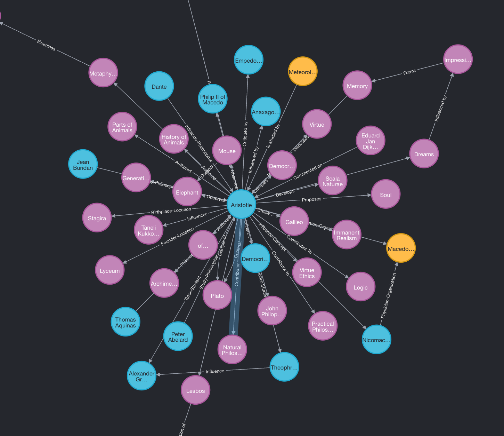
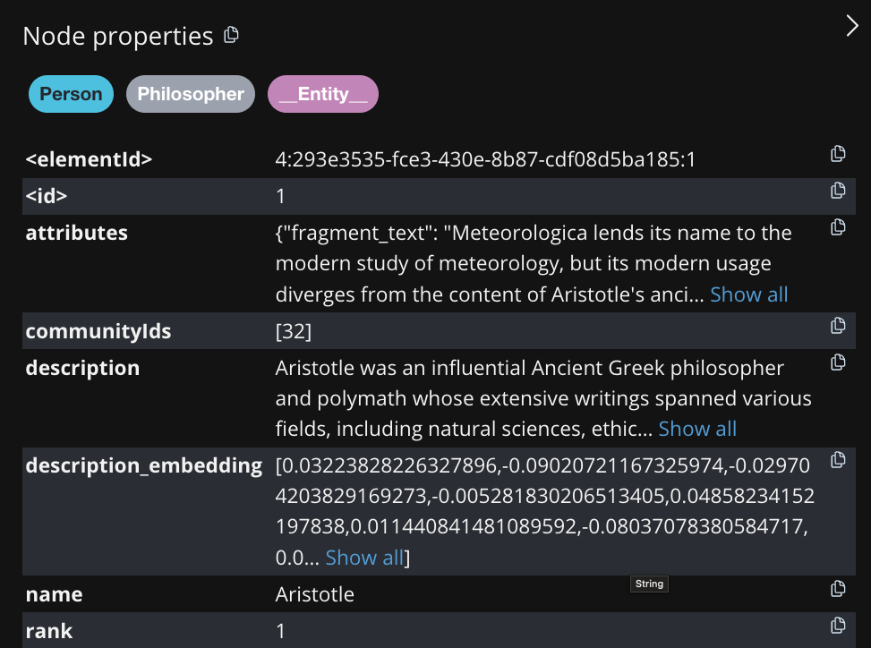

## Introduction

GraphRAG is a powerful feature of R2R that allows you to perform graph-based search and retrieval. This guide will walk you through the process of setting it up and running your first queries.


<Frame caption="An example knowledge graph constructed from companies in the YC directory.">
  
</Frame>

<Note>
Note that graph construction may take long for local LLMs, we recommend using cloud LLMs for faster results.
</Note>


## Start server

<Tabs>
<Tab title="Cloud LLMs">
```bash
r2r serve
```

<Accordion icon="gear" title="Configuration: r2r.toml">
``` toml
[kg]
provider = "neo4j"
batch_size = 256
kg_extraction_prompt = "graphrag_triplet_extraction_zero_shot"

  [kg.kg_creation_settings]
    entity_types = [] # if empty, all entities are extracted
    relation_types = [] # if empty, all relations are extracted
    max_knowledge_triples = 100
    fragment_merge_count = 4 # number of fragments to merge into a single extraction
    generation_config = { model = "gpt-4o-mini" } # and other params, model used for triplet extraction

  [kg.kg_enrichment_settings]
    max_description_input_length = 65536 # increase if you want more comprehensive descriptions
    max_summary_input_length = 65536 # increase if you want more comprehensive summaries
    generation_config = { model = "gpt-4o-mini" } # and other params, model used for node description and graph clustering
    leiden_params = { max_levels = 10 } # more params here: https://neo4j.com/docs/graph-data-science/current/algorithms/leiden/

  [kg.kg_search_config]
    model = "gpt-4o-mini"
```
</Accordion>
</Tab>

<Tab title="Local LLMs">
```bash
r2r serve --config-name=local_llm_neo4j_kg
```

### Local LLM Setup (Optional)

Feel free to skip this section when running with cloud LLM providers.

When running with local RAG, you must have the Triplex model available locally. Pull it and refresh your other relevant models, then start the Ollama server:

  ```bash
    ollama pull sciphi/triplex
    ollama pull llama3.1
    ollama pull mxbai-embed-large
    ollama serve
  ```


<Accordion icon="gear" title="Configuration: local_llm_neo4j_kg">
``` toml
[completion]
provider = "litellm"
concurrent_request_limit = 1
model = "ollama/llama3.1"
temperature = 0.1
top_p = 1
max_tokens_to_sample = 1_024
stream = false
add_generation_kwargs = { }

[embedding]
provider = "ollama"
base_model = "mxbai-embed-large"
base_dimension = 1_024
batch_size = 32
add_title_as_prefix = true

[parsing]
excluded_parsers = [ "gif", "jpeg", "jpg", "png", "svg", "mp3", "mp4" ]

[kg]
provider = "neo4j"
kg_extraction_prompt = "graphrag_triplet_extraction_zero_shot"

  [kg.kg_creation_settings]
    entity_types = [] # if empty, all entities are extracted
    relation_types = [] # if empty, all relations are extracted
    max_knowledge_triples = 100
    fragment_merge_count = 4 # number of fragments to merge into a single extraction
    generation_config = { model = "ollama/llama3.1" } # and other params, model used for triplet extraction

  [kg.kg_enrichment_settings]
    max_description_input_length = 65536 # increase if you want more comprehensive descriptions
    max_summary_input_length = 65536
    generation_config = { model = "ollama/llama3.1" } # and other params, model used for node description and graph clustering
    leiden_params = { max_levels = 10 } # more params here: https://neo4j.com/docs/graph-data-science/current/algorithms/leiden/

  [kg.kg_search_config]
    model = "ollama/llama3.1"

[database]
provider = "postgres"

[agent]
system_instruction_name = "rag_agent"
tool_names = ["search"]

  [agent.generation_config]
  model = "ollama/llama3.1"
```
</Accordion>
</Tab>
</Tabs>


## Ingesting files

We begin the cookbook by ingesting the default sample file `aristotle.txt` used across R2R tutorials and cookbooks:

```bash
r2r ingest-sample-file
```

```bash Example Response
[{'message': 'Ingestion task queued successfully.', 'task_id': '2b16bb55-4f47-4e66-a6bd-da9e215b9793', 'document_id': '9fbe403b-c11c-5aae-8ade-ef22980c3ad1'}]
```

You can also ingest your own files:

```
r2r ingest-files /path/to/your/files_or_directory
```

The initial ingestion step adds parses the given documents and inserts them into R2R's relational and vector databases, enabling document management and semantic search over them. The `aristotle.txt` example file is typically ingested in under 10s. You can confirm ingestion is complete by querying the documents overview table:

```bash
r2r documents-overview
```

```bash Example Response
{'id': '9fbe403b-c11c-5aae-8ade-ef22980c3ad1', 'title': 'aristotle.txt', 'user_id': '2acb499e-8428-543b-bd85-0d9098718220', 'type': 'txt', 'created_at': '2024-09-05T18:20:47.921933Z', 'updated_at': '2024-09-05T18:20:47.921938Z', 'ingestion_status': 'success', 'restructuring_status': 'pending', 'version': 'v0', 'collection_ids': [], 'metadata': {'version': 'v0'}}
```

When ingestion completes successfully for a given file we will find that `ingestion_status` reads `success` in the corresponding output.

## Create Knowledge Graph

Knowledge graph creation is done in two steps:

1. `create-graph`: Extracts nodes and relationships from your input document collection.
2. `enrich-graph`: Enhances the graph structure through clustering and explaining entities (commonly referred to as `GraphRAG`).

```bash
# document-ids are optional
r2r create-graph --document-ids=9fbe403b-c11c-5aae-8ade-ef22980c3ad1
```

```bash Example Response
[{'message': 'Graph creation task queued successfully.', 'task_id': 'd9dae1bb-5862-4a16-abaf-5297024df390'}]
```

This step will create a knowledge graph with nodes and relationships. You can visualize the graph in two ways:


1. Using the neo4j browser on `http://localhost:7474`. The username and password are `neo4j` and `ineedastrongerpassword`. To visualize the graph, run the following command in the neo4j browser:

```
MATCH (a)
RETURN a
```




2. Using the `r2r inspect-knowledge-graph` command.

```bash
r2r inspect-knowledge-graph
```

The output should be roughly as follows:

```
== Meteorologica ==
  Is studied by:
    - Aristotle

== Aristotle ==
  Influenced by:
    - Anaxagoras
    - Democritus
  Critiqued by:
    - Empedocles
....

== Graph Statistics ==
Number of nodes: 54
Number of edges: 57
Number of connected components: 7

== Most Central Nodes ==
  Aristotle: 0.6604
  Organon: 0.1132
  Meteorologica: 0.0189
  Lesbos: 0.0189
  Nicomachus: 0.0189
```

## Graph Enrichment

Now we have a graph, but this graph is not searchable yet. We need to perform the graph enrichment step.

The graph enrichment step adds node and relationship descriptions, performs hierarchical leiden clustering to create communities, and embeds the descriptions. These embeddings will be used later in the local search stage of the pipeline. If you are more interested in the algorithm, please refer to the blog post [here](https://www.sciphi.ai/blog/graphrag).

```bash
r2r enrich-graph
```

Now you can see that the graph is enriched with the following information. We have added descriptions and embeddings to the nodes and relationships. Also, each node is mapped to a community.




## Search

GraphRAG currently supports two types of searches: `local` and `global`.


### Local search

Local searches are faster and cheaper than global.  A local knowledge graph search performs similarity search on the entity, relationship and community description embeddings.

```bash
r2r search --query="Who is Aristotle?" --use-kg-search --kg-search-type=local
```

The answer will be returned in JSON format and contains results from entities, relationships and communities. Following is a snippet of the output:

```bash
Vector search results:
[
  {
    'fragment_id': 'ecc754cd-380d-585f-84ac-021542ef3c1d',
    'extraction_id': '92d78034-8447-5046-bf4d-e019932fbc20',
    'document_id': '9fbe403b-c11c-5aae-8ade-ef22980c3ad1',
    'user_id': '2acb499e-8428-543b-bd85-0d9098718220',
    'collection_ids': [],
    'score': 0.7393344796100582,
    'text': 'Aristotle[A] (Greek: Ἀριστοτέλης Aristotélēs, pronounced [aristotélɛːs]; 384–322 BC) was an Ancient Greek philosopher and polymath. His writings cover a broad range of subjects spanning the natural sciences, philosophy, linguistics, economics, politics, psychology, and the arts. As the founder of the Peripatetic school of philosophy in the Lyceum in Athens, he began the wider Aristotelian tradition that followed, which set the groundwork for the development of modern science.\n\nLittle is known about Aristotle's life. He was born in the city of Stagira in northern Greece during the Classical period. His father, Nicomachus, died when Aristotle was a child, and he was brought up by a guardian. At 17 or 18, he joined Plato's Academy in Athens and remained there until the age of 37 (c.\u2009347 BC). Shortly after Plato died, Aristotle left Athens and, at the request of Philip II of Macedon, tutored his son Alexander the Great beginning in 343 BC. He established a library in the Lyceum, which helped him to produce many of his hundreds of books on papyrus scrolls.\n\nThough Aristotle wrote many elegant treatises and dia ...",
    'metadata': {'title': 'aristotle.txt', 'version': 'v0', 'file_name': 'tmpm3ceiqs__aristotle.txt', 'chunk_order': 0, 'document_type': 'txt', 'size_in_bytes': 73353, 'unstructured_filetype': 'text/plain', 'unstructured_languages': ['eng'], 'partitioned_by_unstructured': True, 'associatedQuery': 'Who is Aristotle?'}}
  }, ...
]

KG search results:
{
  'local_result': {
    'query': 'Who is Aristotle?',
    'entities': {'0': {'name': 'Aristotle', 'description': 'Aristotle was an ancient Greek philosopher and polymath, recognized as the father of various fields including logic, biology, and political science. He authored significant works such as the *Nicomachean Ethics* and *Politics*, where he explored concepts of virtue, governance, and the nature of reality, while also critiquing Platos ideas. His teachings and observations laid the groundwork for numerous disciplines, influencing thinkers ...'}},
    'relationships': {},
    'communities': {'0': {'summary': '```json\n{\n    "title": "Aristotle and His Contributions",\n    "summary": "The community revolves around Aristotle, an ancient Greek philosopher and polymath, who made significant contributions to various fields including logic, biology, political science, and economics. His works, such as 'Politics' and 'Nicomachean Ethics', have influenced numerous disciplines and thinkers from antiquity through the Middle Ages and beyond. The relationships between his various works and the fields he contributed to highlight his profound impact on Western thought.",\n    "rating": 9.5,\n    "rating_explanation": "The impact severity rating is high due to Aristotle's foundational influence on multiple disciplines and his enduring legacy in Western philosophy and science.",\n    "findings": [\n        {\n            "summary": "Aristotle's Foundational Role in Logic",\n            "explanation": "Aristotle is credited with the earliest study of formal logic, and his conception of it was the dominant form of Western logic until the 19th-century advances in mathematical logic. His works compiled into a set of six bo ...}}}}
  },
  'global_result': None
}
Time taken: 2.39 seconds
```

### Global search

Global searches can be used for queries that require reasoning over the whole dataset. They provide more accurate results, however they use a large amount of queries and are expensive. We recommend checking the number of clusters created in the graph and setting the `max-llm-queries` to be a fraction (> 0.1) of that number.

```bash
r2r search --query="What were Aristotles key contributions to philosophy?" --use-kg-search --kg-search-type=global --max-llm-queries-for-global-search=100
```

Extracting the `global_result` from the payload that is returned above we find the following:

```markdown

### Aristotle's Key Contributions to Philosophy

Aristotle, an ancient Greek philosopher and polymath, made foundational contributions to numerous fields, including philosophy, logic, biology, and political science. His works have had a lasting impact on Western thought and the development of modern science.

#### Foundational Role in Various Fields

Aristotle is recognized as the father of several disciplines. His significant works, such as the *Nicomachean Ethics* and *Politics*, explore concepts of virtue, governance, and the nature of reality. These texts are foundational in ethical theory and political science, examining the best ways to achieve a virtuous and potentially happy character [Data: Reports (2, 51, 52, 53, 54, 55, +more)].

#### Contributions to Logic

Aristotle is credited with the earliest study of formal logic, which remained the dominant form of Western logic until the 19th century. His works, compiled into a set of six books called the *Organon*, are foundational to the field of logic [Data: Reports (21, 22, 23, 24, 25, +more)].

#### Influence on Medieval and Modern Thought

Aristotle's influence extended well beyond his lifetime, impacting medieval scholars and modern thinkers alike. His works were translated into Arabic and studied by Muslim philosophers, contributing to the intellectual heritage of the Islamic Golden Age. In the Middle Ages, Aristotle's ideas were integrated into Christian theology and philosophy, shaping the scholastic tradition [Data: Reports (5)].

#### Classification of the Rational Soul

According to Aristotle's classification, humans possess the rational soul, which is unique to them. This rational soul is responsible for higher-order thinking and reasoning, distinguishing humans from other beings that may only possess vegetative or sensitive souls. The rational soul enables humans to engage in philosophical thought, ethical reasoning, and scientific inquiry [Data: Reports (3)].

#### Exploration of Memory and Cognition

Aristotle's exploration of memory in relation to sensation and perception laid the groundwork for understanding human cognition and perception. His methodological approach to studying memory and other cognitive processes involved systematic observation and logical analysis, influencing the scientific method and the way researchers study human cognition and behavior [Data: Reports (1, 2, 3, 4, 5)].

#### Concept of Aether

Aristotle proposed Aether as a divine substance within the framework of classical elements. It is associated with circular motion in the heavens and is seen as encompassing all classical elements. This concept highlights its central role in ancient philosophical thought and its influence on the conceptualization of the universe [Data: Reports (4)].

#### Influence on Dante

Dante Alighieri, the renowned Italian poet, referred to Aristotle as "the master of those who know," highlighting the profound respect and influence Aristotle had on his work. Dante's philosophy is deeply rooted in Aristotelian thought, particularly in the context of his *Comedy* [Data: Reports (3)].

### Conclusion

Aristotle's contributions to philosophy are vast and multifaceted, spanning ethics, logic, political science, and cognitive science. His works have influenced a wide range of disciplines and continue to be studied and revered for their profound insights into human nature and the world.
```

## RAG

You can directly use these search results as part of your RAG pipeline.

```bash
r2r rag --query="What are the key contributions of Aristotle to modern society?" --use-kg-search --kg-search-type=global --max-llm-queries-for-global-search=100
```

The output is as follows:
```
'results': {
  'completion': {
    'id': 'chatcmpl-A4CPZfvJWHNdbSU0EaUYW2jVjpOgi',
    'choices': [
      {
        'finish_reason': 'stop',
        'index': 0,
        'logprobs': None,
        'message': {
          'content': 'Aristotle's contributions that still impact modern society span a wide range of fields:
          1. **Logic**: Aristotle is often called the father of formal logic. His work in this area laid the groundwork for the development of logical reasoning, which continues to be a fundamental aspect of modern philosophy, mathematics, and computer science [2].

          2. **Biology**: Aristotle is considered the first person to study biology systematically. His observations and classifications in zoology and embryology have influenced the field significantly. Modern zoologists still refer to him as the father of biology, and his methods of empirical observation are foundational to the scientific method [2], [6].

          3. **Political Science**: Aristotle's work in political science, particularly his book "Politics," has had a lasting influence on the field. His ideas about the nature of the city, the role of citizens, and the classification of political systems continue to be relevant in contemporary political theory and practice [2], [8].

          4. **Ethics**: Aristotle's "Nicomachean Ethics" explores the concept of virtue and the good life, which remains a cornerstone of modern ethical theory. His ideas have seen a resurgence with the modern advent of virtue ethics [1], [12].

          5. **Scientific Method**: Aristotle's contributions to the scientific method, including his emphasis on empirical observation and systematic inquiry, have left every future scientist and philosopher in his debt. His approach to studying the natural world laid the groundwork for modern scientific inquiry [2], [12].

          6. **Literature and the Arts**: Aristotle's "Poetics" has profoundly influenced literary theory, particularly the structure of tragedy. His analysis of plot, character, and catharsis continues to be a reference point for writers and critics [4].

          7. **Economics**: Aristotle made substantial contributions to economic thought, particularly in his discussions on property, trade, and the origin of money. His ideas influenced medieval economic thought and continue to be relevant in discussions about the nature and function of money [5].

          8. **Psychology**: Aristotle's exploration of the rational soul and its capabilities has significantly influenced philosophical thought and ethical reasoning. His classification of the rational soul underscores the unique capabilities of human cognition [12].

          These contributions highlight Aristotle's enduring legacy and his profound impact on various fields of modern knowledge and society.', 'refusal': None, 'role': 'assistant', 'function_call': None, 'tool_calls': None}}], 'created': 1725564385, 'model': 'gpt-4o-2024-05-13
          ',
          ....
}
```

# Conclusion

In conclusion, integrating R2R with GraphRAG significantly enhances the capabilities of your RAG applications. By leveraging the power of graph-based knowledge representations, GraphRAG allows for more nuanced and context-aware information retrieval. This is evident in the example query we ran using R2R, which not only retrieved relevant information but also provided a structured analysis of the key contributions of Aristotle to modern society.

In essence, combining R2R with GraphRAG empowers your RAG applications to deliver more intelligent, context-aware, and insightful responses, making it a powerful tool for advanced information retrieval and analysis tasks.

Feel free to reach out to us at founders@sciphi.ai if you have any questions or need further assistance.
