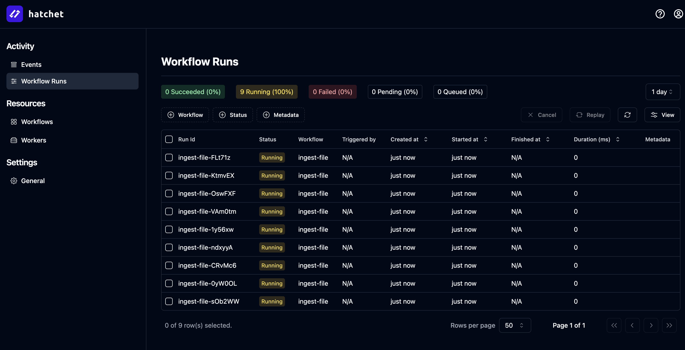
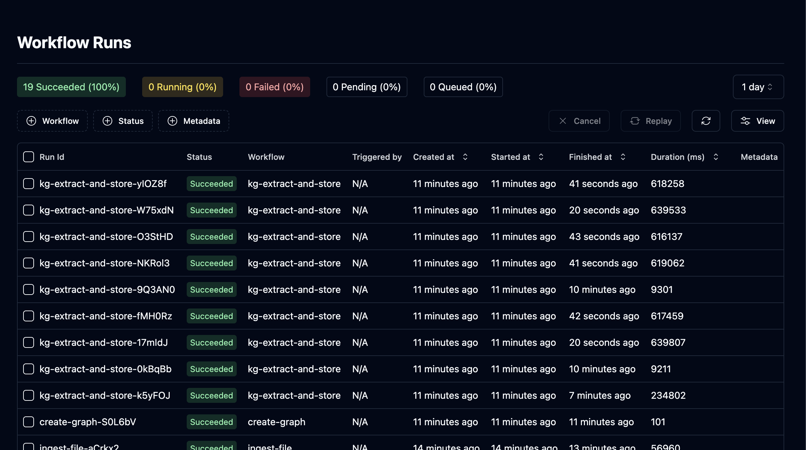

R2R uses [Hatchet](https://docs.hatchet.run/home) for orchestrating complex workflows, particularly for ingestion and knowledge graph construction processes.

Hatchet is a distributed, fault-tolerant task queue that solves scaling problems like concurrency, fairness, and rate limiting. It allows R2R to distribute functions between workers with minimal configuration.

### Key Concepts

1. **Workflows**: Sets of functions executed in response to external triggers.
2. **Workers**: Long-running processes that execute workflow functions.
3. **Managed Queue**: Low-latency queue for handling real-time tasks.

## Orchestration in R2R

### Benefits of orchestration

1. **Scalability**: Efficiently handles large-scale tasks.
2. **Fault Tolerance**: Built-in retry mechanisms and error handling.
3. **Flexibility**: Easy to add or modify workflows as R2R's capabilities expand.

### Workflows in R2R

1. **IngestFilesWorkflow**: Handles file ingestion, parsing, chunking, and embedding.
2. **UpdateFilesWorkflow**: Manages the process of updating existing files.
3. **KgExtractAndStoreWorkflow**: Extracts and stores knowledge graph information.
4. **CreateGraphWorkflow**: Orchestrates the creation of knowledge graphs.
5. **EnrichGraphWorkflow**: Handles graph enrichment processes like node creation and clustering.

## Orchestration GUI

By default, the R2R Docker ships with with Hatchet's front-end application on port 7274. This can be accessed by navigating to `http://localhost:7274`.

You may login with the following credentials:

<Note>

**Email:** admin@example.com

**Password:** Admin123!!
</Note>

### Login

<Frame caption="Logging into hatchet at http://localhost:7274">
  
</Frame>

### Running Tasks

The panel below shows the state of the Hatchet workflow panel at `http://localhost:7274/workflow-runs` immediately after calling `r2r documents create-samples`:

<Frame caption="Running workflows at http://localhost:7274/workflow-runs">
  
</Frame>

### Inspecting a workflow

You can inspect a workflow within Hatchet and can even attempt to retry the job from directly in the GUI in the case of failure:

<Frame caption="Inspecting a workflow at http://localhost:7274/workflow-runs/274081a8-acfb-4686-84c9-9fd73bc5c7f1?tenant=707d0855-80ab-4e1f-a156-f1c4546cbf52">
  
</Frame>

### Long running tasks

Hatchet supports long running tasks, which is very useful during knowledge graph construction:

<Frame caption="Worker timeout is set to 60m to support long running tasks like graph construction.">
  
</Frame>

## Coming Soon

In the coming day(s) / week(s) we will further highlight the available feature set and best practices for orchestrating your ingestion workflows inside R2R.
