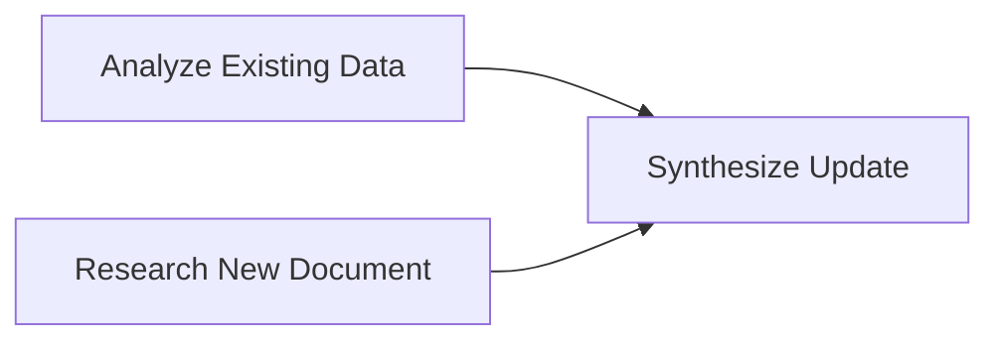
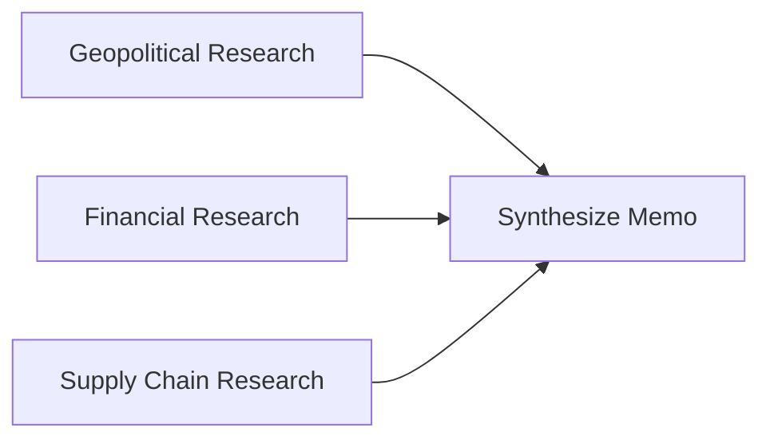

# Ellen V2: CrewAI Flows Specification

**Version**: 1.0

This document specifies the design and logic for the CrewAI flows that form the Reasoning Layer of the Ellen V2 platform. These flows live in the `apps/crewai_services` directory.

We use CrewAI's Flow feature with Directed Acyclic Graph (DAG) model, allowing complex, controlled, and parallelized task execution.

## 1. Core Tool: R2RKnowledgeSearchTool
**File**: `apps/crewai_services/tools/r2r_knowledge_search.py`
**Class**: `R2RKnowledgeSearchTool`

**Purpose**: Provide a high-level interface for agents to perform RAG queries against the entire Ellen knowledge base.

**Logic**:
- Accepts single string argument: `query`
- Makes HTTP POST request to R2R server's RAG endpoint (`http://r2r_extensions:7272/v3/retrieval/rag`)
- Returns synthesized text-based answer from RAG pipeline

## 2. Key Flows

### 2.1. `entity_update_flow.py`
**Purpose**: Perform targeted, contextual update of an entity's structured data based on a new document.

**Trigger**: Called by Ingestion Engine when a new document mentions a watched entity.

**Inputs**:
- `entity_name` (string): Entity to update (e.g., "MP Materials")
- `document_id` (string): ID of new document triggering update
- `existing_entity_data` (JSON): Current structured data of entity

**Agents**:
| Role               | Specialization                                      |
|--------------------|-----------------------------------------------------|
| Contextual Analyst | Understands context of existing entity data         |
| Source Researcher  | Extracts relevant info from new documents           |
| Synthesis Agent    | Compares old/new info and generates updated JSON    |

**Flow (DAG)**:

1. **Task 1 (Analyze Existing Data)**: Contextual Analyst reviews `existing_entity_data`
2. **Task 2 (Research New Document)**: Source Researcher queries new document using `R2RKnowledgeSearchTool`
3. **Task 3 (Synthesize Update)**: Synthesis Agent generates updated structured data JSON with automatic interlinking

**Output**: Validated JSON object representing updated structured data

### 2.2. `decision_framework_flow.py`
**Purpose**: Execute complex multi-step analytical tasks requiring information from multiple domains.

**Trigger**: Called from UI by user.

**Inputs**:
- `topic` (string): High-level analytical goal

**Agents**:
| Role                 | Specialization                                      |
|----------------------|-----------------------------------------------------|
| Geopolitical Analyst | Country risk, policy, international relations       |
| Financial Analyst    | Market impacts, pricing, company financials         |
| Supply Chain Analyst | Logistics, material flows, production               |
| Chief Strategist     | Synthesizes multi-domain analysis into executive memo|

**Flow (DAG)**:

1. **Task 1 (Geopolitical Research)**: Geopolitical Analyst researches political implications
2. **Task 2 (Financial Research)**: Financial Analyst researches market/financial impacts
3. **Task 3 (Supply Chain Research)**: Supply Chain Analyst researches supply chain impacts
4. **Task 4 (Synthesize Memo)**: Chief Strategist creates comprehensive memo from all analyses

**Output**: Markdown-formatted analytical memo