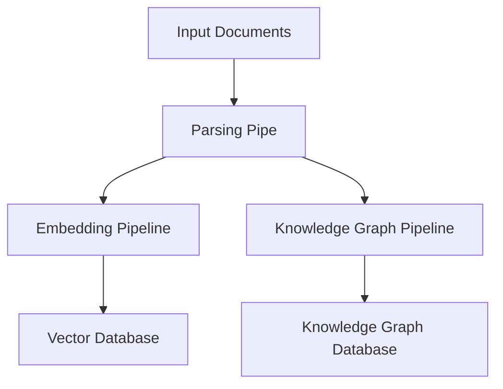

## Introduction
R2R's ingestion pipeline efficiently processes various document formats, transforming them into searchable content. It seamlessly integrates with vector databases and knowledge graphs for optimal retrieval and analysis.

### Implementation Options
R2R offers two main implementations for ingestion:
- **Light**: Uses R2R's **built-in** ingestion logic, supporting a wide range of file types including TXT, JSON, HTML, PDF, DOCX, PPTX, XLSX, CSV, Markdown, images, audio, and video. For high-quality PDF parsing, it is recommended to use the zerox parser.
- **Full**: Leverages **Unstructured's** open-source [ingestion platform](https://docs.unstructured.io/open-source/introduction/overview) to handle supported file types. This is the default for the 'full' installation and provides more advanced parsing capabilities.

## Core Concepts

### Document Processing Pipeline
Inside R2R, ingestion refers to the complete pipeline for processing input data:
- Parsing files into text
- Chunking text into semantic units
- Generating embeddings
- Storing data for retrieval

Ingested files are stored with an associated document identifier and user identifier to enable comprehensive management.

### Multimodal Support
R2R has recently expanded its capabilities to include multimodal foundation models. In addition to using such models by default for images, R2R can now use them on PDFs by configuring the parser override:

```json
"ingestion_config": {
  "parser_overrides": {
    "pdf": "zerox"
  }
}
```

## Configuration

### Key Configuration Areas
Many settings are managed by the `r2r.toml` configuration file:

```toml
[database]
provider = "postgres"

[ingestion]
provider = "r2r"
chunking_strategy = "recursive"
chunk_size = 1_024
chunk_overlap = 512
excluded_parsers = ["mp4"]

[embedding]
provider = "litellm"
base_model = "openai/text-embedding-3-small"
base_dimension = 512
batch_size = 128
add_title_as_prefix = false
rerank_model = "None"
concurrent_request_limit = 256
```

### Configuration Impact
These settings directly influence how R2R performs ingestion:

1. **Database Configuration**
   - Configures Postgres database for semantic search and document management
   - Used during retrieval to find relevant document chunks via vector similarity

2. **Ingestion Settings**
   - Determines file type processing and text conversion methods
   - Controls text chunking protocols and granularity
   - Affects information storage and retrieval precision

3. **Embedding Configuration**
   - Defines model and parameters for text-to-vector conversion
   - Used during retrieval to embed user queries
   - Enables vector comparison against stored document embeddings

## Document Management

### Document Ingestion
The system provides several methods for ingesting documents:

1. **File Ingestion**
```python
file_paths = ['path/to/file1.txt', 'path/to/file2.txt']
metadatas = [{'key1': 'value1'}, {'key2': 'value2'}]

ingest_response = client.ingest_files(
    file_paths=file_paths,
    metadatas=metadatas,
    ingestion_config={
        "provider": "unstructured_local",
        "strategy": "auto",
        "chunking_strategy": "by_title",
        "new_after_n_chars": 256,
        "max_characters": 512
    }
)
```

2. **Direct Chunk Ingestion**
```python
chunks = [
  {
    "text": "Sample text chunk 1...",
  },
  {
    "text": "Sample text chunk 2...",
  }
]

ingest_response = client.ingest_chunks(
  chunks=chunks,
  metadata={"title": "Sample", "source": "example"}
)
```

### Document Updates
Update existing documents while maintaining version history:

```python
update_response = client.update_files(
    file_paths=file_paths,
    document_ids=document_ids,
    metadatas=[{"status": "reviewed"}]
)
```

### Vector Index Management

#### Creating Indices
Vector indices improve search performance for large collections:

```python
create_response = client.create_vector_index(
    table_name="vectors",
    index_method="hnsw",
    index_measure="cosine_distance",
    index_arguments={"m": 16, "ef_construction": 64},
    concurrently=True
)
```

Important considerations for index creation:
- Resource intensive process
- Requires pre-warming for optimal performance
- Parameters affect build time and search quality
- Monitor system resources during creation

#### Managing Indices
List and delete indices as needed:

```python
# List indices
indices = client.list_vector_indices(table_name="vectors")

# Delete index
delete_response = client.delete_vector_index(
    index_name="index_name",
    table_name="vectors",
    concurrently=True
)
```

## Troubleshooting

### Common Issues and Solutions

1. **Ingestion Failures**
   - Verify file permissions and paths
   - Check supported file formats
   - Ensure metadata matches file_paths
   - Monitor memory usage

2. **Chunking Issues**
   - Large chunks may impact retrieval quality
   - Small chunks may lose context
   - Adjust overlap for better context preservation

3. **Vector Index Performance**
   - Monitor creation time
   - Check memory usage
   - Verify warm-up queries
   - Consider rebuilding if quality degrades

## Pipeline Architecture
The ingestion pipeline consists of several key components:



This modular design allows for customization and extension of individual components while maintaining robust document processing capabilities.

## Next Steps

For more detailed information on configuring specific components of the ingestion pipeline, please refer to the following pages:

- [Parsing & Chunking Configuration](/documentation/configuration/ingestion/parsing_and_chunking)
- [Embedding Configuration](/documentation/configuration/ingestion/embedding)
- [Knowledge Graph Configuration](/documentation/configuration/knowledge-graph/overview)
- [Retrieval Configuration](/documentation/configuration/retrieval/overview)
