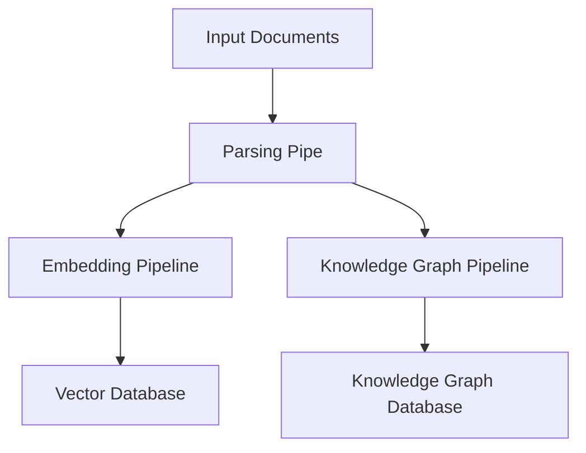

## Introduction


R2R's ingestion pipeline efficiently processes various document formats, transforming them into searchable content. It seamlessly integrates with vector databases and knowledge graphs for optimal retrieval and analysis.

R2R offers two main implementations for ingestion:

- **Light**: Uses R2R's **built-in** ingestion logic, which supports a wide range of file types including TXT, JSON, HTML, PDF, DOCX, PPTX, XLSX, CSV, Markdown, images, audio, and video. For high quality parsing of pdfs it is recommended that developers run with the zerox parser, [explained here](/documentation/python-sdk/ingestion). This is the default for the 'light' installation.
- **Full**: Leverages **Unstructured's** open-source [ingestion platform](https://docs.unstructured.io/open-source/introduction/overview) to handle supported file types. This is the default for the 'full' installation and provides more advanced parsing capabilities.


Supported file types for each implementation are listed [here](/documentation/configuration/ingestion/parsing_and_chunking).

## Key Configuration Areas

Many of the settings managed by the [`r2r.toml`](https://github.com/SciPhi-AI/R2R/blob/main/py/r2r.toml) relate to the ingestion process, some of which are shown below

```toml default_ingestion_settings.toml
[database]
provider = "postgres"

[ingestion]
provider = "r2r"
chunking_strategy = "recursive"
chunk_size = 1_024
chunk_overlap = 512
excluded_parsers = ["mp4"]

[embedding]
provider = "litellm"
base_model = "openai/text-embedding-3-small"
base_dimension = 512
batch_size = 128
add_title_as_prefix = false
rerank_model = "None"
concurrent_request_limit = 256
```
These settings directly impact how R2R performs ingestion:

- The `[database]` section configures the Postgres database used for semantic search and document management. During retrieval, this database is queried to find the most relevant document chunks based on vector similarity.

- The `[ingestion]` section determines how different file types are processed and converted into text. This includes protocol for how text is split into smaller, manageable pieces. This affects the granularity of information storage and retrieval.

- The `[embedding]` section defines the model and parameters for converting text into vector embeddings. In the retrieval process, these settings are used to embed the user's query, allowing it to be compared against the stored document embeddings.


## Key Features

- **Multi-format Support**: Handles various document types including TXT, JSON, HTML, PDF, DOCX, PPTX, XLSX, CSV, Markdown, images, audio, and video.
- **Customizable**: Supports the addition of custom parsers for specific data types.
- **Asynchronous Processing**: Efficiently manages data handling with asynchronous operations.
- **Dual Storage**: Supports ingestion into both vector databases for embedding-based search and knowledge graphs for structured information retrieval.
- **Modular Design**: Composed of distinct pipes that can be customized or extended.

## Pipeline Architecture

Ingestion in R2R is implemented as a pipeline and consists of the main components shown below:

Here's a high-level overview of the pipeline structure:




## Next Steps

For more detailed information on configuring specific components of the ingestion pipeline, please refer to the following pages:

- [Parsing & Chunking Configuration](/documentation/configuration/ingestion/parsing_and_chunking)
- [Embedding Configuration](/documentation/configuration/ingestion/embedding)
- [Knowledge Graph Configuration](/documentation/configuration/knowledge-graph/overview)
- [Retrieval Configuration](/documentation/configuration/retrieval/overview)
