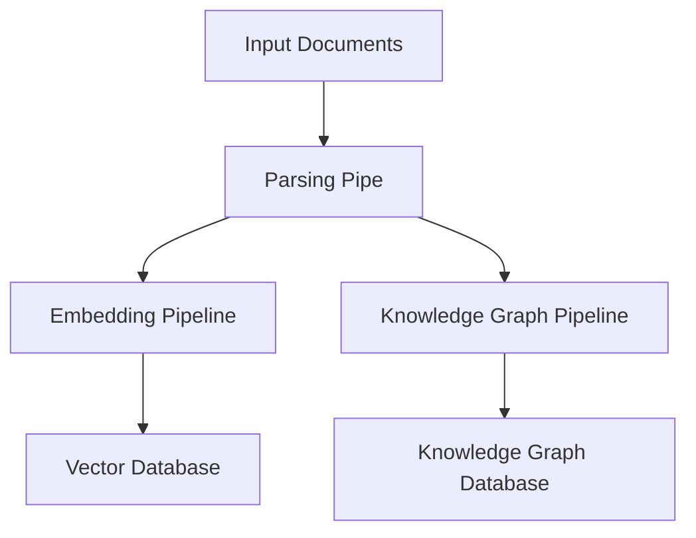

## Introduction


The Ingestion Pipeline is a core component of the R2R framework that processes and stores incoming documents. It supports various document formats and can store data in vector databases and knowledge graphs, enabling efficient retrieval and analysis in downstream processes.

R2R integrates Unstructured's open-source [ingestion platform](https://docs.unstructured.io/open-source/introduction/overview) by default to parse supported file types.

## Key Configuration Areas

Many of the settings managed by the `r2r.toml` relate to the ingestion process, some of which are shown below

```toml default_ingestion_settings.toml
[database]
provider = "postgres"

[chunking]
provider = "unstructured_local"
strategy = "auto"
chunking_strategy = "basic"
new_after_n_chars = 512
max_characters = 1_024
combine_under_n_chars = 128
overlap = 20

[parsing]
provider = "unstructured_local"
excluded_parsers = ["mp4"]

[embedding]
provider = "litellm"
base_model = "openai/text-embedding-3-small"
base_dimension = 512
batch_size = 128
add_title_as_prefix = false
rerank_model = "None"
concurrent_request_limit = 256

[parsing]
provider = "r2r"
excluded_parsers = ["mp4"]
```
These settings directly impact how R2R performs ingestion:

- The `[database]` section configures the vector database used for semantic search. During retrieval, this database is queried to find the most relevant document chunks based on vector similarity.

- The `[chunking]` section defines how documents are split into smaller, manageable pieces. This affects the granularity of information storage and retrieval.

- The `[parsing]` section determines how different file types are processed and converted into text. This impacts the initial extraction of content from various document formats.

- The `[embedding]` section defines the model and parameters for converting text into vector embeddings. In the retrieval process, these settings are used to embed the user's query, allowing it to be compared against the stored document embeddings.


## Key Features

- **Multi-format Support**: Handles various document types including TXT, JSON, HTML, PDF, DOCX, PPTX, XLSX, CSV, Markdown, images, audio, and video.
- **Customizable**: Supports the addition of custom parsers for specific data types.
- **Asynchronous Processing**: Efficiently manages data handling with asynchronous operations.
- **Dual Storage**: Supports ingestion into both vector databases for embedding-based search and knowledge graphs for structured information retrieval.
- **Modular Design**: Composed of distinct pipes that can be customized or extended.

## Pipeline Architecture

Ingestion in R2R is implemented as a pipeline and consists of the main components shown below:

Here's a high-level overview of the pipeline structure:




## Next Steps

For more detailed information on configuring specific components of the ingestion pipeline, please refer to the following pages:

- [Parsing & Chunking Configuration](/documentation/configuration/ingestion/parsing_and_chunking)
- [Embedding Configuration](/documentation/configuration/ingestion/embedding)
- [Knowledge Graph Configuration](/documentation/configuration/knowledge-graph/overview)
- [Retrieval Configuration](/documentation/configuration/retrieval/overview)
