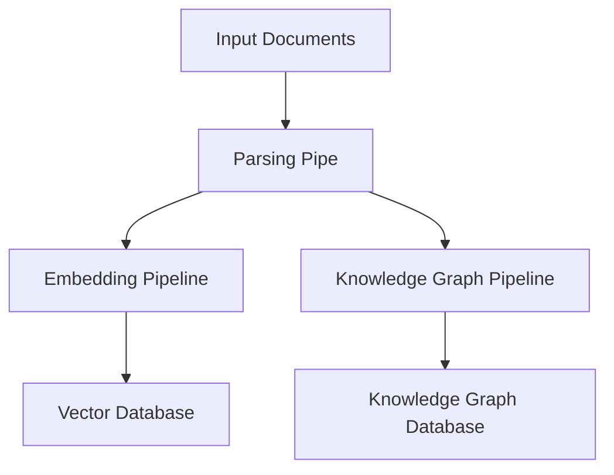

## Introduction


The Ingestion Pipeline is a core component of the R2R framework, responsible for processing and storing incoming documents. It supports a wide range of document formats and can store data in vector databases and knowledge graphs, enabling efficient retrieval and analysis in downstream processes.

## Key Configuration Areas

Many of the settings managed by the `r2r.toml` relate to the ingestion process, some of which are shown below

```toml default_ingestion_settings.toml
[database]
provider = "postgres"

[chunking]
provider = "r2r"
method = "recursive"
chunk_size = 512
chunk_overlap = 50

[embedding]
provider = "litellm"
base_model = "openai/text-embedding-3-small"
base_dimension = 512
batch_size = 128
add_title_as_prefix = false
rerank_model = "None"
concurrent_request_limit = 256

[kg]
provider = "None"

[parsing]
provider = "r2r"
excluded_parsers = ["mp4"]
```

These settings directly impact how R2R performs retrieval operations:

- The `[database]` section configures the vector database used for semantic search. During retrieval, this database is queried to find the most relevant document chunks based on vector similarity.

- The `[embedding]` section defines the model and parameters for converting text into vector embeddings. In the retrieval process, these settings are used to embed the user's query, allowing it to be compared against the stored document embeddings.

- The `[kg]` section, when configured, enables knowledge graph-based retrieval. This allows for more structured and relationship-aware searches, complementing vector-based retrieval.

- The `[completion]` section sets up the language model used for generating responses in the RAG pipeline. This model takes the retrieved context and the user's query to produce a final, contextually relevant response.


## Key Features

- **Multi-format Support**: Handles various document types including TXT, JSON, HTML, PDF, DOCX, PPTX, XLSX, CSV, Markdown, images, audio, and video.
- **Customizable**: Supports the addition of custom parsers for specific data types.
- **Asynchronous Processing**: Efficiently manages data handling with asynchronous operations.
- **Dual Storage**: Supports ingestion into both vector databases for embedding-based search and knowledge graphs for structured information retrieval.
- **Modular Design**: Composed of distinct pipes that can be customized or extended.

## Pipeline Architecture

Ingestion in R2R is implemented as a pipeline and consists of the main components shown below:

Here's a high-level overview of the pipeline structure:




## Next Steps

For more detailed information on configuring specific components of the ingestion pipeline, please refer to the following pages:

- [Parsing Configuration](/documentation/configuration/ingestion/parsing)
- [Postgres Database Configuration](/documentation/configuration/ingestion/postgres)
- [Chunking Configuration](/documentation/configuration/ingestion/chunking)
- [Embedding Configuration](/documentation/configuration/ingestion/embedding)
- [Knowledge Graph Configuration](/documentation/configuration/ingestion/knowledge-graph)
