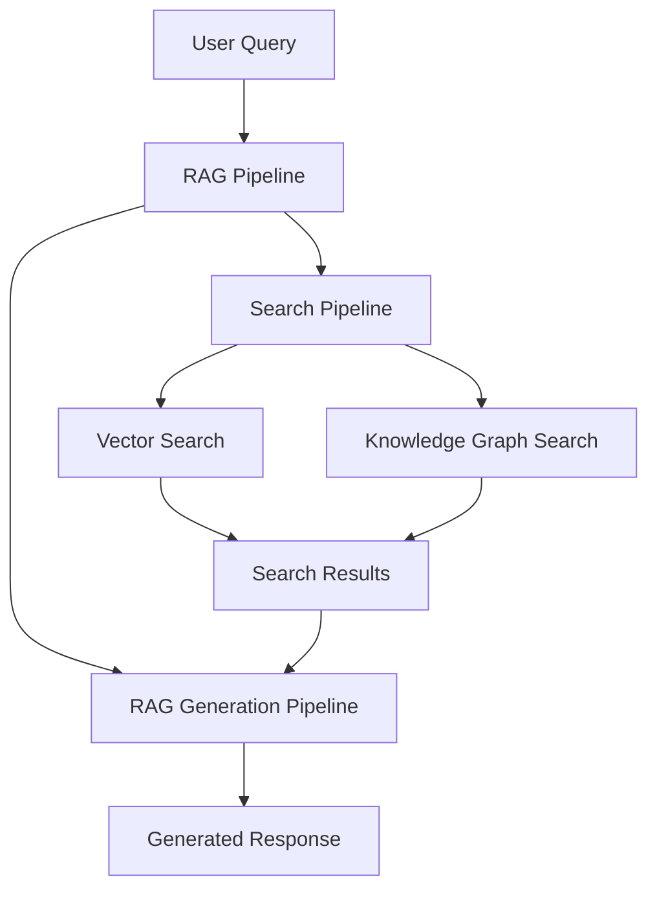

## Introduction

Retrieval in R2R is a sophisticated system that leverages ingested data to provide powerful search and Retrieval-Augmented Generation (RAG) capabilities. It combines vector-based semantic search, knowledge graph querying, and language model generation to deliver accurate and contextually relevant results.

## Key Configuration Areas

To configure the retrieval system in R2R, you'll need to focus on several areas in your `r2r.toml` file:

```toml
[database]
provider = "postgres"

[embedding]
provider = "litellm"
base_model = "openai/text-embedding-3-small"
base_dimension = 512
batch_size = 128
add_title_as_prefix = false
rerank_model = "None"
concurrent_request_limit = 256

[kg]
provider = "postgres"
batch_size = 256

[completion]
provider = "litellm"
concurrent_request_limit = 16

[completion.generation_config]
model = "openai/gpt-4"
temperature = 0.1
top_p = 1
max_tokens_to_sample = 1_024
stream = false
```

These settings directly impact how R2R performs retrieval operations:

- The `[database]` section configures the vector database used for semantic search and document management.
- The `[embedding]` section defines the model and parameters for converting text into vector embeddings.
- The `[kg]` section, when configured, enables knowledge graph-based retrieval.
- The `[completion]` section sets up the language model used for generating responses in the RAG pipeline.

## Customization and Advanced Features

R2R's retrieval system is highly customizable, allowing you to:

- Implement hybrid search combining vector-based and knowledge graph queries
- Customize search filters, limits, and query generation
- Add custom pipes to the search and RAG pipelines
- Implement reranking for improved result relevance

### Structured Outputs

R2R supports structured outputs for RAG responses, allowing you to define specific response formats using Pydantic models. This ensures consistent, type-safe responses that can be easily validated and processed programmatically.

<Info>Some models may require the word 'JSON' to appear in their prompt for structured outputs to work. Be sure to update your prompt to reflect this, if necessary.</Info>

Here's a simple example of using structured outputs with Pydantic models:

```python
from r2r import R2RClient, GenerationConfig
from pydantic import BaseModel

# Initialize the client
client = R2RClient()

# Define your response structure
class ResponseModel(BaseModel):
    answer: str
    sources: list[str]

# Make a RAG query with structured output
response = client.rag(
    query="…",
    rag_generation_config=GenerationConfig(
        response_format=ResponseModel
    )
)
```

## Pipeline Architecture

Retrieval in R2R is implemented as a pipeline and consists of the main components shown below:




## Next Steps

For more detailed information on configuring specific components of the ingestion pipeline, please refer to the following pages:

- [Ingestion Configuration](/documentation/configuration/ingestion/overview)
- [Vector Search Configuration](/documentation/configuration/retrieval/vector-search)
- [Knowledge Graph Search Configuration](/documentation/configuration/retrieval/knowledge-graph)
- [Retrieval Configuration](/documentation/configuration/retrieval/overview)
