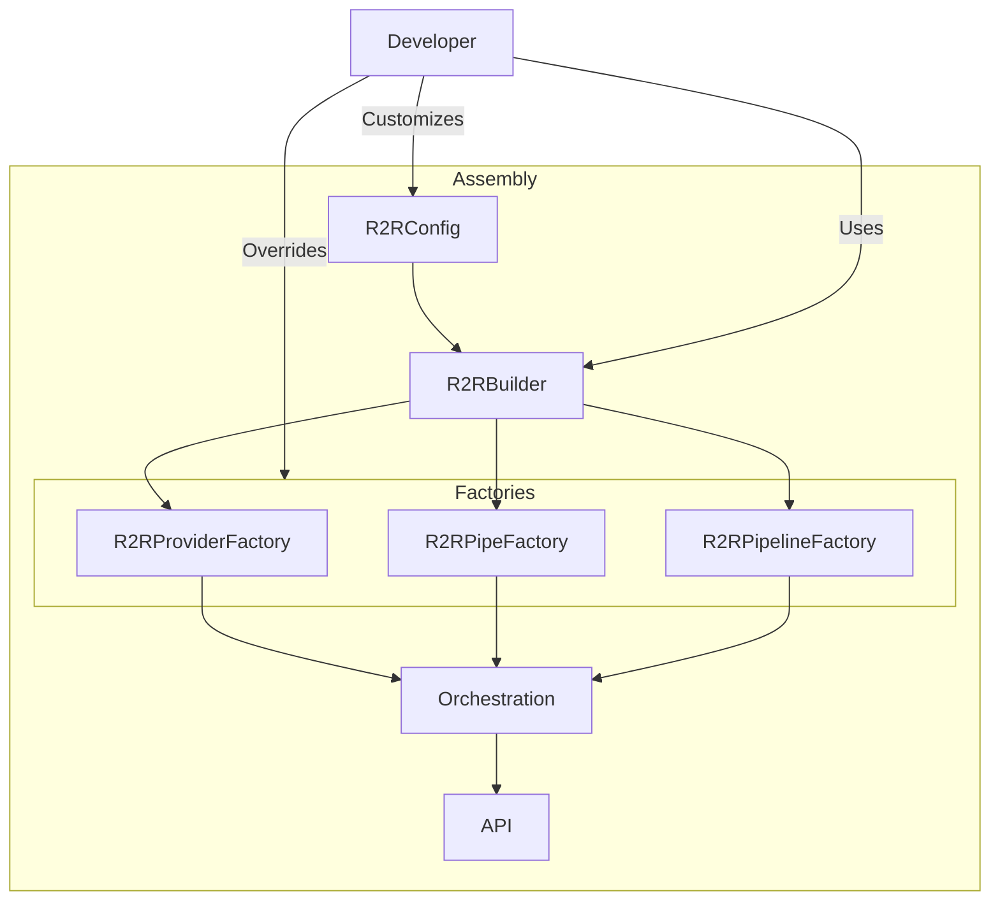

## Introduction

R2R is a an engine for building user-facing Retrieval-Augmented Generation (RAG) applications. At its core, R2R uses several main components to create and manage these applications: `R2RConfig`, `R2RBuilder`, `R2REngine`, `R2RApp`, and `R2R`. In this section we will explore all of these components in detail.

## Assembly Process

The following diagram illustrates how R2R assembles a user-facing application:



## R2RConfig

R2RConfig is the configuration management class for R2R applications. It serves as the central point for defining and managing all settings required by various components of the R2R system.

Key features of R2RConfig:

1. **Configurable**: R2RConfig loads its settings from a TOML file, making it easy to modify and version control.
2. **Hierarchical Structure**: The configuration is organized into sections, each corresponding to a specific aspect of the R2R system (e.g., embedding, database, logging).
3. **Default Values**: R2RConfig provides a set of default values, which can be overridden as needed.
4. **Validation**: The class includes methods to validate the configuration, ensuring all required settings are present.
5. **Type-safe Access**: Once loaded, the configuration provides type-safe access to settings, reducing the risk of runtime errors.

Example usage:
```python
config = R2RConfig.from_toml("path/to/config.toml")
embedding_model = config.embedding.base_model
max_file_size = config.app.max_file_size_in_mb
```

## R2RBuilder

R2RBuilder is the central component for assembling R2R applications, using the builder pattern. It provides a flexible way to construct and customize the R2R system.

Key features of R2RBuilder:

1. **Fluent Interface**: Allows chaining of configuration methods for easy setup.
2. **Component Overrides**: Provides methods to override default providers, pipes, and pipelines.
3. **Factory Customization**: Supports custom factory implementations for providers, pipes, and pipelines.
4. **Configuration Integration**: Uses R2RConfig to set up the system according to specified settings.

Example usage:
```python
builder = R2RBuilder(config=config)
builder.with_embedding_provider(custom_embedding_provider)
builder.with_llm_provider(custom_llm_provider)
r2r = builder.build()
```

## R2RApp

R2RApp is the class responsible for setting up the FastAPI application that serves as the interface for the R2R system. It encapsulates the routing and CORS configuration for the R2R API.

Key features of R2RApp:

1. **FastAPI Integration**: Creates and configures a FastAPI application, setting up all necessary routes.
2. **Route Setup**: Automatically sets up routes for ingestion, management, retrieval, and authentication based on the provided R2REngine.
3. **CORS Configuration**: Applies CORS (Cross-Origin Resource Sharing) settings to the FastAPI application.
4. **Serving Capability**: Includes a `serve` method to easily start the FastAPI server.

Example usage:
```python
app = r2r.app
app.serve(host="0.0.0.0", port=7272)
```


By combining these core components, R2R provides a flexible and powerful system for building and deploying RAG applications. The R2RConfig allows for easy customization while the R2RBuilder facilitates the assembly process. Lastly, the R2RApp offers a robust API interface.
