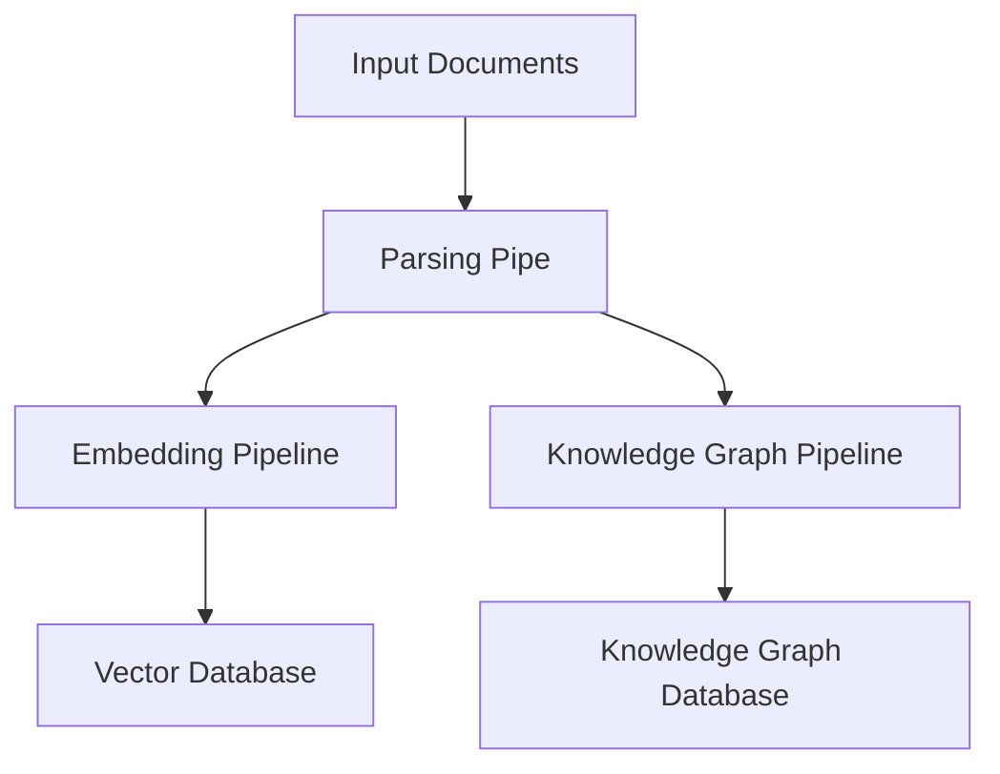

# R2R Ingestion Pipeline

## Introduction

The Ingestion Pipeline is a core component of the R2R framework, responsible for processing and storing incoming documents. It supports a wide range of document formats and can store data in vector databases and knowledge graphs, enabling efficient retrieval and analysis in downstream processes.

## Key Features

- **Multi-format Support**: Handles various document types including TXT, JSON, HTML, PDF, DOCX, PPTX, XLSX, CSV, Markdown, images, audio, and video.
- **Customizable**: Supports the addition of custom parsers for specific data types.
- **Asynchronous Processing**: Efficiently manages data handling with asynchronous operations.
- **Dual Storage**: Supports ingestion into both vector databases for embedding-based search and knowledge graphs for structured information retrieval.
- **Modular Design**: Composed of distinct pipes that can be customized or extended.

## Pipeline Architecture

The Ingestion Pipeline in R2R is implemented as an `AsyncPipeline` and consists of three main components:

1. **Parsing Pipe**: Converts various document formats into plaintext or structured data.
2. **Embedding Pipeline**: Generates and stores vector embeddings for parsed text.
3. **Knowledge Graph Pipeline**: Extracts and stores structured information as a knowledge graph.

Here's a high-level overview of the pipeline structure:



## Pipeline Components

### Parsing Pipe

The `ParsingPipe` is responsible for converting various document formats into plaintext or structured data. It supports multiple parsers:

- **Text-based Parsers**: TextParser, JSONParser, HTMLParser, CSVParser, MarkdownParser
- **Document Parsers**: PDFParser, DOCXParser, PPTParser, XLSXParser
- **Media Parsers**: AudioParser, ImageParser, MovieParser

### Embedding Pipeline

The Embedding Pipeline consists of two main pipes:

1. **EmbeddingPipe**: Generates vector embeddings for the parsed text data using the configured embedding provider.

2. **VectorStoragePipe**: Stores the generated embeddings in a vector database. It handles batch storage operations efficiently using asynchronous processing.

```python
class VectorStoragePipe(LoggableAsyncPipe):
    async def store(
        self,
        vector_entries: list[VectorEntry],
        do_upsert: bool = True,
    ) -> None:
        if do_upsert:
            self.vector_db_provider.upsert_entries(vector_entries)
        else:
            self.vector_db_provider.copy_entries(vector_entries)
```

### Knowledge Graph Pipeline

When the knowledge graph provider settings are configured, the pipeline includes pipes for generating and storing knowledge graph data:

- **KGExtractionPipe**: Extracts entities and relationships from the parsed text.
- **KGStoragePipe**: Stores the generated knowledge graph data in the specified knowledge graph database.

## Ingestion Process

The ingestion process follows these steps:

1. Documents are passed to the `ParsingPipe` for conversion to a standardized format.
2. Parsed documents are duplicated and sent to both the Embedding Pipeline and Knowledge Graph Pipeline (if configured).
3. The Embedding Pipeline generates embeddings and stores them in the vector database.
4. The Knowledge Graph Pipeline (if active) extracts structured information and stores it in the knowledge graph database.

This process is managed asynchronously, allowing for efficient handling of multiple documents:

```python
async def run(self, input: Any, *args: Any, **kwargs: Any) -> None:
    # ... initialization ...
    async def enqueue_documents():
        async for document in await self.parsing_pipe.run(...):
            if self.embedding_pipeline:
                await embedding_queue.put(document)
            if self.kg_pipeline:
                await kg_queue.put(document)
        # ... signal completion ...

    enqueue_task = asyncio.create_task(enqueue_documents())

    if self.embedding_pipeline:
        embedding_task = asyncio.create_task(self.embedding_pipeline.run(...))
    if self.kg_pipeline:
        kg_task = asyncio.create_task(self.kg_pipeline.run(...))

    # ... wait for tasks and collect results ...
```

## Customizing the Ingestion Pipeline

To create a custom ingestion pipeline, you can extend the `IngestionPipeline` class and configure it with your specific requirements:

```python
from r2r import IngestionPipeline, R2RConfig, R2RProviderFactory, R2RPipeFactory, R2RPipelineFactory

# Load configuration
config = R2RConfig.from_toml()

# Create providers and pipes
providers = R2RProviderFactory(config).create_providers()
pipes = R2RPipeFactory(config, providers).create_pipes()

# Define the custom ingestion pipeline
class CustomIngestionPipeline(IngestionPipeline):
    def __init__(self):
        super().__init__()
        self.add_pipe(pipes.parsing_pipe, parsing_pipe=True)
        self.add_pipe(pipes.embedding_pipe, embedding_pipe=True)
        self.add_pipe(pipes.vector_storage_pipe, embedding_pipe=True)
        # Add custom KG pipes if needed

# Instantiate and use the pipeline
custom_ingestion_pipeline = CustomIngestionPipeline()

pipelines = R2RPipelineFactory(config, pipes).create_pipelines(
    ingestion_pipeline = custom_ingestion_pipeline
)
r2r = R2RCore(config=config, providers=providers, pipes=pipes, pipelines=pipelines)
```

## Integration with R2R App

The Ingestion Pipeline is exposed through the R2R App via the following API endpoints:

- `/v2/ingest_documents`: Endpoint for ingesting document data directly.
- `/v2/ingest_files`: Endpoint for ingesting file uploads.

These endpoints are handled by the `IngestionRouter` in the R2R App, which utilizes the `IngestionService` to process incoming documents or files:

```python
@router.post("/ingest_documents")
async def ingest_documents(request: R2RIngestDocumentsRequest, ...):
    return await engine.ingest_documents(
        documents=request.documents,
        versions=request.versions,
        ...
    )

@router.post("/ingest_files")
async def ingest_files(files: List[UploadFile], ...):
    return await engine.ingest_files(
        files=files,
        metadatas=request.metadatas,
        document_ids=request.document_ids,
        versions=request.versions,
        ...
    )
```

## Best Practices

1. **Efficient Parsing**: Ensure parsers are optimized for your specific document types to minimize processing time.
2. **Batch Processing**: Use batch operations when possible, especially for embedding generation and storage.
3. **Error Handling**: Implement robust error handling to manage issues with individual documents without failing the entire ingestion process.
4. **Monitoring**: Set up logging and monitoring to track ingestion performance and identify bottlenecks.
5. **Scalability**: Design your custom pipes and parsers with scalability in mind, considering potential increases in document volume and complexity.

## Conclusion

The R2R Ingestion Pipeline provides a flexible and powerful system for processing and storing various types of documents. Its modular design allows for easy customization and extension, making it adaptable to a wide range of use cases. By leveraging both vector embeddings and knowledge graphs, it sets the foundation for sophisticated retrieval and analysis in downstream RAG applications.

For more information on configuring and customizing the Ingestion Pipeline, refer to the [R2R configuration guide](/documentation/configuration) and [R2R configuration deep-dive](/documentation/deep-dive/main/config) documentation. If you need help or want to connect with other R2R users, [join our Discord server](https://discord.gg/p6KqD2kjtB).
