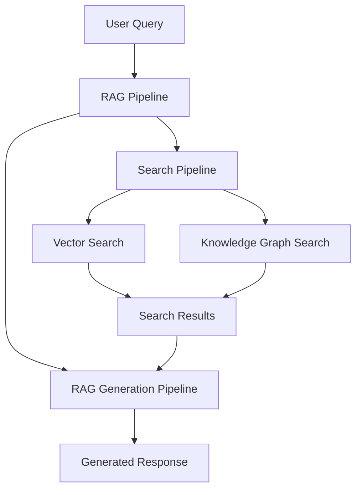

# R2R RAG Pipeline

## Introduction

The RAG (Retrieval-Augmented Generation) Pipeline in R2R is a sophisticated component that combines search capabilities with language generation to produce more informative and contextually relevant outputs. It leverages both vector search and knowledge graph capabilities to enhance the quality of generated responses.

## Key Features

- **Integrated Search and Generation**: Seamlessly combines search results with language generation for comprehensive responses.
- **Multi-Source Context**: Utilizes both vector search and knowledge graph results for richer context.
- **Customizable**: Supports custom configurations for search settings and generation parameters.
- **Asynchronous Processing**: Efficiently handles operations asynchronously for improved performance.
- **Streaming Support**: Offers both regular and streaming modes to suit different use cases.
- **Flexible Query Handling**: Supports processing of multiple queries in parallel.

## Pipeline Architecture

The RAG Pipeline in R2R is implemented as an `AsyncPipeline` and consists of two main components:

1. **Search Pipeline**: Retrieves relevant information from vector databases and knowledge graphs.
2. **RAG Generation Pipeline**: Processes search results and generates responses.

Here's a high-level overview of the pipeline structure:



## Pipeline Components

### Search Pipeline

The Search Pipeline is responsible for retrieving relevant information based on the input query. It's configured within the RAG Pipeline:

```python
class RAGPipeline(AsyncPipeline):
    def set_search_pipeline(
        self,
        _search_pipeline: AsyncPipeline,
        *args,
        **kwargs,
    ) -> None:
        self._search_pipeline = _search_pipeline
```

### RAG Generation Pipeline

The RAG Generation Pipeline processes search results and generates responses. It can include various pipes, typically including:

1. **SearchRAGPipe**: For non-streaming RAG operations.
2. **StreamingSearchRAGPipe**: For streaming RAG operations.

These pipes are added to the pipeline using the `add_pipe` method:

```python
def add_pipe(
    self,
    pipe: AsyncPipe,
    add_upstream_outputs: Optional[list[dict[str, str]]] = None,
    rag_pipe: bool = True,
    *args,
    **kwargs,
) -> None:
    if not rag_pipe:
        raise ValueError("Only RAG pipes can be added to the RAG pipeline")
    if not self._rag_pipeline:
        self._rag_pipeline = AsyncPipeline()
    self._rag_pipeline.add_pipe(pipe, add_upstream_outputs, *args, **kwargs)
```

## RAG Process

The RAG process in R2R follows these steps:

1. The input query (or queries) is passed to the Search Pipeline.
2. The Search Pipeline retrieves relevant information from vector databases and knowledge graphs.
3. Search results are passed to the RAG Generation Pipeline.
4. The RAG Generation Pipeline processes the search results and generates a response using a language model.

This process is managed asynchronously, allowing for efficient handling of multiple queries:

```python
async def run(self, input: Any, *args: Any, **kwargs: Any):
    async def multi_query_generator(input):
        tasks = []
        async for query in input:
            task = asyncio.create_task(
                self._search_pipeline.run(
                    to_async_generator([query]),
                    # ... other parameters ...
                )
            )
            tasks.append((query, task))

        for query, task in tasks:
            yield (query, await task)

    rag_results = await self._rag_pipeline.run(
        input=multi_query_generator(input),
        # ... other parameters ...
    )
    return rag_results
```

## Customizing the RAG Pipeline

To create a custom RAG pipeline, you can extend the `RAGPipeline` class and configure it with your specific requirements:

```python
from r2r import RAGPipeline, R2RConfig, R2RProviderFactory, R2RPipeFactory, QueryTransformPipe, GenerationConfig

# Load configuration and create providers and pipes
config = R2RConfig.from_toml()
providers = R2RProviderFactory(config).create_providers()
pipes = R2RPipeFactory(config, providers).create_pipes()

# Add a custom query transformation prompt
transform_prompt = {
    "name": "custom_rag_transform_prompt",
    "template": "Transform the query into multiple sub-queries:\n\nQuery: {message}\n\nSub-queries:\n",
    "input_types": {"message": "str"},
}
providers.prompt.add_prompt(**transform_prompt)

# Create a query transform pipe
query_transform_pipe = QueryTransformPipe(
    llm_provider=providers.llm,
    prompt_provider=providers.prompt,
    config=QueryTransformPipe.QueryTransformConfig(
        task_prompt=transform_prompt["name"]
    ),
)

# Define a custom RAG pipeline
class CustomRAGPipeline(RAGPipeline):
    def __init__(self, streaming: bool = False):
        super().__init__()
        self.add_pipe(query_transform_pipe)
        rag_pipe = pipes.streaming_rag_pipe if streaming else pipes.rag_pipe
        self.add_pipe(rag_pipe)
        self.set_search_pipeline(pipes.search_pipeline)

# Use the custom pipeline
custom_pipeline = CustomRAGPipeline(streaming=False)
result = await custom_pipeline.run(
    input="Compare apples and oranges",
    query_transform_config=GenerationConfig(model="gpt-4"),
    rag_generation_config=GenerationConfig(model="gpt-4"),
    vector_search_settings=VectorSearchSettings(search_limit=5)
)
```

## Integration with R2R App

The RAG Pipeline is exposed through the R2R App via the following API endpoint:

- `/v2/rag`: Endpoint for performing RAG operations.

This endpoint is handled by the `RetrievalRouter` in the R2R App, which utilizes the `RetrievalService` to process RAG requests:

```python
@router.post("/rag")
async def rag(request: R2RRAGRequest, ...):
    return await engine.rag(
        query=request.query,
        rag_generation_config=request.rag_generation_config,
        vector_search_settings=request.vector_search_settings,
        kg_search_settings=request.kg_search_settings,
        ...
    )
```

## Best Practices

1. **Efficient Search**: Optimize your search pipeline to retrieve the most relevant information quickly.
2. **Prompt Engineering**: Carefully design prompts for the RAG generation to make the best use of retrieved context.
3. **Balancing Context**: Find the right balance between the amount of context provided and the generation quality.
4. **Error Handling**: Implement robust error handling to manage issues with search or generation without failing the entire RAG process.
5. **Monitoring**: Set up logging and monitoring to track RAG performance and identify areas for improvement.
6. **Scalability**: Design your custom pipes with scalability in mind, considering potential increases in query volume and complexity.

## Conclusion

The R2R RAG Pipeline provides a powerful way to combine search capabilities with language generation, resulting in more informative and contextually relevant responses. Its modular design supports customization and both streaming and non-streaming modes, making it suitable for a wide range of applications.

For more information on configuring and customizing the RAG Pipeline, refer to the [R2R Configuration](/documentation/deep-dive/main/config) and [Customizing R2R](/documentation/deep-dive/main/builder) documentation. If you need help or want to connect with other R2R users, [join our Discord server](https://discord.gg/p6KqD2kjtB).
