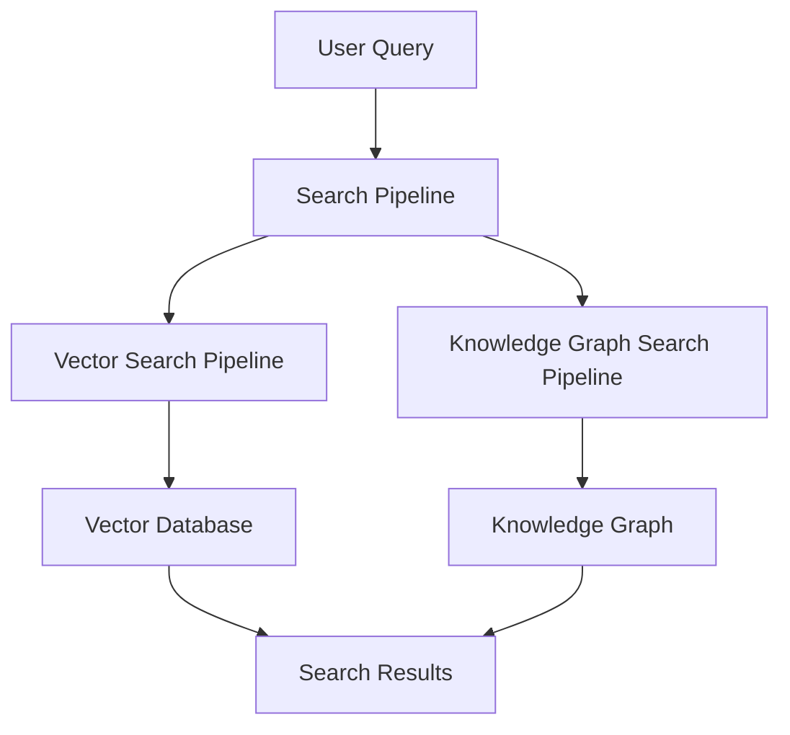

# R2R Search Pipeline

## Introduction

The R2R Search Pipeline is a sophisticated component designed for retrieving relevant information using both vector embeddings and knowledge graphs. It provides a versatile system that supports hybrid search capabilities, allowing for efficient and accurate information retrieval across different data structures.

<Note>
Before diving deep into the Search Pipeline, we recommend starting with the [R2R Quickstart](/documentation/quickstart) guide to familiarize yourself with R2R's basic concepts and operations.
</Note>

## Key Features

- **Hybrid Search**: Combines vector-based semantic search with knowledge graph querying for comprehensive results.
- **Vector-based Search**: Utilizes embeddings to perform semantic searches on vector databases.
- **Knowledge Graph Querying**: Leverages graph structures for complex, relationship-based queries.
- **Customizable**: Supports custom configurations for search filters, limits, and query generation.
- **Asynchronous Processing**: Efficiently handles search operations with asynchronous processing.
- **Reranking**: Implements result reranking for improved relevance (in vector search).

## Pipeline Architecture

The Search Pipeline in R2R consists of two main components that can be used independently or in combination:

1. Vector Search Pipeline
2. Knowledge Graph Search Pipeline

Here's a high-level overview of the pipeline structure:



## Pipeline Components

### Vector Search Pipeline

The Vector Search Pipeline processes queries and returns relevant results by leveraging vector embeddings.

#### Key Features

- Semantic search using vector embeddings
- Hybrid search combining semantic and keyword matching
- Customizable search filters and limits
- Asynchronous processing for efficiency
- Result reranking for improved relevance

#### Vector Search Pipe

The core component of the Vector Search Pipeline is the `VectorSearchPipe`:

```python
class VectorSearchPipe(SearchPipe):
    async def search(
        self,
        message: str,
        run_id: uuid.UUID,
        vector_search_settings: VectorSearchSettings,
        *args: Any,
        **kwargs: Any,
    ) -> AsyncGenerator[VectorSearchResult, None]:
        # Vector search implementation
```

<Note>
For a quick introduction to hybrid search in R2R, check out the [Hybrid Search Cookbook](/cookbooks/hybrid-search).
</Note>

### Knowledge Graph Search Pipeline

The Knowledge Graph Search Pipeline leverages graph structures to perform complex queries and retrieve contextual information.

#### Key Features

- LLM-powered querying for generating Cypher queries
- Execution of structured queries on the knowledge graph
- Customizable prompts for query generation

#### KG Agent Search Pipe

The main component of the Knowledge Graph Search Pipeline is the `KGAgentSearchPipe`:

```python
class KGAgentSearchPipe(GeneratorPipe):
    async def _run_logic(
        self,
        input: GeneratorPipe.Input,
        state: AsyncState,
        run_id: uuid.UUID,
        kg_search_settings: KGSearchSettings,
        *args: Any,
        **kwargs: Any,
    ):
        # Knowledge graph search implementation
```

<Note>
To learn more about using knowledge graphs with R2R, see the [GraphRAG Cookbook](/cookbooks/knowledge-graph).
</Note>

## Combining Search Methods

The `SearchPipeline` class allows for the combination of vector and knowledge graph search methods:

```python
class SearchPipeline(Pipeline):
    async def run(
        self,
        input: Any,
        state: Optional[AsyncState] = None,
        stream: bool = False,
        run_manager: Optional[RunManager] = None,
        log_run_info: bool = True,
        vector_search_settings: VectorSearchSettings = VectorSearchSettings(),
        kg_search_settings: KGSearchSettings = KGSearchSettings(),
        *args: Any,
        **kwargs: Any,
    ):
        # Combined search pipeline implementation
```

## Customizing the Search Pipeline

The Search Pipeline can be customized by adding different pipes or implementing custom logic. Here's an example of a custom search pipeline with additional query transformation:

```python
from r2r import SearchPipeline, R2RConfig, R2RProviderFactory, R2RPipeFactory, QueryTransformPipe

# Load configuration and create providers and pipes
config = R2RConfig.from_json()
providers = R2RProviderFactory(config).create_providers()
pipes = R2RPipeFactory(config, providers).create_pipes()

# Add a custom query transformation prompt
transform_prompt = {
    "name": "custom_search_transform_prompt",
    "template": "Enhance the search query for better results:\n\nQuery: {message}\n\nEnhanced Query:\n",
    "input_types": {"message": "str"},
}
providers.prompt.add_prompt(**transform_prompt)

# Create a query transform pipe
query_transform_pipe = QueryTransformPipe(
    llm_provider=providers.llm,
    prompt_provider=providers.prompt,
    config=QueryTransformPipe.QueryTransformConfig(
        task_prompt=transform_prompt["name"]
    ),
)

# Define a custom search pipeline
class CustomSearchPipeline(SearchPipeline):
    def __init__(self):
        super().__init__()
        self.add_pipe(query_transform_pipe)
        self.add_pipe(pipes.vector_search_pipe)
        self.add_pipe(pipes.kg_search_search_pipe)

# Use the custom pipeline
custom_pipeline = CustomSearchPipeline()
result = await custom_pipeline.run(
    input="What are the effects of climate change on biodiversity?",
    vector_search_settings=VectorSearchSettings(search_limit=5),
    kg_search_settings=KGSearchSettings(use_kg_search=True)
)
```

## Integration with R2R App

The Search Pipeline is exposed through the R2R App via the following API endpoint:

- `/v2/search`: Endpoint for performing search operations.

This endpoint is handled by the `RetrievalRouter` in the R2R App, which utilizes the `RetrievalService` to process search requests:

```python
@router.post("/search")
async def search(request: R2RSearchRequest, ...):
    return await engine.search(
        query=request.query,
        vector_search_settings=request.vector_search_settings,
        kg_search_settings=request.kg_search_settings,
        ...
    )
```

## Best Practices

1. **Efficient Indexing**: Ensure your vector database and knowledge graph are properly indexed for optimal search performance.
2. **Query Optimization**: Use query transformation techniques to enhance the quality of search queries.
3. **Balancing Methods**: Find the right balance between vector search and knowledge graph search based on your data and use case.
4. **Error Handling**: Implement robust error handling to manage issues with either search method without failing the entire search process.
5. **Monitoring**: Set up logging and monitoring to track search performance and identify areas for improvement.
6. **Scalability**: Design your custom pipes with scalability in mind, considering potential increases in query volume and complexity.

## Related Resources

To help you get started with R2R and its search capabilities, we recommend exploring the following resources:

- [Hybrid Search Cookbook](/cookbooks/hybrid-search): Introduction to running hybrid search with R2R.
- [/v2/search](/api-reference/endpoint/search): R2R Search endpoint documentation.

For more advanced usage and cloud integration, you can refer to the [SciPhi Cloud Docs](https://docs.sciphi.ai/).

## Conclusion

The R2R Search Pipeline provides a flexible and powerful way to retrieve information using both vector embeddings and knowledge graphs. Its modular design supports customization and asynchronous processing, making it suitable for diverse search requirements. By combining these search methods and allowing for custom extensions, it can deliver comprehensive and accurate results for various information retrieval tasks.

For more information on configuring and customizing the Search Pipeline, refer to the [R2R Configuration](/documentation/deep-dive/main/config) and [customizing R2R](/documentation/deep-dive/main/builder) documentation. If you need help or want to connect with other R2R users, [join our Discord server](https://discord.gg/p6KqD2kjtB).
