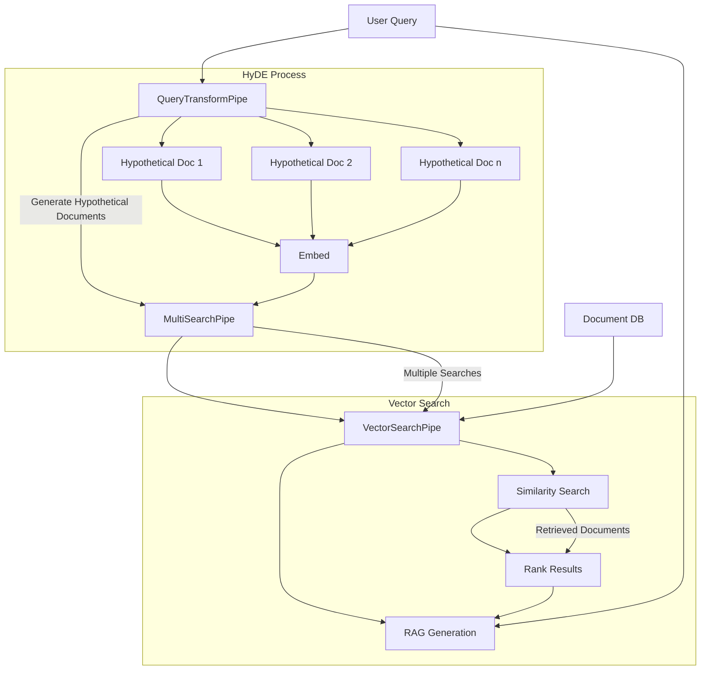
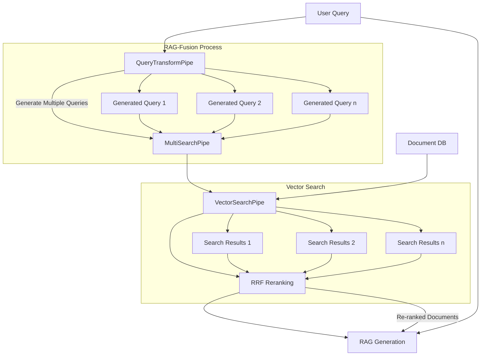

R2R supports advanced Retrieval-Augmented Generation (RAG) techniques that can be easily configured at runtime. This flexibility allows you to experiment with different state of the art strategies and optimize retrieval for specific use cases. **This cookbook will cover toggling between vanilla RAG, [HyDE](https://arxiv.org/abs/2212.10496) and [RAG-Fusion](https://arxiv.org/abs/2402.03367).**.

<Note>

Advanced RAG techniques are still a beta feature in R2R. They are not currently supported in agentic workflows and there may be limitations in observability and analytics when implementing them.


Are we missing an important RAG technique? If so, then please let us know at founders@sciphi.ai.

</Note>

## Supported Advanced RAG Techniques

R2R currently supports two advanced RAG techniques:

1. **HyDE (Hypothetical Document Embeddings)**: Enhances retrieval by generating and embedding hypothetical documents based on the query.
2. **RAG-Fusion**: Improves retrieval quality by combining results from multiple search iterations.

## Using Advanced RAG Techniques

You can specify which advanced RAG technique to use by setting the `search_strategy` parameter in your vector search settings. Below is a comprehensive overview of techniques supported by R2R.

### HyDE

#### What is HyDE?

HyDE is an innovative approach that supercharges dense retrieval, especially in zero-shot scenarios. Here's how it works:

1. **Query Expansion**: HyDE uses a Language Model to generate hypothetical answers or documents based on the user's query.
2. **Enhanced Embedding**: These hypothetical documents are embedded, creating a richer semantic search space.
3. **Similarity Search**: The embeddings are used to find the most relevant actual documents in your database.
4. **Informed Generation**: The retrieved documents and original query are used to generate the final response.

#### Implementation Diagram


The diagram which follows below illustrates the HyDE flow which fits neatly into the schema of our diagram above (note, the GraphRAG workflow is omitted for brevity):



#### Using HyDE in R2R


```python
client.retrieval.rag(
    "What are the main themes in the DeepSeek paper?",
    search_settings={
        "search_strategy": "hyde",
        "limit": 10
    }
)
```

```plaintext
RAGResponse(
    generated_answer='DeepSeek-R1 is a model that demonstrates impressive performance across various tasks, leveraging reinforcement learning (RL) and supervised fine-tuning (SFT) to enhance its capabilities. It excels in writing tasks, open-domain question answering, and benchmarks like IF-Eval, AlpacaEval2.0, and ArenaHard [1], [2]. DeepSeek-R1 outperforms its predecessor, DeepSeek-V3, in several areas, showcasing its strengths in reasoning and generalization across diverse domains [1]. It also achieves competitive results on factual benchmarks like SimpleQA, although it performs worse on the Chinese SimpleQA benchmark due to safety RL constraints [2]. Additionally, DeepSeek-R1 is involved in distillation processes to transfer its reasoning capabilities to smaller models, which perform exceptionally well on benchmarks [4], [6]. The model is optimized for English and Chinese, with plans to address language mixing issues in future updates [8].',
    search_results=AggregateSearchResult(
      chunk_search_results=[ChunkSearchResult(score=0.643, text=Document Title: DeepSeek_R1.pdf ...)]
    ),
    citations=[Citation(index=1, rawIndex=1, startIndex=305, endIndex=308, snippetStartIndex=288, snippetEndIndex=315, sourceType='chunk', id='e760bb76-1c6e-52eb-910d-0ce5b567011b', document_id='e43864f5-a36f-548e-aacd-6f8d48b30c7f', owner_id='2acb499e-8428-543b-bd85-0d9098718220', collection_ids=['122fdf6a-e116-546b-a8f6-e4cb2e2c0a09'], score=0.6433466439465674, text='Document Title: DeepSeek_R1.pdf\n\nText: could achieve an accuracy of over 70%.\nDeepSeek-R1 also delivers impressive results on IF-Eval, a benchmark designed to assess a\nmodels ability to follow format instructions. These improvements can be linked to the inclusion\nof instruction-following...]
    metadata={'id': 'chatcmpl-B0BaZ0vwIa58deI0k8NIuH6pBhngw', 'choices': [{'finish_reason': 'stop', 'index': 0, 'logprobs': None, 'message': {'refusal': None, 'role': 'assistant', 'audio': None, 'function_call': None, 'tool_calls': None}}], 'created': 1739384247, 'model': 'gpt-4o-2024-08-06', 'object': 'chat.completion', 'service_tier': 'default', 'system_fingerprint': 'fp_4691090a87', ...}
)
```
### RAG-Fusion

#### What is RAG-Fusion?

RAG-Fusion is an advanced technique that combines Retrieval-Augmented Generation (RAG) with Reciprocal Rank Fusion (RRF) to improve the quality and relevance of retrieved information. Here's how it works:

1. **Query Expansion**: The original query is used to generate multiple related queries, providing different perspectives on the user's question.
2. **Multiple Retrievals**: Each generated query is used to retrieve relevant documents from the database.
3. **Reciprocal Rank Fusion**: The retrieved documents are re-ranked using the RRF algorithm, which combines the rankings from multiple retrieval attempts.
4. **Enhanced RAG**: The re-ranked documents, along with the original and generated queries, are used to generate the final response.

This approach helps to capture a broader context and potentially more relevant information compared to traditional RAG.

#### Implementation Diagram

Here's a diagram illustrating the RAG-Fusion workflow (again, we omit the graph process for brevity):



#### Using RAG-Fusion in R2R


```python
rag_fusion_response = client.retrieval.rag(
    "What are the main themes in DeepSeeks paper?",
    search_settings={
        "search_strategy": "rag_fusion",
        "limit": 20
    }
)

```


### Combining with Other Settings

You can readily combine these advanced techniques with other search and RAG settings:

```python
custom_rag_response = client.retrieval.rag(
    "What are the main themes in the DeepSeek paper?",
    search_settings={
        "search_strategy": "hyde",
        "limit": 15,
        "use_hybrid_search": True
    },
    rag_generation_config={
        "model": "anthropic/claude-3-opus-20240229",
        "temperature": 0.7
    }
)
```


## Conclusion

By leveraging these advanced RAG techniques and customizing their underlying prompts, you can significantly enhance the quality and relevance of your retrieval and generation processes. Experiment with different strategies, settings, and prompt variations to find the optimal configuration for your specific use case. The flexibility of R2R allows you to iteratively improve your system's performance and adapt to changing requirements.
