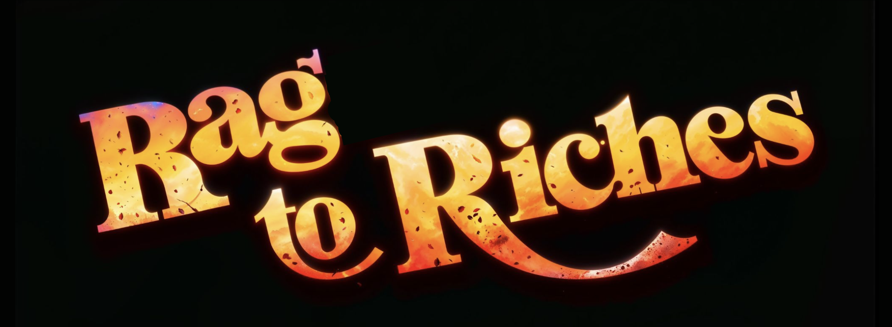

import GithubButtons from '../components/GithubButtons';

R2R (RAG to Riches), the Elasticsearch for RAG, bridges the gap between experimenting with and deploying state of the art Retrieval-Augmented Generation (RAG) applications. It's a complete platform that helps you quickly build and launch scalable RAG solutions. Built around a containerized [RESTful API](/api-reference/introduction), R2R offers multimodal ingestion support, hybrid search, GraphRAG, user & document management, and observability / analytics features.

## Key Features
- [**📁 Multimodal Ingestion**](/documentation/configuration/ingestion/overview): Parse `.txt`, `.pdf`, `.json`, `.png`, `.mp3`, and more.
- [**🔍 Hybrid Search**](/cookbooks/hybrid-search): Combine semantic and keyword search with reciprocal rank fusion for enhanced relevancy.
- [**🔗 Graph RAG**](/cookbooks/graphrag): Automatically extract relationships and build knowledge graphs.
- [**🗂️ App Management**](/cookbooks/user-auth): Efficiently manage documents and users with full authentication.
- [**🔭 Observability**](/cookbooks/observability): Observe and analyze your RAG engine performance.
- [**🧩 Configurable**](/documentation/configuration/introduction): Provision your application using intuitive configuration files.
- [**🖥️ Dashboard**](https://github.com/SciPhi-AI/R2R-Dashboard): An open-source React+Next.js app with optional authentication, to interact with R2R via GUI.

## Getting Started

- [Installation](/documentation/installation): Quick installation of R2R using Docker or pip
- [Quickstart](/documentation/quickstart): A quick introduction to R2R's core features
- [Setup](/documentation/configuration/introduction): Learn how to setup and configure R2R

## API & SDKs

- [SDK](/documentation/python-sdk): API reference and Python/JS SDKs for interacting with R2R
- [API](/api-reference/introduction): API reference and Python/JS SDKs for interacting with R2R
- [Configuration](/documentation/configuration): A guide on how to configure your R2R system
- [SciPhi Website](https://sciphi.ai/): Explore a managed AI solution powered by R2R.
- [Contact Us](mailto:founders@sciphi.ai): Get in touch with our team to discuss your specific needs.

## Cookbooks

- Advanced RAG Pipelines
  - [RAG Agent](/cookbooks/agent): R2R's powerful RAG agent
  - [Hybrid Search](/cookbooks/hybrid-search): Introduction to hybrid search
  - [Advanced RAG](/cookbooks/advanced-rag): Advanced RAG features

- Knowledge Graphs
  - [GraphRAG](/cookbooks/graphrag): Walkthrough of GraphRAG

- Orchestration
  - [GraphRAG](/cookbooks/orchestration): R2R event orchestration

- Auth & Admin Features
  - [Web Development](/cookbooks/web-dev): Building webapps using R2R
  - [User Auth](/cookbooks/user-auth): Authenticating users
  - [Collections](/cookbooks/collections): Document collections
  - [Analytics & Observability](/cookbooks/observability): End-to-end logging and analytics
  - [Web Application](/cookbooks/application): Connecting with the R2R Application

## Community

[Join our Discord server](https://discord.gg/p6KqD2kjtB) to get support and connect with both the R2R team and other developers in the community. Whether you're encountering issues, looking for advice on best practices, or just want to share your experiences, we're here to help.
