## System Diagram

```mermaid
graph TD
    U((User)) -->|Query| GW[Traefik Gateway]
    GW -->|Route| API[R2R API Cluster]
    API -->|Authenticate| AS[Auth Service]

    R2R[R2R Application] -->|Use| API

    subgraph "Core Services"
        AS
        ReS[Retrieval Service]
        IS[Ingestion Service]
        GBS[Graph Builder Service]
        AMS[App Management Service]
    end

    subgraph "Providers"
        EP[Embedding Provider]
        LP[LLM Provider]
        AP[Auth Provider]
        IP[Ingestion Provider]
    end

    IS & GBS & ReS <-->|Coordinate| O

    ReS -->|Use| EP
    ReS -->|Use| LP
    IS -->|Use| EP
    IS -->|Use| IP
    GBS -->|Use| LP
    AS -->|Use| AP

    subgraph "Orchestration"
        O[Orchestrator]
        RMQ[RabbitMQ]
        O <-->|Use| RMQ
    end

    subgraph "Storage"
        PG[(Postgres + pgvector)]
        FS[File Storage]
    end

    AS & AMS & ReS -->|Use| PG
    GBS & ReS -->|Use| Neo
    IS -->|Use| FS

    classDef gateway fill:#2b2b2b,stroke:#ffffff,stroke-width:2px;
    classDef api fill:#4444ff,stroke:#ffffff,stroke-width:2px;
    classDef orchestrator fill:#007acc,stroke:#ffffff,stroke-width:2px;
    classDef messagequeue fill:#2ca02c,stroke:#ffffff,stroke-width:2px;
    classDef storage fill:#336791,stroke:#ffffff,stroke-width:2px;
    classDef providers fill:#ff7f0e,stroke:#ffffff,stroke-width:2px;
    classDef auth fill:#ff0000,stroke:#ffffff,stroke-width:2px;
    classDef application fill:#9932cc,stroke:#ffffff,stroke-width:2px;
    class GW gateway;
    class API api;
    class O orchestrator;
    class RMQ messagequeue;
    class PG,Neo,FS storage;
    class EP,LP,AP,IP providers;
    class AS auth;
    class R2R application;
```

## System Overview

R2R is built on a modular, service-oriented architecture designed for scalability and flexibility:

1. **API Layer**: A FastAPI-based cluster handles incoming requests, routing them to appropriate services.

2. **Core Services**: Specialized services for authentication, retrieval, ingestion, graph building, and app management.

3. **Orchestration**: Manages complex workflows and long-running tasks using a message queue system.

4. **Storage**: Utilizes PostgreSQL with pgvector for vector storage and search, and graph search.

5. **Providers**: Pluggable components for embedding, LLM, auth, and ingestion services, supporting multimodal ingestion and flexible model integration.

6. **R2R Application**: A React+Next.js app providing a user interface for interacting with the R2R system.

This architecture enables R2R to handle everything from simple RAG applications to complex, production-grade systems with advanced features like hybrid search and GraphRAG.

Ready to get started? Check out our [Docker installation guide](/documentation/installation/full/docker) and [Quickstart tutorial](/documentation/quickstart) to begin your R2R journey.
