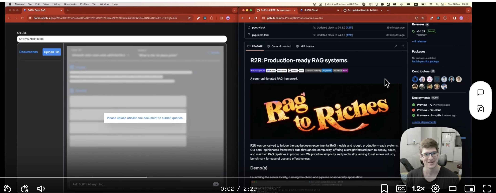

# Basic Example

This example demonstrates how to run a basic R2R application that includes ingestion, embedding, and RAG pipelines. It also shows how to interact with the local server using the [`R2RClient`](https://github.com/SciPhi-AI/R2R/blob/main/r2r/client/base.py).

## Step 1: Launch the Basic Application Server

To launch the basic application server, run the following command:

```bash
python -m r2r.examples.servers.basic_pipeline
```

This command starts the backend server with the basic RAG pipeline, which includes the ingestion, embedding, and RAG pipelines served via FastAPI.

The server exposes the default pipeline, and the pipeline settings are defined in the `config.json` file. The default values for these settings are shown in the [config.json section](#configjson) below.

## Step 2: Interact with the R2RClient

After starting the basic pipeline server, you can interact with it using the `R2RClient`. The `R2RClient` provides an interface to communicate with the server and perform various operations.

To run the basic client example, use the following command:

```bash
python -m r2r.examples.clients.run_basic_client
```

This example demonstrates uploading text entries and a PDF to the local server using the Python client. It also showcases document and user-level vector management with built-in features.

The `R2RClient` provides the following main methods:

- `upload_and_process_file(document_id: str, file_path: str, metadata: Optional[dict] = None, settings: Optional[dict] = None) -> dict`: Uploads a file to the server and processes it.

- `add_entry(document_id: str, blobs: Dict[str, str], metadata: Optional[Dict[str, Any]] = None, do_upsert: Optional[bool] = False, settings: Optional[Dict[str, Any]] = None) -> dict`: Adds an entry to the server.

- `add_entries(entries: List[Dict[str, Any]], do_upsert: Optional[bool] = False, settings: Optional[Dict[str, Any]] = None) -> dict`: Adds multiple entries to the server.

- `search(query: str, limit: Optional[int] = 10, filters: Optional[Dict[str, Any]] = None, settings: Optional[Dict[str, Any]] = None) -> dict`: Searches the server for a query.

- `rag_completion(query: str, limit: Optional[int] = 10, filters: Optional[Dict[str, Any]] = None, settings: Optional[Dict[str, Any]] = None) -> dict`: Requests a RAG completion from the server.

- `filtered_deletion(key: str, value: Union[bool, int, str]) -> dict`: Deletes entries from the server based on a filter.

- `get_logs() -> dict`: Retrieves logs from the server.

- `get_logs_summary() -> dict`: Retrieves a summary of logs from the server.

## Step 3: Configure the Application

<a name="configjson"></a>

During the example pipeline creation, a default `config.json` is loaded and passed to the pipeline. It provides settings for various components, including the database provider, LLM settings, embedding settings, parsing logic, and more.

The default values for the configuration are shown below:

```json
{
  "vector_database": {
    "provider": "local",
    "collection_name": "demo-v1-test"
  },
  "evals": {
    "provider": "deepeval",
    "frequency": 0.25
  },
  "embedding": {
    "provider": "openai",
    "model": "text-embedding-3-small",
    "dimension": 1536,
    "batch_size": 32
  },
  "text_splitter": {
    "chunk_size": 512,
    "chunk_overlap": 20
  },
  "language_model": {
    "provider": "litellm",
    "model": "gpt-4-0125-preview",
    "temperature": 0.1,
    "top_p": 0.9,
    "top_k": 128,
    "max_tokens_to_sample": 1024,
    "do_stream": false
  },
  "logging": {
    "provider": "local",
    "level": "INFO",
    "name": "r2r",
    "database": "demo_logs_v1"
  }
}
```

_Note: For a full list of options, see [Config Setup](../core_features/config.mdx)._

The pipeline consists of three main components: `Ingestion`, `Embedding`, and `RAG`, along with `Logging`.

To launch your own custom application pipeline, you can use the following code:

```python
class E2EPipelineFactory:
    ...
    app = E2EPipelineFactory.create_pipeline(
        # override with your own custom ingestion pipeline
        ingestion_pipeline_impl=BasicIngestionPipeline,
        # override with your own custom embedding pipeline
        embedding_pipeline_impl=BasicEmbeddingPipeline,
        # override with your own custom RAG pipeline
        rag_pipeline_impl=BasicRAGPipeline,
        # override with your own config.json
        config=R2RConfig.load_config("your_config_path.json")
    )
```

This code allows you to customize the pipeline components and provide your own configuration file.

## Demo: Installation and Launching Basic App & Client

[](https://github.com/SciPhi-AI/r2r/assets/68796651/c648ab67-973a-416a-985e-2eafb0a41ef0)

The demo video above showcases the installation process and demonstrates how to launch the basic application server and interact with it using the R2RClient.

By following the steps outlined in this example, you can quickly set up and run a basic R2R application, customize the pipeline components, and interact with the server using the provided client methods.