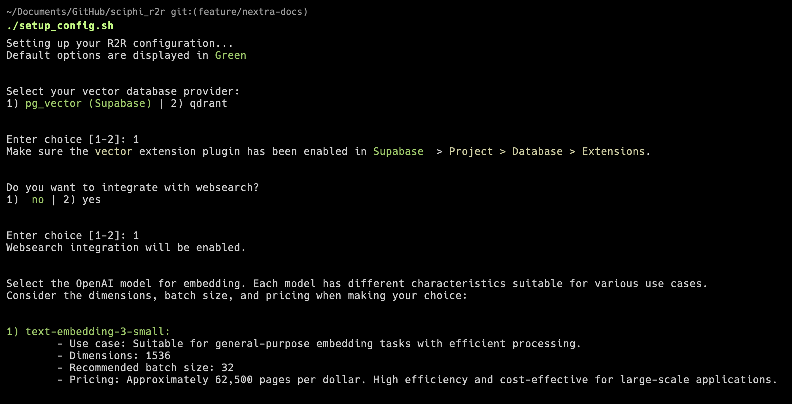

import Image from "next/image";

## Developer Installation

This section outlines the installation process for the R2R framework. Our recommended approach is to following the [full install](#full-install) guidelines to fully leverage the options offered by `config.json`. However, if you just want to set it up as a package to test how it works, you can do it via [fast install](#fast-install).

### Quick Navigation

- [Fast Install](#fast-install): Quick setup using `pip`.
- [Full Install](#full-install): Detailed setup to leverage `config.json`.
  1. [Config Setup (Optional)](#config-setup-optional): Create `.env` and `config.json`.
  2. [Install Poetry](#install-poetry): Ensure Poetry is installed.
  3. [Clone and Install Dependencies](#clone-and-install-dependencies): Get the project and its dependencies.
  4. [Configure Environment Variables](#configure-environment-variables): Set up necessary `.env` configurations.

### Fast Install:

    **Install R2R directly using `pip`:**

    ```bash
    pip install r2r
    ```

### Full Install:

The core idea of a Full install is to fully leverage the `config.json` file in order to setup your pipelines.

##### Config Setup (Optional)

This script will update a `.env.example` file and a `config.json` files according to your installation preferences. Both files will contain the necessary environment variables for the project to get initialized properly.



Make the Script Executable (if it's not already):

```bash
chmod +x setup_config.sh
```

Run the Script and input your preferences:

```bash
./setup_config.sh
```

These are the available options, with the first being the `default(Option){:py}`:

- **Vector Database Provider**: `pg_vector(Supabase){:py}` | `qdrant`
- **Websearch Integration**: `False{:py}` | `True`
- **Embedding Provider**: `openAI{:py}` -> _More coming soon!_
- **Embeddings Model**: `text-embedding-3-small{:py}` | `text-embedding-3-large` | `text-embedding-ada-002`
- **Embedding Model Dimension**: `1536{:py}` | `2048` | `4096` | `Custom`
- **Embedding Batch Size**: `16{:py}` | `24` | `32` | `Custom`

**Follow the Prompts**: The script will guide you through several configuration options, including selecting your vector database provider (Supabase or Qdrant), setting up the embedding provider (currently OpenAI), choosing the OpenAI model, and specifying other settings such as dimension and batch size. Simply follow the prompts and enter your choices.

##### Install Poetry:

Poetry manages the virtual environment and dependency resolution for your project, making it compatible with both existing `Pip` and `Conda` environments.
To install poetry, visit the [official Poetry website](https://python-poetry.org/docs/#installation) for the latest package and installation instructions or run the following command.

```bash
pipx install poetry
```

##### Clone and Install Dependencies:

Clone the project repository and navigate to the project directory:

```bash
git clone git@github.com:SciPhi-AI/r2r.git
cd r2r
```

Install the project dependencies with Poetry:

```bash
poetry install
```

##### Configure Environment Variables:

- Copy the `.env.example` to `.env` to apply your configurations, which should be updated after you've run the `setup_config.sh{:bash}` script.:

  ```bash
  cp .env.example .env
  ```

- We have several config options to run the project locally or at the cloud. At minimum, you'll need your OpenAI key secrets in your `.env` file for the project to work properly.
- For a fast setup, we recommend creating a project on Supabase, enabling the vector extension, and then updating the `.env` with the necessary details.

## Demo

https://github.com/SciPhi-AI/r2r/assets/68796651/c648ab67-973a-416a-985e-2eafb0a41ef0
