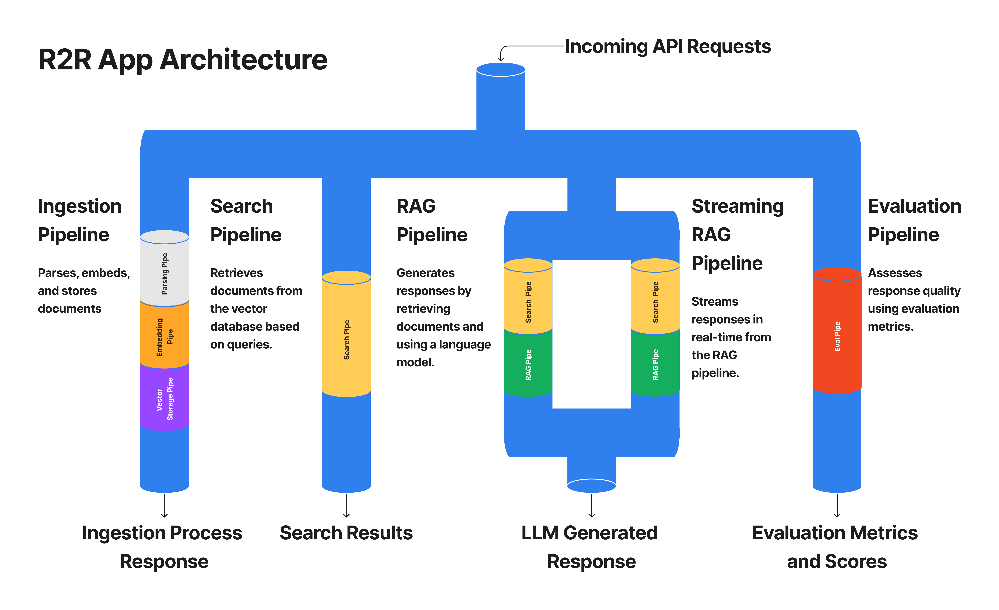

import { Callout } from 'nextra/components'

## Quickstart

This guide offers a step-by-step walkthrough of the core features provided by R2R using the R2R Python SDK. The framework includes a REST API for document ingestion, RAG, evaluation, and supporting features like observability, analytics, and document management.



We will start by ingesting a list of assorted document types to showcase search, RAG, and more advanced functionalities. The script powering this quickstart, [`r2r/examples/quickstart.py`](https://github.com/SciPhi-AI/R2R/blob/main/r2r/examples/quickstart.py), can be easily customized to fit your specific use case.

## Setup

<Callout type="info" emoji="🐳">
   The quickstart guide which follows below assumes that you have installed R2R locally via `pip install r2r`.

   If you would prefer to do the heavy lifting with Docker instead then refer to the [Docker installation instructions](/getting-started/installation?tab=Installing+with+Docker+%F0%9F%90%B3) and then proceed to the [client-server cookbook](/cookbooks/client-server).
</Callout>


## R2R Dashboard

Developers can interact with R2R in several ways, including through our [open-source React+Next.js dashboard](https://github.com/SciPhi-AI/R2R-Dashboard). The dashboard is designed to give R2R developers an easy way to interface with their pipelines, reducing development and iteration time. Checkout the [Dashboard Cookbook](https://r2r-docs.sciphi.ai/cookbooks/dashboard) to get started!

## Interacting with your Documents

<details open>
<summary>Ingesting Files</summary>
    To comprehensively demonstrate the RAG functionalities of the R2R framework, we must start by ingesting a realistic set of documents. Running the command below will parse, chunk, embed, and store a preset list of files. The included file types cover HTML, PDF, PNG, and TXT examples:

    ```bash filename="bash" copy
    python -m r2r.examples.quickstart ingest_as_files
    ```

    **Demo Output:**

    ```ansi
    r2r.main.r2r_config - INFO - Loading configuration from <YOUR_WORKDIR>/config.json - 2024-05-20 22:08:48,025
    r2r.core.providers.llm_provider - INFO - Initializing LLM provider with config: extra_fields={} provider='litellm' - 2024-05-20 22:08:48,562
    r2r.core.providers.vector_db_provider - INFO - Initializing VectorDBProvider with config extra_fields={} provider='local' collection_name='demo_vecs'. - 2024-05-20 22:08:48,765
    r2r.providers.embeddings.openai.openai_base - INFO - Initializing `OpenAIEmbeddingProvider` to provide embeddings. - 2024-05-20 22:08:48,774
    ...
    r2r.pipes.parsing_pipe - INFO - Parsed document with metadata={'title': 'pg_essay_1.html', 'user_id': '063edaf8-3e63-4cb9-a4d6-a855f36376c3'} and id=4a4fb848-fc03-5487-a7e5-33c9fdfb73cc in t=0.00 seconds. - 2024-05-21 08:39:59,003
    r2r.pipes.parsing_pipe - INFO - Parsed document with metadata={'title': 'lyft_2021.pdf', 'user_id': '063edaf8-3e63-4cb9-a4d6-a855f36376c3'} and id=c5abc0b7-b9e5-54d9-b3d3-fdb14af4d065 in t=3.47 seconds. - 2024-05-21 08:40:02,477
    r2r.pipes.parsing_pipe - INFO - Parsed document with metadata={'title': 'pg_essay_2.html', 'user_id': '063edaf8-3e63-4cb9-a4d6-a855f36376c3'} and id=f0c63aff-af59-50c9-81fc-2fe55004c771 in t=0.00 seconds. - 2024-05-21 08:40:02,479
    r2r.pipes.parsing_pipe - INFO - Parsed document with metadata={'title': 'uber_2021.pdf', 'user_id': '063edaf8-3e63-4cb9-a4d6-a855f36376c3'} and id=c996e617-88a4-5c65-ab1e-948344b18d27 in t=4.96 seconds. - 2024-05-21 08:40:07,440
    r2r.pipes.parsing_pipe - INFO - Parsed document with metadata={'title': 'pg_essay_3.html', 'user_id': '063edaf8-3e63-4cb9-a4d6-a855f36376c3'} and id=1a9d4d3b-bbe9-53b9-8149-67806bdf60f2 in t=0.00 seconds. - 2024-05-21 08:40:07,442
    r2r.pipes.parsing_pipe - INFO - Parsed document with metadata={'title': 'screen_shot.png', 'user_id': '063edaf8-3e63-4cb9-a4d6-a855f36376c3', 'image_type': 'png'} and id=74f1506a-9a37-59d7-b288-5ef3683dca8f in t=24.87 seconds. - 2024-05-21 08:40:32,310
    r2r.pipes.parsing_pipe - INFO - Parsed document with metadata={'title': 'pg_essay_4.html', 'user_id': '063edaf8-3e63-4cb9-a4d6-a855f36376c3'} and id=b722f1ec-b90e-5ed8-b7c8-c768e8b323cb in t=0.00 seconds. - 2024-05-21 08:40:32,313
    r2r.pipes.parsing_pipe - INFO - Parsed document with metadata={'title': 'aristotle.txt', 'user_id': '063edaf8-3e63-4cb9-a4d6-a855f36376c3'} and id=c9bdbac7-0ea3-5c9e-b590-018bd09b127b in t=0.00 seconds. - 2024-05-21 08:40:32,313
    r2r.pipes.parsing_pipe - INFO - Parsed document with metadata={'title': 'pg_essay_5.html', 'user_id': '063edaf8-3e63-4cb9-a4d6-a855f36376c3'} and id=ef66e5dd-2130-5fd5-9bdd-aa7eff59fda5 in t=0.00 seconds. - 2024-05-21 08:40:32,317
    r2r.pipes.parsing_pipe - INFO - Parsed document with metadata={'title': 'sample.mp3', 'user_id': '063edaf8-3e63-4cb9-a4d6-a855f36376c3'} into 1 extractions in t=1.35 seconds. - 2024-06-06 15:49:00,311
    r2r.pipes.parsing_pipe - INFO - Parsed document with metadata={'title': 'sample2.mp3', 'user_id': '063edaf8-3e63-4cb9-a4d6-a855f36376c3'} into 1 extractions in t=1.95 seconds. - 2024-06-06 15:58:07,273
    r2r.pipes.embedding_pipe - INFO - Fragmented the input document ids into counts as shown: {UUID('4a4fb848-fc03-5487-a7e5-33c9fdfb73cc'): 31, UUID('c5abc0b7-b9e5-54d9-b3d3-fdb14af4d065'): 2094, UUID('f0c63aff-af59-50c9-81fc-2fe55004c771'): 17, UUID('c996e617-88a4-5c65-ab1e-948344b18d27'): 3108, UUID('1a9d4d3b-bbe9-53b9-8149-67806bdf60f2'): 18, UUID('c9bdbac7-0ea3-5c9e-b590-018bd09b127b'): 233, UUID('b722f1ec-b90e-5ed8-b7c8-c768e8b323cb'): 5, UUID('74f1506a-9a37-59d7-b288-5ef3683dca8f'): 10, UUID('ef66e5dd-2130-5fd5-9bdd-aa7eff59fda5'): 11} - 2024-06-04 13:34:40,885
    {'results': ["File 'aristotle.txt' processed successfully.", "File 'screen_shot.png' processed successfully.", "File 'pg_essay_1.html' processed successfully.", "File 'pg_essay_2.html' processed successfully.", "File 'pg_essay_3.html' processed successfully.", "File 'pg_essay_4.html' processed successfully.", "File 'pg_essay_5.html' processed successfully.", "File 'lyft_2021.pdf' processed successfully.", "File 'uber_2021.pdf' processed successfully."]}
    ```

    **Note**

    Each ingested document derives a unique `document_id` from the input file path. As the document is parsed, chunked, and embedded, this association is maintained to allow for frictionless vector database management. Additionally, the demo submits a `user_id` during the document creation process which will be used to facilitate user-level document management.
</details>

<details>
<summary>Document Info</summary>
    We can fetch associated document metadata after successfully ingesting the demo documents:

    ```bash filename="bash" copy
    python -m r2r.examples.quickstart documents_info
    ```
    **Demo Output:**

    ```ansi
    [
        DocumentInfo(
            document_id=UUID('c9bdbac7-0ea3-5c9e-b590-018bd09b127b'),
            version='v0',
            size_in_bytes=73353,
            metadata={'title': 'aristotle.txt', 'user_id': '063edaf8-3e63-4cb9-a4d6-a855f36376c3'},
            title='aristotle.txt'
        ),
        ...
    ]
    ```

    ```bash filename="bash" copy
    python -m r2r.examples.quickstart users_stats
    ```


    ```plaintext
    [
        UserStats(
            user_id=UUID('063edaf8-3e63-4cb9-a4d6-a855f36376c3'),
            num_files=9,
            total_size_in_bytes=4809510,
            document_ids=[UUID('c9bdbac7-0ea3-5c9e-b590-018bd09b127b'), ...]
        ),
    ]
    ```
</details>

## Basic RAG Functionality

The basic RAG functionality of the R2R framework allows you to search ingested documents and generate responses using Retrieval-Augmented Generation (RAG). These steps will guide you through performing a search query, generating a RAG response, and streaming RAG results.

<details open>
<summary>Search Documents</summary>
    Documents are stored by default in a local vector database. The vector database provider and settings can be specified via an input `config.json`. To perform a search query on the ingested user documents, use the following command:

    ```bash
    python -m r2r.examples.quickstart search --query="Who was Aristotle?"
    ```

    **Demo Output:**

    ```plaintext
    {
        'id': UUID('93c44e73-8e95-50c2-84af-6a42f070b552'),
        'score': 0.7739712385010018,
        'metadata':
        {
            'document_id': '15255e98-e245-5b58-a57f-6c51babf72dd',
            'extraction_id': '5c61f9b9-b468-5fd7-8eb1-5d797a15c484',
            'text': 'Aristotle[A] (Greek: Ἀριστοτέλης Aristotélēs, pronounced [aristotélɛːs]; 384–322 BC) was an Ancient Greek philosopher and polymath. His writings cover a broad range of subjects spanning the natural sciences, philosophy, linguistics, economics, politics, psychology, and the arts. As the founder of the Peripatetic school of philosophy in the Lyceum in Athens, he began

    the wider Aristotelian tradition that followed, which set the groundwork for the development of modern science.',
            'title': 'aristotle.txt',
            'user_id': '063edaf8-3e63-4cb9-a4d6-a855f36376c3',
            'associatedQuery': 'Who was Aristotle?'
        }
    },
    ...
    ```
</details>

<details>
<summary>Completion Response</summary>
To generate a response for a query using RAG, execute the following command:

```bash filename="bash" copy
python -m r2r.examples.quickstart rag --query="What was Ubers profit in 2020?"
```

**Demo Output:**

```ansi
...
{'results': [
    ChatCompletion(
        id='chatcmpl-9RCB5xUbDuI1f0vPw3RUO7BWQImBN',
        choices=[
            Choice(
                finish_reason='stop',
                index=0,
                logprobs=None,
                message=ChatCompletionMessage(
                    content="Uber's profit in 2020 was a net loss of $6,768 million [10].",
                    role='assistant',
                    function_call=None,
                    tool_calls=None)
                )
            ],
        created=1716268695,
        model='gpt-3.5-turbo-0125',
        object='chat.completion',
        system_fingerprint=None,
        usage=CompletionUsage(completion_tokens=20, prompt_tokens=1470, total_tokens=1490)
    )
]}
```
</details>

<details>
<summary>Streaming Response</summary>
For streaming results from a RAG query, use the following command:

```bash filename="bash" copy
python -m r2r.examples.quickstart rag --query="What was Lyfts profit in 2020?" --streaming=true
```

**Demo Output:**

```ansi
r2r.main.r2r_config - INFO - Loading configuration from <YOUR_WORKDIR>/config.json - 2024-05-20 22:27:31,890
...
<search>["{\"id\":\"808c47c5-ebef-504a-a230-aa9ddcfbd87 .... </search>
<completion>Lyft reported a net loss of $1,752,857,000 in 2020 according to [2]. Therefore, Lyft did not make a profit in 2020.</completion>
```
</details>

## Document Management

Effective document management is crucial for maintaining a robust and efficient RAG system. This section guides you through various operations related to document management, including deleting documents and managing user-specific data. These steps will help ensure your document database remains organized and up-to-date.

<details open>
<summary>Update Document</summary>
To update document(s) we may use the `update_as_files` or `update_as_documents` endpoints. Running the demo with `update_as_files` overwrites the data associated with 'aristotle.txt' with new data corresponding to 'aristotle_v2.txt' and increments the file version.

```bash filename="bash" copy
python -m r2r.examples.quickstart update_as_files
```
</details>

<details>
<summary>Document Deletion</summary>
To delete a document by its ID, or any other metadata field, use the delete command. For example, to delete all chunks corresponding to the uploaded file `aristotle.txt`, we can call delete on the associated document ID with the value `15255e98-e245-5b58-a57f-6c51babf72dd`:

```bash filename="bash" copy
python -m r2r.examples.quickstart delete --keys="['document_id']" --values="['c9bdbac7-0ea3-5c9e-b590-018bd09b127b']"
```
By default the delete method will perform an AND operation over all given metadata keys and values.

After deleting a document, you can run a search command to verify its removal:

```bash filename="bash" copy
python -m r2r.examples.quickstart search --query="Who was Aristotle?"
```

**Demo Output:**

```ansi
{'id': UUID('37993d2c-b61a-58b4-9a89-f167d59b8633'), 'score': 0.2662125334175588, ...}
{'id': UUID('1669532f-8b2c-5eb0-b203-f0731490f8e9'), 'score': 0.2565397481515653, ...}
...
```

**Note**

The quality of search results has dramatically decreased now that the Aristotle-specific document has been fully erased. This highlights the importance of the ingested data quality on the RAG results.
</details>

<details>
<summary>User Specific Document Deletion</summary>
To delete all documents associated with a given user, run the delete command on the `user_id`.

```bash filename="bash" copy
# run the following command with care, as it will erase all ingested user data for `063edaf8-3e63-4cb9-a4d6-a855f36376c3`
python -m r2r.examples.quickstart delete --keys="['user_id']" --values="['063edaf8-3e63-4cb9-a4d6-a855f36376c3']"
```

Afterwards, we may confirm complete user documentation through the `documents_info` endpoint.

**Demo Output:**

```ansi filename="bash" copy
...
{'results': []}
```
</details>

## Advanced Features

<details>
<summary>Logging</summary>
Pipes naturally integrate with your selected logging provider. R2R pipelines for ingestion, search, and RAG create comprehensive logs that allow for total observability.

```bash filename="bash" copy
python -m r2r.examples.quickstart logs
```

**Demo Output:**

```ansi
...
{'results': [
    {
        'run_id': UUID('9b70a494-c5c9-4485-b7a5-675f0eacb4a0'),
        'run_type': 'ingestion',
        'entries': [
            {'key': 'extraction', 'value': '{"data": "\\n\\nA Project of One\'s Ow ....
```
</details>

- [Client-Server Architecture](/cookbooks/client-server)
- [Multiple LLM Providers](/cookbooks/multiple-llms)
- [Local RAG](/cookbooks/local-rag)
- [Hybrid Search](/cookbooks/hybrid-search)
- [Search w/ Reranking](/cookbooks/rerank-search)
- [Multimodal RAG](/cookbooks/multimodal-rag)
- [Knowledge Graphs](/cookbooks/knowledge-graph)
- [Dashboard](/cookbooks/dashboard)


## Next Steps
This R2R quickstart guides you through the basics of setting up and using the R2R framework to run a Retrieval-Augmented Generation (RAG) pipeline, but this is just a start! [Checkout our cookbooks](../cookbooks/starter) for more advanced tutorials.
