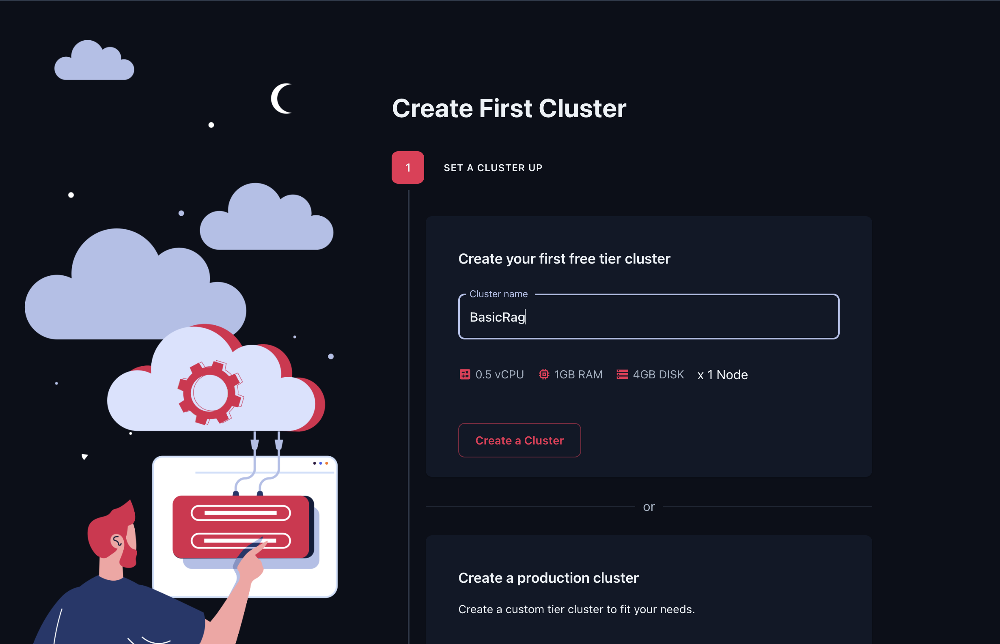
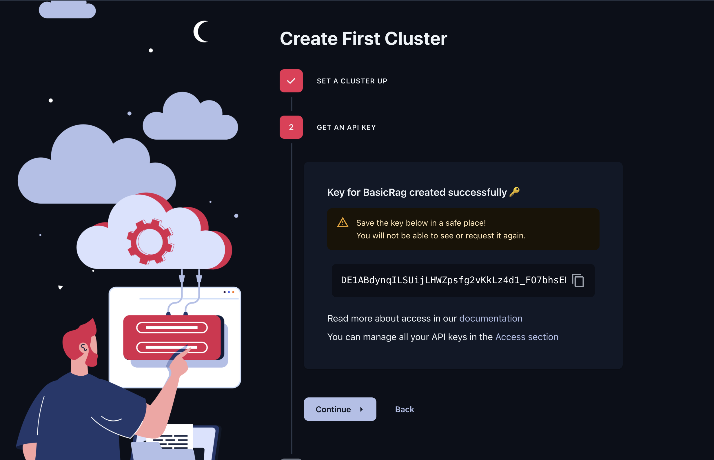
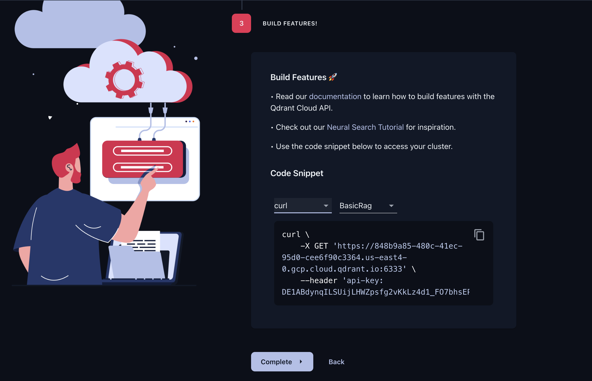
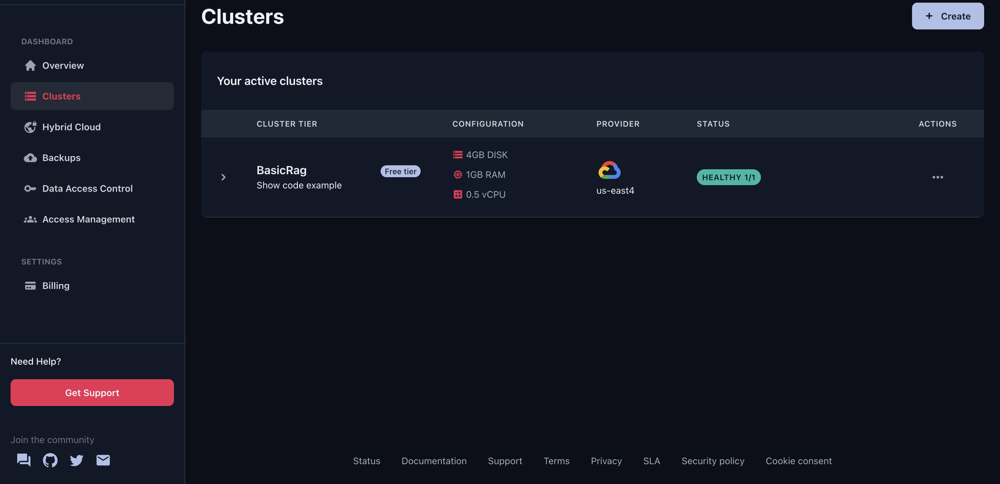
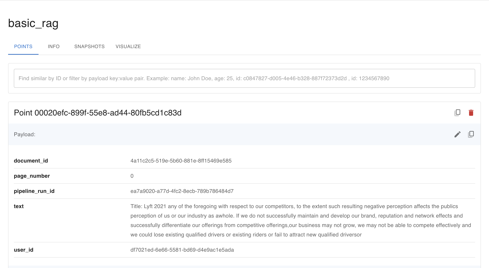
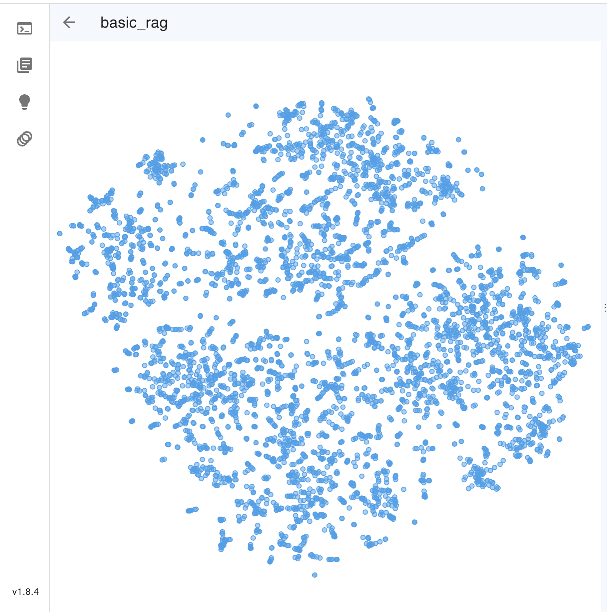

## Basic RAG using Cloud Providers with R2R: A Step-by-Step Guide

R2R, short for "RAG to Riches," is a game-changing framework that simplifies the process of building applications with LLMs. With R2R, you can hit the ground running with a local RAG system in minutes, eliminating the need for complex cloud infrastructure or costly hosted services.

Locally hosted solutions might not be be a good fit for your use case. Cloud providers offer scalable and cost-effective solutions for hosting LLMs and databases, making them ideal for applications that require flexibility and scalability. Additionally, cloud services often include built-in features for security, backup, and maintenance, reducing the burden on developers and ensuring the reliability of your application.

In this comprehensive, step-by-step tutorial, we'll guide you through the process of installing R2R, ingesting your documents, querying those docs using a cloud provider's LLM, and tailoring the RAG pipeline to perfectly fit your unique requirements. By the end of this guide, you'll have a fully functional and readily deployable LLM application at your fingertips!

### Running R2R with Docker

If you prefer using Docker, you can easily run R2R in a containerized environment. Here's how:

1. Pull the latest R2R Docker image:

   ```bash
   docker pull emrgntcmplxty/r2r:latest
   ```

2. Choose the appropriate configuration option based on your deployment:
   - For cloud deployment, select `default` and pass `--env-file .env` to provide the necessary environment variables.
   - For local deployment, select `local_ollama`.

3. Run the R2R Docker container:

   ```bash
   docker run -d --name r2r_container -p 8000:8000 -e CONFIG_OPTION=local_ollama emrgntcmplxty/r2r:latest
   ```

   This command starts the R2R container in detached mode (`-d`), names it `r2r_container`, maps port 8000 from the container to the host (`-p 8000:8000`), and sets the configuration option to `local_ollama` using the `-e` flag.

Once the container is running, you can interact with the R2R API in the same way as described in the tutorial.

### Setting Up Your Environment
R2R supports a number of cloud LLM providers through `LiteLLM` and `OpenAI`. You'll need to set your `OPENAI_API_KEY` in the `.env` file.

To install R2R, we'll use pip to manage Python dependencies by running the following command:

```bash
pip install --upgrade pip
pip install 'r2r[eval]'
```

Now we'll need to add an OpenAI API key, which is required to create embeddings and make LLM calls. You can create new keys through your [OpenAI account](https://platform.openai.com/docs/quickstart?context=python). Simply add your key in the `.env` file:

```bash
## openai
OPENAI_API_KEY=your_openai_key
```


To toggle between different LLM providers, you need to update the `language_model` section of the configuration file (`config.json`). For example:

```json
"language_model": {
    "provider": "litellm",
}
```

By changing the `provider` value to either `"openai"` or `"litellm"` you can switch between the supported cloud LLM providers.


### Pipeline Configuration

R2R relies on a `config.json` file for defining various settings, such as embedding models and chunk sizes. By default, the `config.json` found in the R2R GitHub repository's root directory is set up for cloud-based services.

By default, R2R uses the OpenAI `text-embedding-3-small` for creating embeddings, Parea for evals, and LiteLLM for the language model.

```json
{
  "embedding": {
    "provider": "openai",
    "model": "text-embedding-3-small",
    "dimension": 1536,
    "batch_size": 32
  },
  "evals": {
    "provider": "parea",
    "frequency": 1.0
  },
  "language_model": {
    "provider": "litellm"
  },
  ...
}
```

You may also modify the configuration defaults for ingestion, logging, and your vector database provider in a similar manner. More information on this follows below. During ingestion, the default is to split documents into chunks of 512 characters with 20 characters of overlap between chunks. 

A local vector database will be used to store the embeddings. The current default is a minimal sqlite implementation, with plans to migrate the tutorial to LanceDB shortly.

### Creating a Cloud Hosted Vector Database
We'd like to use a cloud hosted vector database to store our embeddings. For this, we'll use [Qdrant](https://qdrant.tech/), an open-source vector database and vector search engine written in Rust.

If you don't already have an account with Qdrant, [register for one here](https://cloud.qdrant.io/login#). Qdrant will host a 1 node cluster for you that includes 0.5 vCPU, 1GB RAM, and 4GB DISK. This is more than enough for our purpose, so we'll create this cluster and name it `BasicRag`.



Now that we've set up our cluster, Qdrant will instruct us to create an API key to access the cluster. You'll need to save this key in your `.env` file. Be sure to uncomment the `QDRANT_API_KEY` variable by removing the leading `##` as seen in `.env.example`.



Finally, we'll continue on in Qdrant to pull out the Qdrant host URL and port. We'll see a curl request that includes these parameters.



Based on this image, we'd modify our `.env` to include:

```bash
### qdrant
QDRANT_HOST=https://848b9a85-480c-41ec-95d0-cee6f90c3364.us-east4-0.gcp.cloud.qdrant.io
QDRANT_PORT=6333
QDRANT_API_KEY=DE1ABdynqILSUijLHWZpsfg2vKkLz4d1_FO7bhsE…
```

We can then see our active cluster on the Qdrant Dashboard:



At this point we're almost ready to use our new Qdrant vector database. We can update our `config.json` to point to this database by updating `"vector_database"` to use `qdrant` as a provider.

```json
…
{
  "vector_database": {
    "provider": "qdrant",
    "collection_name": "basic_rag"
  }
}
```

### Server Standup

To stand up our local server, we can run:

```bash
python -m r2r.examples.servers.config_pipeline
```

### Ingesting and Embedding Documents

We've now created our environment and we're ready to begin working with documents! R2R ships with a few test files by default. We'd like to be able to upload and interface with our own documents, though.

To do so we'll navigate to the `run_basic_client.py` file located in the `r2r/examples/clients` directory. We'll see that the constructor of the `PDFChat` is where our PDF documents are defined. From here, we'll comment out any documents that we won't need to embed and we'll add any additional documents.

Here, we've added both Uber and Lyft's 2021 10-K forms, which contain a few hundred pages of financial and business reports each. We'll save it in the `r2r/examples/data` directory and add it to our PDFChat constructor like so:

```python
class PDFChat:
    def __init__(self, base_url="http://localhost:8000", user_id=None):
        self.client = R2RClient(base_url)
        if not user_id:
            self.user_id = generate_id_from_label("user_id")
        self.titles = {
            #
            "uber_2021.pdf": "Title: Uber 2021",
            "lyft_2021.pdf": "Title: Lyft 2021",
            # Comment out any documents that we won't need to embed
            # "meditations.pdf": "Title: Meditations - Marcus Aurelius",
            # uncomment the following line to add more documents
            # "the_republic.pdf": "Title: The Republic - Plato",
        }
```

We can then ingest our documents by running:

```bash
python -m r2r.examples.clients.run_basic_client ingest
```

Which will output a response that looks like:

```bash
> Upload response =  {'message': "File 'uber_2021.pdf' processed and saved at '/Users/user/R2R/uploads/uber_2021.pdf'"}
> Upload response =  {'message': "File 'lyft_2021.pdf' processed and saved at '/Users/user/R2R/uploads/lyft_2021.pdf'"}
```
Here's what's happening under the hood:
1. R2R loads the included PDF and converts it to text using PyPDF2.
2. It splits the text into chunks of 512 characters each, with 20 characters overlapping between chunks.
3. Each chunk is embedded using the `text-embedding-3-small` model from OpenAI.
4. The chunks and embeddings are stored in the specified Qdrant database.

We can verify that our points have been upserted into our database through the Qdrant dashboard. Below is an example of points in the Qdrant dashboard, as well as a visualization of our points projected into latent space.




With just one command, we've gone from a raw document to an embedded knowledge base we can query. In addition to the raw chunks, metadata such as user ID or document ID can be attached to enable easy filtering later.

### Running Queries with a Cloud LLM

We're ready to begin asking questions about our documents!

We can use the default model, `gpt-4-turbo-preview`, or set a flag for which model we'd like to use

```bash
python -m r2r.examples.clients.run_basic_client rag_completion "What is the revenue growth of Uber from 2020 to 2021"
python -m r2r.examples.clients.run_basic_client rag_completion --query="What customer segments grew the fastest for Lyft?" --model="gpt-3.5-turbo"
```

This command tells R2R to use the specified model to generate a completion for the given query. R2R will:
1. Embed the query using `text-embedding-3-small`.
2. Find the chunks most similar to the query embedding.
3. Pass the query and relevant chunks to the LLM to generate a response.

Once the API call is made, you'll receive a ChatCompletition with responses such as:

```bash
> The revenue growth of Uber from 2020 to 2021 was 57%.
> Based on the provided context from the Lyft 2021 report, it appears that the customer segments that grew the fastest for Lyft were the Active Riders. The report mentions efforts to grow and recoup the rider base amid the COVID-19 pandemic, as well as an increase in ride frequency and revenue per Active Rider. This indicates that the Active Riders segment experienced significant growth during the period covered in the report.
```

And just like that, we've built a way to interact with our documents using cloud providers from our terminal!

### Configuring Your RAG Pipeline

R2R provides flexibility in customizing various aspects of the RAG pipeline to suit your needs. This can be done through the `config.json` file. Some key configuration options include:

#### Vector Database Provider
R2R supports multiple vector database providers:
- `local`: A SQLite-based local vector database
- `qdrant`: Integration with Qdrant
- `pgvector`: Integration with pgvector extension for Postgres

Set the `provider` field under `vector_database` in `config.json` to specify your provider.

#### Embedding Provider
R2R supports OpenAI and local inference embedding providers:
- `openai`: OpenAI models like `text-embedding-3-small`
- `sentence-transformers`: HuggingFace models like `all-MiniLM-L6-v2`

Configure the `embedding` section to set your desired embedding model, dimension, and batch size.

#### Language Model Provider
- `openai`: Models like `gpt-3.5-turbo`
- `litellm` (default): Integrates with many providers (OpenAI, Anthropic, Vertex AI, etc.)
- `ollama`: A specifically supported provider, with the connection managed by `litellm`

#### Logging Provider
R2R supports logging to Postgres, SQLite (local), and Redis. The logs capture pipeline execution information.

Check out the [full R2R configuration docs](/deep-dive/config) for more details on all available options.

### Customizing Your RAG Pipeline

The R2R library provides flexibility in customizing various aspects of the RAG pipeline to suit your specific needs. You can create custom implementations of the ingestion pipeline, embedding pipeline, RAG pipeline, and evaluation pipeline by subclassing the respective base classes.

For example, to create a custom ingestion pipeline:

```python
from r2r.pipelines import IngestionPipeline

class CustomIngestionPipeline(IngestionPipeline):
    def process_data(self, entry_type, entry_data):
        # Custom processing logic
        ...
```

Then pass your custom pipeline to `E2EPipelineFactory.create_pipeline()` using the `ingestion_pipeline_impl` parameter:

```python
app = E2EPipelineFactory.create_pipeline(
    config=R2RConfig.load_config(),
    ingestion_pipeline_impl=CustomIngestionPipeline,
)
```

Similar subclassing patterns can be used for the embedding pipeline (`EmbeddingPipeline`), RAG pipeline (`RAGPipeline`), and evaluation pipeline (`EvalPipeline`). You can see an example of a custom pipeline that can be run similar to the previous examples of this tutorial [here](https://github.com/SciPhi-AI/R2R-synthetic-queries-template).

This allows you to deeply customize the behavior of ingestion, embedding, retrieval, and evaluation to fit your application's exact needs.

### Next Steps

In this tutorial, we've walked through the steps to get a local LLM application up and running with R2R:
1. Installing dependencies
2. Configuring the R2R pipeline
3. Ingesting and embedding documents
4. Running queries on a local LLM
5. Customizing pipeline components

But we've only scratched the surface of what you can build with R2R! I encourage you to keep experimenting - try ingesting your own documents, tweaking model parameters, and exploring R2R's evaluation capabilities.

If you have any questions or want to learn more, [R2R's GitHub repo](https://github.com/SciPhi-ai/R2R), [R2R Discord](https://discord.gg/p6KqD2kjtB), and [docs](https://r2r-docs.sciphi.ai/) are great resources.

Happy building! I can't wait to see what you create with R2R and local LLMs.