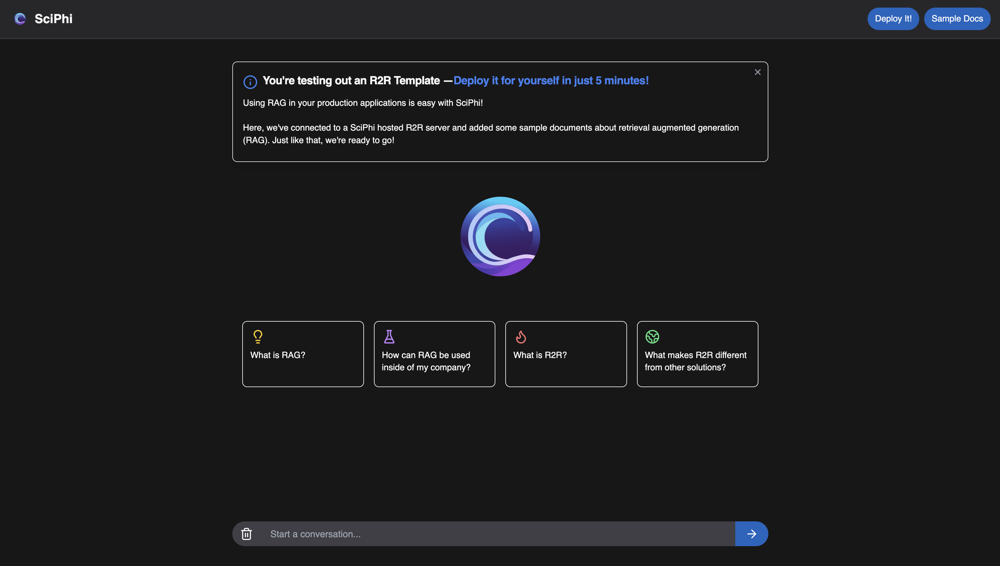

## Agentic RAG Chatbot

### R2R templates are in beta! We value your feedback and contributions to make them more widely accessible.

**Framework:** Python, Next.js

A boilerplate chatbot that uses the R2R Python SDK to connect to an R2R server. This template offers a simple and clean interfact for users to interact with the chatbot.

### [Preview a live demo of this template:](https://agentic-chatbot.vercel.app/)
<a href="https://agentic-chatbot.vercel.app/" target="_blank">
  
</a>

### Deploying
Using the R2R CLI we can clone the template. First, we install the R2R CLI, followed by the clone command for this template:
```bash
pip install r2r

r2r clone agentic_rag_chatbot
```

### Starting your R2R server
We'll need to connect our templates to a running R2R server. You can deploy an R2R pipeline instantly with [SciPhi Cloud](https://app.sciphi.ai/) or you can [learn how to deploy a pipeline yourself here.](https://r2r-docs.sciphi.ai/documentation/installation)

Once our R2R server is up and running, we can navigate to the template directory, where we'll see a python back end and a Next.js front end.

```bash
cd agentic_rag_chatbot

cd python-backend
```

If we inspect the `r2r_ingestion.py` file it will shows us that we'll use the R2R Python SDK to ingest a number of sample files about RAG. These file path can be changed.

```python
import os
import time

from r2r import R2RClient

# Our R2R base URL is the URL of our SciPhi deployed R2R server
deployment_url = os.getenv("R2R_DEPLOYMENT_URL")
client = R2RClient(deployment_url)

# We'll make sure that we can connect to the server
health_response = client.health()
print(health_response)

# We'll ingest the data from the data folder
file_paths = ["../web-app/public/data"]
t0 = time.time()
ingest_response = client.ingest_files(
    file_paths=file_paths,
)
t1 = time.time()
print(ingest_response)
print(f"Time taken to ingest: {t1 - t0} seconds")
```

Additionally, we see that we need to specify the URL at which our R2R server is deployed at.
We can set our R2R deployment URL, and run this file to ingest our sample data:
```bash
export R2R_DEPLOYMENT_URL=<your_deployment_url>

python r2r_ingestion.py
```

Then, we can launch our front end. This can be done locally, or through a serverless provider such as Vercel.

```bash
cd ../web-app
export NEXT_PUBLIC_DEFAULT_AGENT_URL=$R2R_DEPLOYMENT_URL
npm run build
npm run start
```
