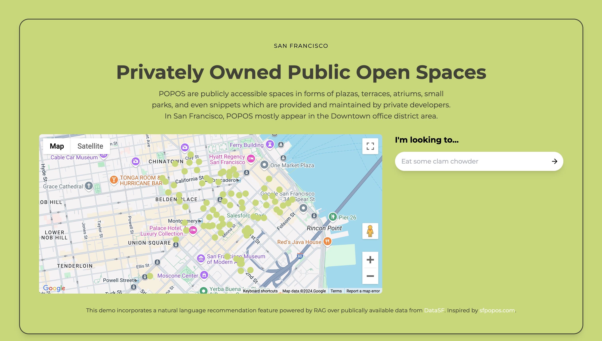

## Recommendation Platform

### R2R templates are in beta! We value your feedback and contributions to make them more widely accessible.

**Framework:** Python, Next.js

A recommendation platform built on R2R and Google Maps, providing users with suggestions on what POPOS(Privately Owned Public Open Spaces) in San Francisco that they should visit.

<!-- ### [Preview a live demo of this template:](https://recommendation-g4bq828nm-my-team-88dd52c0.vercel.app/) -->

<!-- <a href="https://recommendation-g4bq828nm-my-team-88dd52c0.vercel.app/" target="_blank">
  
</a> -->

### Deploying
Using the R2R CLI we can clone the template. First, we install the R2R CLI, followed by the clone command for this template:
```bash
pip install r2r

r2r clone recommendation_platform
```

### Starting your R2R server
We'll need to connect our templates to a running R2R server. You can deploy an R2R pipeline instantly with [SciPhi Cloud](https://app.sciphi.ai/) or you can [learn how to deploy a pipeline yourself here.](https://r2r-docs.sciphi.ai/documentation/installation)

Once our R2R server is up and running, we can navigate to the template directory, where we'll see a python back end and a Next.js front end.

```bash
cd recommendation_platform

cd python-backend
```

Then, inspecting the `r2r_ingestion.py` file shows us that we'll use the R2R Python SDK to ingest a number of sample files about RAG. These file path can be changed.

Additionally, we see that we need to specify the URL at which our R2R server is deployed at.

```python
import csv
import os

from r2r import R2RClient

# Our R2R base URL is the URL of our SciPhi deployed R2R server
deployment_url = os.getenv("R2R_DEPLOYMENT_URL")
client = R2RClient(deployment_url)

# Check server health
health_response = client.health()
print(health_response)

# Path to the original CSV file from DataSF
input_csv_path = (
    "../web-app/public/data/Privately_Owned_Public_Open_Spaces_20240809.csv"
)

# Read the CSV file and process each row as a separate file
with open(input_csv_path, "r") as csvfile:
    csvreader = csv.reader(csvfile)

    header = next(csvreader)
    name_index = header.index("NAME")

    for row in csvreader:
        row_name = row[name_index].replace(" ", "_").replace("/", "-")
        temp_filename = f"{row_name}.txt"

        with open(temp_filename, "w") as temp_txtfile:
            for key, value in zip(header, row):
                temp_txtfile.write(f"{key}: {value}\n")

        # Ingest the temporary file using the R2R client with a custom chunk size
        client.ingest_files(
            [temp_filename], ingestion_config={"chunk_size": 2048}
        )

        os.remove(temp_filename)

print("All rows have been processed and ingested.")
```

Additionally, we see that we need to specify the URL at which our R2R server is deployed at.
We can set our R2R deployment URL, and run this file to ingest our sample data:
```bash
export R2R_DEPLOYMENT_URL=<your_deployment_url>

python r2r_ingestion.py
```

Then, we can launch our front end. This can be done locally, or through a serverless provider such as Vercel.

```bash
cd ../web-app
export NEXT_PUBLIC_DEFAULT_AGENT_URL=$R2R_DEPLOYMENT_URL
export NEXT_PUBLIC_GOOGLE_MAPS_API_KEY=your-value
npm run build
npm run start
```
